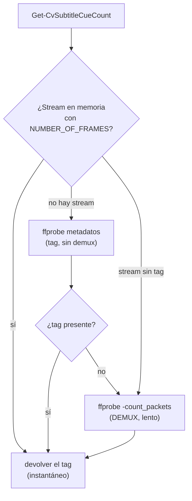

# Diagnóstico de rendimiento: PREPARAR lento con subtítulos (v4.2.2)

Nota técnica de una optimización real: por qué preparar ciertos MKV grandes tardaba varios segundos de más, cómo se localizó la causa y cómo se resolvió. Sirve también de ejemplo de cómo diagnosticar este tipo de lentitud.

## 1. Síntoma

En la fase **PREPARAR**, algunos archivos tardaban notablemente más que otros **sin razón aparente** (todos MKV de tamaño parecido, 1–5 GB):

| Archivo | Tamaño | PREPARAR |
|---|---|---|
| `Vídeo A` | 4,4 GB | **lento** (varios segundos) |
| `Vídeo B` | 4,6 GB | rápido |
| `Vídeo C` | 5,6 GB | rápido |
| `Vídeo D` | 1,3 GB | rápido |

El tamaño no explicaba la diferencia (el más lento no era el más grande). El factor común de los lentos resultó ser la **estructura de sus subtítulos**, no el vídeo ni el audio.

## 2. Cómo funcionaba antes

Al preparar cada archivo, `Split-CvSubtitlesByRole` ([Subtitle.psm1](../lib/Subtitle.psm1)) clasifica los subtítulos del idioma preferido en **forzado** y **completo**:

1. **Por flag/título** (fiable): si alguna pista trae la disposition `forced` o un título tipo "Forzados", se usa eso. Instantáneo.
2. **Por tamaño** (plan B): si **ninguna** trae el flag y hay 2+ pistas, se decide por el **número de cues** (entradas de subtítulo) — la notablemente más pequeña es la forzada, la grande es la completa.

El número de cues se obtenía **siempre** con:

```
ffprobe -select_streams <idx> -count_packets -show_entries stream=nb_read_packets ...
```

El problema: `-count_packets` **demultiplexa el fichero entero** para contar los paquetes de esa pista (los paquetes de subtítulo están repartidos por todo el contenedor, así que ffprobe recorre los GB completos). En un MKV de 4,4 GB eso son **~3,8 s por pista**, y se hacía una vez por cada subtítulo del idioma preferido.

## 3. Diagnóstico: cómo se localizó

Se **midió cada operación** de PREPARAR por separado sobre el archivo lento (Vídeo A), con las herramientas del propio proyecto (`tools\ffmpeg\…`):

| Operación | Comando | Tiempo |
|---|---|---|
| `Get-MediaInfo` | `ffprobe -show_streams -show_format` (JSON) | 0,15 s |
| `Get-AudioInitDelay` (sincronía) | `ffmpeg -i … -frames:a 1` (1 frame) | 0,12 s |
| **Cue count** sub idx 3 | `ffprobe -count_packets` | **3,8 s** |
| **Cue count** sub idx 4 | `ffprobe -count_packets` | **3,8 s** |

El cuello de botella era claramente el **conteo de cues** (~7,6 s en los 2 subtítulos en español), no la lectura de metadatos ni la sincronía.

Después se **comparó la estructura de subtítulos** del archivo lento con la de uno rápido:

```
# Vídeo A (LENTO): ninguno marcado forced -> clasifica por tamaño (cuenta cues)
idx 3  subrip  spa  default            "(sin título)"
idx 4  subrip  spa                     "Castilian"

# Vídeo B (RÁPIDO): idx 3 trae forced=1 + título "Forzados"
idx 3  subrip  spa  forced default     "Castellano [Forzados]"
idx 4  subrip  spa                     "Castellano [Completos]"
```

Ahí estaba la diferencia: **el Vídeo B clasifica por flag** (instantáneo) y **el Vídeo A cae al conteo por tamaño** (demux). Lo mismo con Vídeo C / Vídeo D: o clasifican por flag, o no tienen 2 subtítulos ambiguos del idioma preferido.

El **hallazgo clave** llegó al mirar los tags completos de los subtítulos del Vídeo A:

```
TAG:NUMBER_OF_FRAMES=10        (sub idx 3)
TAG:NUMBER_OF_FRAMES=659       (sub idx 4)
TAG:_STATISTICS_WRITING_APP=mkvmerge v88.0 …
```

Es decir: **el número de cues ya estaba en los metadatos** (`NUMBER_OF_FRAMES`, un tag de estadísticas que escribe **mkvmerge/MKVToolNix** al muxar), y `Get-MediaInfo` ya lo tenía cargado en memoria. Se estaba demultiplexando 4,4 GB para obtener un dato que estaba a mano. (Se verificó que el tag coincide exacto con el conteo real: `count_packets` daba 10 y 659, igual que los tags.)

## 4. La solución

`Get-CvSubtitleCueCount` ([MediaInfo.psm1](../lib/MediaInfo.psm1)) ahora resuelve el nº de cues **de rápido a lento**:

1. **Tag `NUMBER_OF_FRAMES`** del stream que ya cargó `Get-MediaInfo` (se le pasa el objeto con `-Stream`): **instantáneo, cero llamadas a ffprobe**. Si el stream no trae el tag, un ffprobe extra tampoco lo encontraría, así que se salta directamente al paso 3.
2. Si el llamador **no** aportó el stream: un `ffprobe` de **solo metadatos** (`-show_entries stream_tags=NUMBER_OF_FRAMES`, sin `-count_packets`) — también rápido, sin demux.
3. **Fallback**: si no hay tag (p. ej. MKV no muxado con mkvmerge, u otros contenedores), se cuenta con `ffprobe -count_packets` como antes (lento, pero solo cuando no queda otra).

Los tres llamadores (`Split-CvSubtitlesByRole`, el menú `Select-SubtitlesKeep` y `Write-SourceSummary`) pasan el `-Stream` en memoria, así que en la práctica no se lanza ningún ffprobe adicional para los archivos con tag.



## 5. Mejora medida

Sobre el caso real (Vídeo A, 4,4 GB, 4 subtítulos):

| Operación | Antes | Ahora | Factor |
|---|---|---|---|
| Contar cues de 4 subtítulos | ~15 s | **37 ms** | ~400× |
| Clasificar los 2 subtítulos en español (`Split-CvSubtitlesByRole`) | ~7,6 s | **~40 ms** | ~190× |
| **Resultado de la clasificación** | forzado = idx 3, completo = idx 4 | **idéntico** | — |

La mejora **solo aplica** a los archivos que antes iban lentos: los que se clasificaban **por tamaño** (2+ subtítulos del idioma preferido, ninguno con flag de forzado) **y** traen el tag `NUMBER_OF_FRAMES`. Los que ya clasificaban por flag/título nunca contaban cues, así que no cambian (ya eran rápidos). Los contenedores sin el tag siguen usando el demux (`-count_packets`), igual que antes.

## 6. Cobertura

Las muestras de la batería (`test\`) se generan con **ffmpeg**, que **no** escribe el tag `NUMBER_OF_FRAMES` (ese lo pone mkvmerge). Por tanto, los tests de clasificación de subtítulos (`audio-y-subs-multiidioma`, `subs-varios-completos-espanol-menu`, …) ejercitan la **ruta de fallback** (`-count_packets`) y siguen pasando (15/15) — se verifican ambos caminos: el rápido (tag, con el archivo real) y el de respaldo (demux, con los fixtures).
