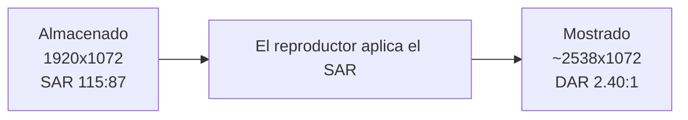

# Vídeo anamórfico (SAR ≠ 1)

Algunos vídeos (DVDs, ciertos *rips* de escena) guardan una resolución que **no es la que se ve**: usan **píxeles no cuadrados**. El contenedor reporta, por ejemplo, `1920x1072`, pero el vídeo está pensado para mostrarse a **~2538x1072** (cinemascope ≈ 2.40:1). El factor que lo indica es el **SAR** (*Sample Aspect Ratio*, relación de aspecto del píxel).

Esto da **dos síntomas** al preparar/convertir:

- La **previsualización** con ffplay abre la ventana al tamaño **mostrado** (~2538 de ancho) → parece que "se sale de escala". En realidad es correcto: así se ve el vídeo.
- Un tope de tamaño (`maxWidth`) que compare contra el ancho **almacenado** (1920) **no se entera** de que el vídeo se ve mucho más ancho → no reescala cuando debería.

## Los tres números: SAR, DAR y ancho mostrado

- **SAR** = forma del píxel. `1:1` = cuadrado (normal). `115:87` ≈ 1.32 = el píxel es más ancho que alto.
- **Ancho mostrado** = ancho almacenado × SAR. `1920 × 115/87 ≈ 2538`.
- **DAR** (*Display Aspect Ratio*) = proporción de la imagen tal como se ve = ancho_mostrado / alto. `2538 / 1072 ≈ 2.368` (2.40:1).



> **Ojo:** quitar el SAR **sin rescalar** (dejar `1920x1072` con `setsar=1`) **deforma** la imagen: la aplasta a 16:9 (1.79:1), la gente sale estrecha. Para eliminar el SAR bien hay que **hornear** la proporción en píxeles reales (rescalar a las dimensiones cuadradas correctas + `setsar=1`).

## Cómo lo resuelve el conversor

1. **Detección (fase PREPARAR).** En `Invoke-VideoAsk` (`lib/Video.psm1`) se compara el ancho **mostrado** (`Get-CvDisplayWidth`, en `lib/MediaInfo.psm1`) con el almacenado. Si difieren, la pista es anamórfica.
2. **Se pregunta qué hacer** (solo al **recodificar**), preseleccionando el modo configurado en `encode.anamorphic` (`Invoke-CvAnamorphicAsk`); `ENTER` o el auto-timeout (`behavior.promptTimeout.anamorphic`) lo aceptan:

   ```
   [VIDEO] [ANAMORFICO] - Almacena 1920x1072 pero SE VE a 2538x1072 (SAR 115:87); el tamano real no es el que reporta el contenedor.
   [VIDEO] [ANAMORFICO] - [1] mantener SAR / [2] cuadrar por ancho / [3] cuadrar por alto  [ENTER=2=cuadrar por ancho]
   ```

3. **Reescalado (fase WORKER).** El modo elegido se traduce a un `scale=` con `Get-CvResize`. La decisión se congela en el job (`video.resize`), así que el worker solo aplica el filtro.
4. **Modo `copy`.** No se recodifica → no se puede cambiar el SAR: solo se **avisa** del tamaño real; la pista se copia tal cual.

### Modos (`encode.anamorphic`)

| Modo | Qué hace | Salida del ejemplo (`1920x1072` SAR `115:87`) |
|---|---|---|
| `square` *(por defecto)* | Cuadra a píxeles cuadrados fijando el **ancho** de almacenamiento (no amplía). | `1920x810`, SAR `1:1` |
| `squareheight` | Cuadra fijando el **alto** (amplía el ancho hasta el mostrado). | `2538x1072`, SAR `1:1` |
| `keep` | Conserva el SAR/DAR tal cual (depende de que el reproductor lo respete). | `1920x1072`, SAR `115:87` |

En `square`/`squareheight` se **elimina el SAR** (`setsar=1`): el archivo se ve igual en cualquier reproductor **sin depender** de que respete el SAR, conservando la proporción (DAR). Con **SAR `1:1`** (píxeles ya cuadrados) `Get-CvResize` no toca nada salvo lo que pida `maxWidth`.

### Interacción con `maxWidth` / `changeSize`

- **`changeSize`** (escala literal `W:H`) tiene **prioridad**: si está definido, manda él.
- **`maxWidth`** se compara contra el ancho **mostrado** y sigue **capando** el resultado también en `square`/`squareheight` (baja ancho y alto a la vez conservando la proporción). Detalle: [ref-configuracion.md](ref-configuracion.md).

### Por qué `scale` "conserva el DAR"

`scale` **no conserva el SAR**: al reescalar recalcula el SAR de salida para mantener el **DAR** (la proporción vista). Por eso, en el modo `keep`, para capar el ancho **mostrado** a `MaxWidth` basta escalar el almacenamiento a `MaxWidth/SAR` (lo hace `Get-CvMaxWidthResize`); y en `square`/`squareheight` se calculan directamente las dimensiones cuadradas correctas y se fija `setsar=1`.

## Verificado (empírico)

Sobre una muestra real anamórfica (HEVC 10-bit, SAR `115:87`; ffmpeg 7.1.1), modo `square`:

| | Original | Convertido |
|---|---|---|
| Resolución | `1920x1072` | `1920x810` |
| SAR | `115:87` | **`1:1`** |
| DAR | `4600:1943` ≈ 2.368 | `64:27` = 2.370 |
| Códec / bits | hevc 10-bit | hevc 10-bit |
| Duración | 6507.07 s | 6507.11 s |

La proporción (≈ 2.40:1) se mantiene, el píxel pasa a cuadrado y el vídeo se muestra a 1920 de ancho real (cabe en pantalla, se ve igual en cualquier reproductor). Audio y duración intactos.

## Funciones implicadas

- `Get-CvDisplayWidth` — ancho mostrado (almacenado × SAR).
- `Get-CvResize` — decide el `scale=` según modo + `maxWidth` (usa `Get-CvMaxWidthResize` para `keep`).
- `Get-CvAnamorphicWarning` — texto del `[AVISO]` (modo `copy`).
- `Invoke-CvAnamorphicAsk` — la pregunta interactiva de PREPARAR.

Todas con tests unitarios (`test/unit-tests.ps1`) y un caso E2E (`test/feature-tests.ps1`, salida SAR `1:1`). Trampa relacionada: [ref-gotchas.md](ref-gotchas.md). Claves de configuración: [ref-configuracion.md](ref-configuracion.md).
