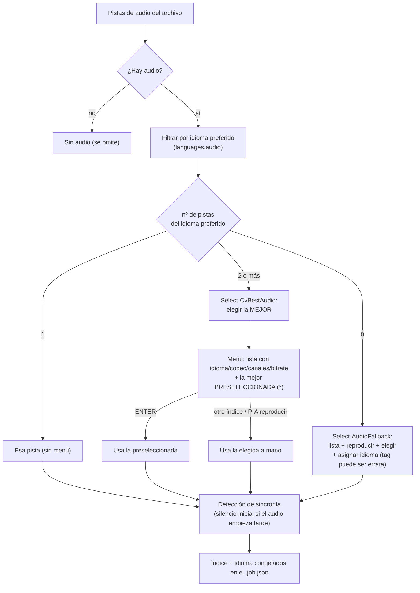
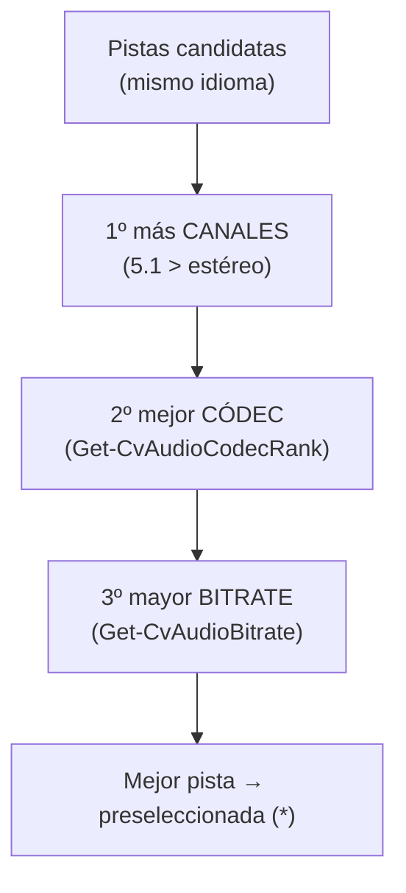
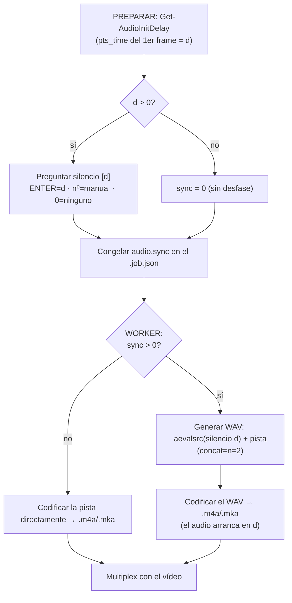
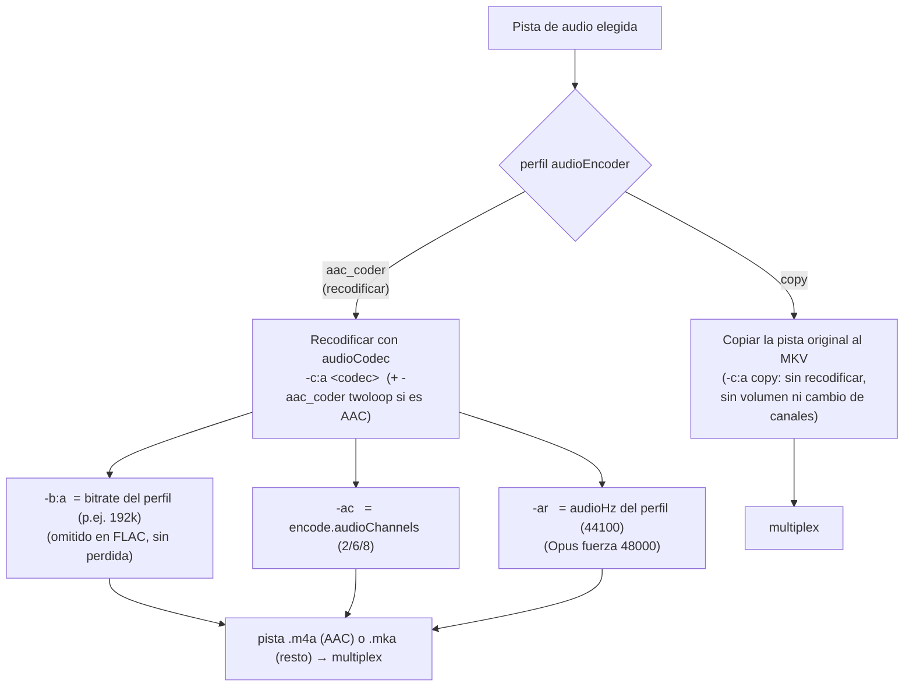

# Audio: selección de pista y procesado de volumen

Cómo el conversor **elige la pista de audio** cuando hay varias y cómo **ajusta el volumen** (con la comparativa de tiempo de cada método). Implementación en `Select-AudioStream`/`Select-CvBestAudio` ([MediaInfo.psm1](../lib/MediaInfo.psm1)) e `Invoke-AudioRun`/`Invoke-AudioAsk` ([Audio.psm1](../lib/Audio.psm1)).

## 1. Selección de la pista de audio

En PREPARAR se decide qué pista de audio se conserva. Preferencia por **idioma configurado** (`languages.audio`); con varias del idioma preferido se elige automáticamente la **mejor calidad** y se pregunta (preseleccionada); sin ninguna del idioma preferido, se pregunta cuál y qué idioma asignar.



### Criterio "mejor pista" (`Select-CvBestAudio`)

Cuando hay 2+ pistas del idioma preferido, se ordenan por calidad de **fuente** y se preselecciona la primera:



- **Canales**: más canales = fuente más rica (aunque luego se baje a estéreo, el downmix de un 5.1 es preferible).
- **Códec** (`Get-CvAudioCodecRank`, mayor = mejor máster): TrueHD/MLP · FLAC/PCM · DTS · **E-AC-3 · AC-3** · Opus · AAC · Vorbis · MP3 · resto.
- **Bitrate** (`Get-CvAudioBitrate`): se lee de `stream.bit_rate` o, si falta, del tag de estadísticas **`BPS`** de mkvmerge. Se muestra en el menú (`bitrate=NNNk`) para decidir a mano.

Ejemplo (dos pistas 5.1 en español): `eac3 768k` gana a `ac3 640k` por códec (E-AC-3 > AC-3), aunque el bitrate sea parecido.

## 2. Procesado de volumen: métodos y tiempo

`volume.method` elige cómo se ajusta el volumen al recodificar el audio (`Invoke-AudioRun`):

| Método | Qué hace | Pasadas sobre el audio |
|---|---|---|
| `peak` | Mide el pico (`volumedetect`) y **amplifica** hasta `volume.peakTarget` con el filtro `volume`. | 2 (análisis + encode), ambas ligeras |
| `loudnorm` | Normalización de **sonoridad EBU R128** (I/TP/LRA) con el filtro `loudnorm`, en **1 pasada** dentro del encode. | 1 (encode), pero el filtro es pesado |
| `aacgain` | Codifica sin ajuste y aplica **ReplayGain** sobre el `.m4a` ya codificado, **sin recodificar**. | 1 encode + escaneo aacgain |

### Comparativa de tiempo

Medido sobre **5 minutos** de audio AC-3 5.1 → AAC (solo la fase de audio; el vídeo se codifica aparte). Valores orientativos (dependen de la CPU), para comparar entre sí:

| Método | Tiempo (5 min audio) | Relativo | Nota |
|---|---|---|---|
| `peak` | **~14 s** | **1×** (más rápido) | filtro `volume` trivial |
| `aacgain` | ~18 s | ~1,3× | encode sin filtro + escaneo ReplayGain |
| `loudnorm` | **~63 s** | **~4,5×** (más lento) | el filtro EBU R128 es pesado |

> El método de volumen apenas mueve el **tiempo total** de la conversión: manda el encode de **vídeo**. Aun así, si procesas mucho audio, `peak` es el más rápido y `loudnorm` el más lento (su filtro hace análisis de sonoridad + true-peak). `loudnorm` da el volumen más uniforme entre archivos; `peak` solo iguala el pico; `aacgain` ajusta sin recodificar (reversible).

Los parámetros de cada método (`volume.peakTarget`, `volume.loudnormI/TP/LRA`) están en [ref-configuracion.md](ref-configuracion.md); los comandos exactos, en [ref-comandos.md](ref-comandos.md).

## 3. Sincronía audio/vídeo

### El problema

Algunos contenedores traen la pista de audio con un **desfase inicial**: su primer frame no está en el segundo 0, sino en `pts_time = d` (el audio "empieza más tarde" que el vídeo). En el archivo original eso está bien porque los timestamps lo colocan en su sitio.

El conflicto aparece porque el conversor **recodifica el audio por separado** (a un temporal `.m4a`/`.mka`) y luego lo multiplexa con el vídeo: al procesar la pista aislada, ese desfase inicial no se conserva y el audio acabaría **`d` segundos adelantado** respecto al vídeo.

La solución del conversor: **anteponer `d` segundos de silencio** a la pista antes de recodificar, para que vuelva a empezar en `d` y quede alineada. (El código solo mide el desfase y compensa con silencio; el "por qué" del desfase depende del contenedor de origen.)

```
  tiempo →   0    d                    fin
  vídeo:     |====|====================|
  audio ok:       [==== audio ====]           empieza en d   -> correcto
  sin fix:   [==== audio ====]                empieza en 0   -> adelantado d
  con sil:   [sil][==== audio ====]           silencio 0..d  -> alineado
```

### Detección (fase PREPARAR)

`Get-AudioInitDelay` ([Audio.psm1](../lib/Audio.psm1)) decodifica **un solo frame** de la pista elegida y lee su `pts_time`:

```
ffmpeg -hide_banner -i <file> -map 0:<i> -af ashowinfo -f alaw -frames:a 1 -y NUL
```

Si `pts_time = d > 0`, se avisa (`[SYNC] - El audio empieza d s más tarde que el vídeo`) y se **pregunta** cuánto silencio añadir, con `d` como valor por defecto:

- `[ENTER]` → usar `d` (el detectado).
- teclear un número → usar ese (ajuste manual).
- `0` → no añadir silencio.

El valor elegido se **congela** en el job (`audio.sync`); que haya habido pregunta marca el archivo como *selección manual* (`[AVISO]`).

### Aplicación (fase WORKER)

En `Invoke-AudioRun`, si `sync > 0` **no** se recodifica la pista directamente: primero se genera un **WAV** = `silencio(d)` **+** `pista`, concatenados, y ese WAV pasa a ser la fuente del encode (medición de volumen incluida). Si `sync = 0`, se codifica la pista tal cual.



Comando de generación del WAV (silencio + pista, en el layout de salida):

```
ffmpeg -hide_banner -y -i <file> -filter_complex \
  "[0:<i>]aformat=channel_layouts=<layout>[a2];aevalsrc=0:d=<sync>:sample_rate=<hz>:channel_layout=<layout>[sil];[sil][a2]concat=n=2:v=0:a=1[out]" \
  -map "[out]" <name>_concat.wav
```

Detalles:

- Se referencia `[0:<i>]` (el **índice concreto** de la pista elegida), no `[0:a]` (que sería la primera pista y podría no ser la seleccionada).
- El silencio (`aevalsrc=0`) se genera en el **mismo layout y samplerate** que la salida, para que el `concat` no falle por formatos distintos.
- Se pasa por un **WAV intermedio** (en vez de aplicar el retardo en el mismo encode) para evitar un problema del AAC que se desincroniza al concatenar directamente.
- En **modo pruebas** el WAV se acota a `test.minutes` (`-t`).

Comandos exactos: [ref-comandos.md](ref-comandos.md) (§4 detección, §5 WAV).

### Modo de sincronía: clásico (WAV) vs `adelay` — 🧪 BETA

Hay **dos** formas de aplicar el silencio, elegibles con **`test.syncAdelay`** en `config.json`:

| | Clásico (por defecto) | `adelay` — **BETA** (`test.syncAdelay: true`) |
|---|---|---|
| Cómo | 2 pasos: genera un WAV `silencio + pista` y luego lo codifica | 1 paso: filtro `adelay=<ms>:all=1` **encadenado con el volumen** en el mismo encode |
| Procesos ffmpeg | 2 (WAV + AAC) | **1** |
| Temporal `_concat.wav` | sí | **no** |
| Estado | estable | **experimental** |

En modo `adelay`, la cadena de filtros combina retardo + volumen en una sola pasada, p. ej.: `[0:<i>]adelay=<ms>:all=1,volume=<g>dB[a]` (o `,loudnorm=...` según `volume.method`).

> **🧪 BETA — controlado para retirar/promover.** La opción vive en:
> - Config: **`test.syncAdelay`** (`lib/Config.psm1`) · Contexto: **`SyncAdelay`** (`lib/Context.psm1`).
> - Lógica: rama `if ($Sync -gt 0 -and $Context.SyncAdelay)` en **`Invoke-AudioRun`** (`lib/Audio.psm1`), marcada con comentarios `BETA`.
> - Verificado (ffmpeg 7.1.1): produce la misma duración y silencio inicial que el clásico (5 s + 2 s → 7 s). Falta rodaje en más casos reales de A/V antes de hacerlo el método por defecto.
>
> Para **promover** a estable: hacerlo el comportamiento único (o mover el flag fuera de `test`). Para **retirar**: quitar `test.syncAdelay`, `SyncAdelay` y la rama `adelay` de `Invoke-AudioRun` (los `grep "adelay"`/`"SyncAdelay"` localizan todo).

## 4. Canales y códec de la pista de salida

El perfil decide si el audio se **copia** tal cual o se **recodifica** al códec elegido (`audioCodec`, por defecto **AAC**):



### Códecs de salida soportados

Cuando se recodifica (la mayoría de perfiles), el códec de salida lo fija `audioCodec` del perfil. Formatos soportados y sus especificaciones (verificado con ffmpeg 7.1.1):

| `audioCodec` | ffmpeg (`-c:a`) | Tipo | Contenedor temp. | Bitrate (presets del builder) | Samplerate | Notas |
|---|---|---|---|---|---|---|
| `aac` (por defecto) | `aac -aac_coder twoloop` | con pérdida | `.m4a` | 96k–320k (**192k** rec.) | `audioHz` (44100) | AAC-LC, muy compatible. `twoloop` = coder de mayor calidad del AAC nativo (2 pasadas internas de asignación de bits por bloque). |
| `ac3` | `ac3` | con pérdida | `.mka` | 192k–640k (**384k** rec.) | `audioHz` | Dolby Digital. Máximo **640k** (tope del formato). Compatible con TV/receptores en 5.1. |
| `eac3` | `eac3` | con pérdida | `.mka` | 192k–640k (**384k** rec.) | `audioHz` | Dolby Digital Plus (E-AC-3). Mejor calidad que AC-3 a igual bitrate. |
| `libmp3lame` | `libmp3lame` | con pérdida | `.mka` | 96k–320k | `audioHz` | MP3, universal. |
| `flac` | `flac` | **sin pérdida** | `.mka` | — (no aplica) | `audioHz` | No se pasa `-b:a` (el tamaño lo decide el contenido). |
| `libopus` | `libopus` | con pérdida | `.mka` | 96k–320k | **48000** (forzado) | Opus, muy eficiente. Solo admite 8/12/16/24/**48** kHz, así que se ignora `audioHz` y se usa 48 kHz (44,1 kHz haría fallar la codificación). |

`aac` es el valor por defecto (comportamiento previo a esta función). El default es **configurable** en `customProfile.audioCodec`.

### Parámetros comunes al recodificar

- **Bitrate**: `-b:a`, el `audioBitrate` del perfil (p. ej. `192k`). **No** se pasa para FLAC (sin pérdida) ni si el perfil no lo define.
- **Canales**: `-ac`, de `encode.audioChannels` (**config global**, no del perfil): `2` = estéreo (por defecto), `6` = 5.1, `8` = 7.1. `-ac` **fuerza** ese nº de canales: **downmix** si la fuente tiene más, **upmix** si tiene menos.
- **Samplerate**: `-ar`, el `audioHz` del **perfil** (`44100` por defecto); `encode.audioHz` es el valor de reserva si el perfil no lo trae. Excepción: **Opus** se codifica siempre a `48000`.

### Contenedor intermedio (`.m4a` / `.mka`)

El audio recodificado se escribe primero en un temporal en `Proceso\`, que luego se multiplexa (copiando el stream, **sin recodificar**) al MKV final. La extensión depende del códec:

- **AAC → `.m4a`** (MP4): así sigue funcionando la normalización `aacgain`, que solo procesa AAC/MP3 en contenedor MP4.
- **Resto → `.mka`** (Matroska): admite cualquier códec (ac3/eac3/mp3/flac/opus), a diferencia de `.m4a`, que solo acepta aac/ac3/alac.

Por eso, si se elige un códec **distinto de AAC** y el método de volumen configurado es `aacgain`, se usa **`peak`** en su lugar (basado en filtro, válido para cualquier códec). `Invoke-Multiplex` toma el temporal que exista (`.m4a` o `.mka`) y `Remove-CvTemps` limpia ambos.

### Cómo se elige en el builder custom

En el constructor de perfil interactivo (opción `0` del menú *USAR PERFIL*), el audio se pide en **dos pasos**:

1. **SALIDA DE AUDIO (codec)**: `copy` (no recodificar) o uno de los códecs de arriba. El default es el de `customProfile.audioCodec` (o `copy` si `customProfile.audioBitrate` es `"copy"`).
2. **BITRATE**: solo si se recodifica y el códec **no** es FLAC. Los presets se adaptan al códec: rango de **sonido envolvente** (hasta 640k) para AC-3/E-AC-3, rango **estéreo/lossy** para AAC/MP3/Opus; además de `custom` para teclear cualquier valor.

Excepción — **`audioEncoder: copy`**: el audio **no se recodifica**; la pista original se copia tal cual en el MKV final (sin ajuste de volumen, canales ni samplerate; se conservan sus metadatos). Ver claves en [ref-configuracion.md](ref-configuracion.md).
