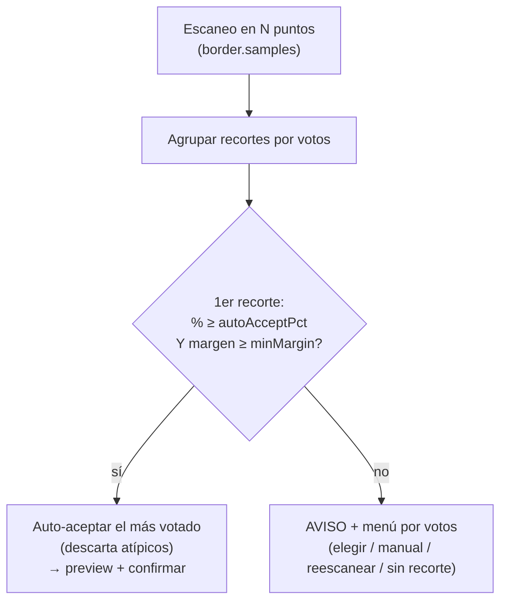

# Detección de bordes negros (cropdetect multipunto)

Cómo el conversor detecta y recorta las barras negras (letterbox/pillarbox), por qué escanea en **varios puntos** del vídeo y cómo decide **automáticamente** cuándo fiarse del resultado y cuándo preguntar. Implementación en `Find-CropDetect` / `Find-CropDetectSamples` ([Video.psm1](../lib/Video.psm1)); configuración en la sección `border` de [ref-configuracion.md](ref-configuracion.md).

## Cuándo se activa

La detección de bordes se ejecuta en PREPARAR según el campo **`detectBorder`** del perfil (o si el nombre del archivo **empieza por `_`**, que fuerza el modo interactivo):

- **`false`** — nunca; se codifica sin recorte.
- **`true`** — **siempre, interactivo**: escaneo completo (`border.samples` puntos × `border.duration` s), con preview y confirmación. **Antes de escanear pregunta el nº de muestras** (por defecto `border.samples`, editable); útil para hacerlo más rápido o más fiable puntualmente. Al reescanear (`R`) se puede volver a cambiar.

> **Auto-aceptar por inactividad:** todas las preguntas del modo interactivo (nº de muestras, inicio/duración del scan, reintentar/continuar y la confirmación del recorte) admiten el **timeout** de `behavior.promptTimeout.border` (por defecto 10 s): si no tocas el teclado en ese tiempo, se acepta el valor por defecto (para dejar PREPARAR desatendido). Ver [ref-configuracion.md](ref-configuracion.md#behaviorprompttimeout--timeout-granular-por-pregunta).
- **`'auto'`** — **decide solo** con un pre-escaneo rápido (ver abajo).

## Modo `auto` (decidir si recortar sin preguntar)

Pensado para no tener que saber de antemano si un vídeo tiene barras. Hace un **pre-escaneo ligero** (`border.autoSamples` puntos × `border.autoDuration` s — mucho menos que el escaneo completo) y decide:

1. **Tolerancia (¿es ruido o barra real?)** — `cropdetect` casi siempre recorta unos pocos píxeles de borde aunque no haya barras (p. ej. `3824:1600` sobre `3832:1600` = 0,2%). Solo se considera que **hay barras** si el recorte más votado reduce **≥ `border.minCropPct`%** (def. 2). Por debajo → **no recorta**.
2. **Consistencia (¿son barras de verdad?)** — unas barras reales son **constantes**: el **mismo** recorte significativo aparece en varios puntos. Un recorte que solo sale en **un** punto es ruido (una escena oscura o un plano con formato distinto da un recorte disparatado, p. ej. `336:752` o `2304:1600`). Así que se filtra: se descartan los near-full (paso 1) y, de los significativos, se mira el más votado.

Resultado (sobre los puntos del pre-escaneo):

| Situación | Acción |
|---|---|
| Todos los recortes near-full / despreciables (< `minCropPct`%) | **No recorta** (sin preguntar) |
| Ningún recorte significativo se repite (todos 1 voto, dispersos) | **No recorta** — es ruido, no barras |
| Un recorte significativo con **mayoría fiable** (`autoAcceptPct` + `autoAcceptMinMargin`, o unánime) | **Aplica el recorte** (sin preguntar) |
| Un recorte significativo **repetido** (≥2 puntos) pero sin mayoría fiable | **Pasa al modo interactivo** (menú por votos) |

Así, en la práctica: los vídeos **sin barras** (incluidos los scope nativos donde cropdetect da recortes dispersos por escenas oscuras) y los que las tienen **claras** se resuelven **sin intervención**; solo los que tienen barras dudosas (acuerdo parcial) preguntan.

## Cómo funciona

Cada escaneo usa el filtro `cropdetect` de ffmpeg sobre un tramo del vídeo y se queda con el recorte (`W:H:X:Y`) más repetido de ese tramo:

```
ffmpeg -ss <inicio> -to <fin> -i <archivo> [-map 0:<pista>] -vf cropdetect -f null -
```

### Por qué en varios puntos

Un solo escaneo al inicio se equivoca a menudo: los primeros minutos pueden ser créditos, un logo, una escena oscura o un plano con formato distinto al del grueso de la película. Por eso se muestrea en **`border.samples`** puntos repartidos **uniformemente** entre `border.start` y casi el final del vídeo, y cada punto **vota** su recorte.

- **`border.start`** (def. 120): segundo del primer punto.
- **`border.duration`** (def. 120): segundos que escanea **cada** punto. No es un presupuesto que se reparta: con `samples=9` son **9 escaneos de `duration` segundos** cada uno (más puntos = más tiempo total de análisis, pero cada muestra conserva su ventana completa).
- **`border.samples`** (def. 9): número de puntos. Con `1` (o duración desconocida) se comporta como el escaneo único clásico.

Ejemplo de reparto en un vídeo de 46 min (`start=120`, `duration=120`):

| samples | ventana por punto | tiempo total de análisis | puntos de muestreo (s) |
|---|---|---|---|
| 3 | 120 s | 360 s | 120, 1380, 2639 |
| 9 | 120 s | 1080 s | 120, 435, 750, 1065, 1380, 1694, 2009, 2324, 2639 |

## Decisión: auto-aceptar o preguntar

Los recortes de todos los puntos se agrupan por **votos**. El más votado se **acepta automáticamente** (y se muestran preview + confirmación) si cumple **las dos** condiciones:

1. **Porcentaje** — alcanza `border.autoAcceptPct` % (def. **60**) de los puntos que detectaron borde.
2. **Margen** — supera al segundo candidato por al menos `border.autoAcceptMinMargin` votos (def. **2**).

Si no se cumplen ambas (voto repartido o empate), se avisa (`▐ AVISO ▌`) y se muestra un **menú de recortes ordenado por votos** para elegir a mano (o valor manual / reescanear / sin recorte).

### Por qué el porcentaje solo no basta

Un umbral de solo `%` **no mide la fuerza de la evidencia**: `2/3` y `6/9` son ambos 67%, pero uno son 2 confirmaciones y el otro 6. Si se bajara `samples`, el mismo % se alcanzaría con muchísimos menos votos → se auto-aceptaría con evidencia débil → **falsos positivos** (recortes atípicos aceptados como buenos). El **margen absoluto** lo corrige: con pocas muestras es difícil sacar margen, así que esos casos caen al menú en vez de auto-aceptarse.

### Matriz de decisión (con los valores por defecto: 60 % y margen +2)

| Votos | Total | % del 1º | Margen | Resultado |
|---|---|---|---|---|
| 2, 1 | 3 | 67 % | +1 | **Menú** (evidencia débil: pocas muestras) |
| 3, 1 | 4 | 75 % | +2 | Auto |
| 2, 1, 1 | 4 | 50 % | +1 | **Menú** |
| 8, 1 | 9 | 89 % | +7 | Auto |
| 7, 2 | 9 | 78 % | +5 | Auto |
| 6, 3 | 9 | 67 % | +3 | Auto |
| 5, 4 | 9 | 56 % | +1 | **Menú** (sin mayoría clara) |
| 3, 3, 3 | 9 | 33 % | +0 | **Menú** (empate) |
| 4, 4, 1 | 9 | 44 % | +0 | **Menú** (empate al primer puesto) |

El caso `8, 1` (un punto atípico frente a ocho coincidentes) se resuelve solo, sin molestar; el caso `2, 1` (esos mismos "dos de tres" pero con muy pocas muestras) se lleva al menú, que es justo lo que evita el falso positivo.



## Ajustes relacionados (`config.json` → `border`)

| Clave | Def. | Efecto |
|---|---|---|
| `start` | `120` | Segundo del primer punto (se ajusta solo si el vídeo es más corto). |
| `duration` | `120` | Segundos que escanea **cada** punto. |
| `samples` | `9` | Nº de puntos repartidos por el vídeo (`1` = escaneo único clásico). |
| `autoAcceptPct` | `60` | % de votos del más votado para auto-aceptar. `100` = exigir unanimidad. |
| `autoAcceptMinMargin` | `2` | Margen mínimo de votos sobre el 2º (además del %). `0` = solo cuenta el %. |
| `autoSamples` / `autoDuration` | `3` / `5` | Pre-escaneo del modo `'auto'`: puntos y segundos por punto (mín. 5 s/punto por el escáner). |
| `minCropPct` | `2` | Reducción mínima (% de ancho/alto) para que el modo `'auto'` tome el recorte como barras reales; por debajo lo ignora (ruido de borde). |

Ejemplos de configuración:

- **Más exigente** (auto-acepta solo con mucho acuerdo): `autoAcceptPct = 80`, `autoAcceptMinMargin = 3`.
- **Más automático** (menos preguntas, mayoría simple): `autoAcceptPct = 50`, `autoAcceptMinMargin = 1`.
- **Rápido** (menos análisis): baja `samples` (p. ej. 3) o `duration`; ten en cuenta que con menos puntos el margen protege de auto-aceptar en falso.
