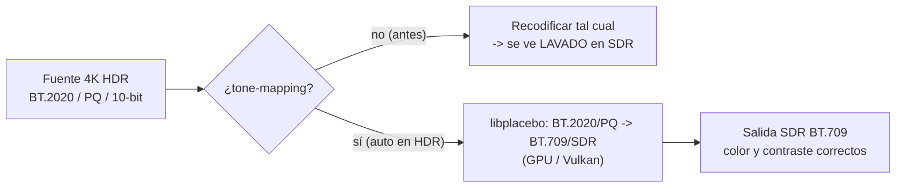

# Tone-mapping HDR → SDR

Cuando el origen es **HDR** y se recodifica **sin** convertir el color, el resultado se ve **lavado / blanquecino**, con poco contraste y colores apagados. Es muy típico al pasar un **4K HDR a 1080p**. No es culpa del reescalado: es un problema de **gestión de color**.

## Por qué se ve "lavado"

El material HDR usa espacio de color **BT.2020** con una curva de transferencia **PQ** (`smpte2084`) o **HLG** (`arib-std-b67`), a 10 bits. El SDR de toda la vida usa **BT.709**. Si recodificas el HDR y **no** conviertes ni reetiquetas el color, el reproductor interpreta unos valores codificados en PQ como si fueran SDR BT.709 → imagen plana, lechosa, desaturada.

## Cómo lo resuelve el conversor

1. **Detección (fase PREPARAR).** `Test-CvHdr` (en `lib/MediaInfo.psm1`) lee el `color_transfer` de la pista de vídeo elegida; si es `smpte2084` (PQ) o `arib-std-b67` (HLG), el origen es HDR. El dato se **congela** en el job (`video.hdr`).
2. **Conversión (fase WORKER).** Si el job es HDR y `encode.video.tonemapHdr` ≠ `off`, `Invoke-VideoRun` añade el filtro **`libplacebo`** (que corre en la **GPU** vía Vulkan) para convertir **BT.2020/PQ → BT.709/SDR**, y **etiqueta** la salida como BT.709. El orden del filtro es `crop → scale → libplacebo → format`.
3. **Etiquetado.** La salida lleva `-color_primaries bt709 -color_trc bt709 -colorspace bt709 -color_range tv`, así que cualquier reproductor la interpreta como SDR.

El material **SDR no se toca**: `Test-CvHdr` da `false` y el vídeo se recodifica exactamente igual que antes.

## Configuración

| Clave | Valor | Efecto |
|---|---|---|
| `encode.video.tonemapHdr` | `auto` (por defecto) | Convierte a SDR BT.709 **solo** si el origen es HDR. |
| `encode.video.tonemapHdr` | `off` | No convierte nunca; el vídeo se recodifica sin tocar el color (conserva el HDR, con el riesgo de verse lavado en SDR). |

- **Profundidad de bits:** la salida SDR mantiene **10 bits** si el perfil lo pide (`main10`/`high10`), lo que evita *banding* en cielos/degradados que puede introducir el tone-mapping. El `-pix_fmt` concreto por encoder lo fija `Get-CvTonemapFormat` (ver [ref-comandos.md](ref-comandos.md) §8).
- **Requisito:** el filtro `libplacebo` necesita una GPU con **Vulkan** (en NVIDIA, el driver normal lo trae). Por eso `Invoke-VideoRun` añade `-init_hw_device vulkan` solo cuando toca convertir. En este proyecto se eligió `libplacebo` porque `zscale`+`tonemap` (zimg) aborta en el build de ffmpeg incluido.

## Verificado (empírico)

Sobre un WEB-DL **4K Dolby Vision + HDR10+** (BT.2020/PQ, 10-bit), reescalado a 1080p, en una **GTX 1070** (ffmpeg 7.1.1):

- Con `auto`: la salida pasa de `bt2020nc/smpte2084/bt2020` a **`bt709/bt709/bt709`**, con color y contraste naturales (cielo azul, verdes y roca correctos) en vez del gris lavado.
- Con `off`: la salida conserva `bt2020nc/smpte2084/bt2020` (comportamiento anterior).
- El tone-mapping (`libplacebo`) y la codificación (`hevc_nvenc`/NVENC) corren **ambos en la GPU**.

Comandos de codificación relacionados: ver "Vídeo: codificación" en [ref-comandos.md](ref-comandos.md). Claves de configuración: [ref-configuracion.md](ref-configuracion.md). Campos del job: [ref-jobs.md](ref-jobs.md).
