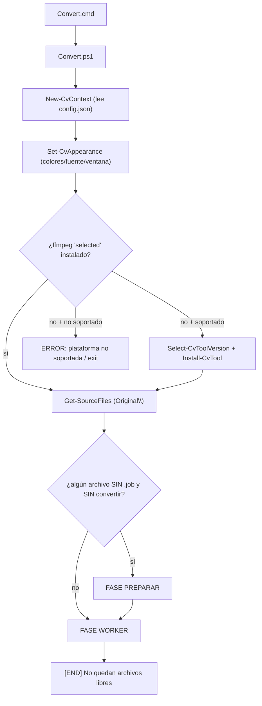
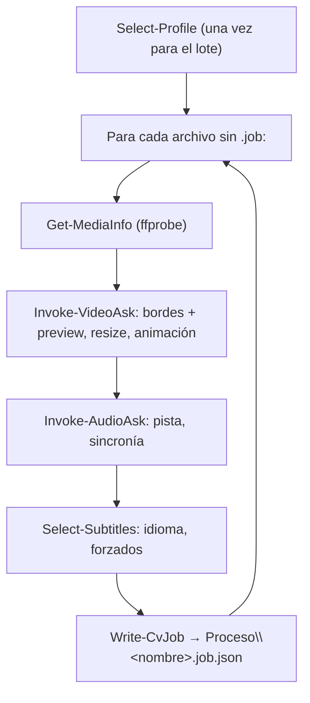
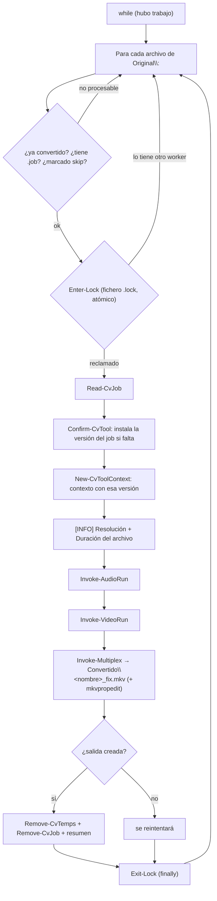

# Flujo de trabajo

El conversor sigue un modelo **productor/consumidor** en dos fases: primero se **prepara** (se pregunta todo y se congela en un job), luego se **procesa** (worker desatendido).

## Visión global



## Clasificación

Al arrancar, tras comprobar herramientas, se recorren los vídeos de `Original\` y se decide si hace falta preparar:

```powershell
foreach ($f in $files) {
    $name = $f.BaseName
    if (Test-Path -LiteralPath (Get-OutputPath $ctx $name)) { continue }   # ya convertido
    if (-not (Test-CvJob -Context $ctx -Name $name)) { $needPrepare = $true; break }
}
```

- Un archivo **necesita prepararse** si NO está convertido (no existe `Convertido\<nombre>_fix.mkv`) **y** no tiene `Proceso\<nombre>.job.json`.
- Si todos tienen job (o están convertidos) → se salta PREPARAR y se entra directo como WORKER. Esto permite abrir **varias ventanas**: la primera prepara, las demás entran como workers.

## Fase PREPARAR

Se elige **un** perfil ([perfiles.md](perfiles.md)) que se aplica a todo el lote, y para cada archivo sin preparar se hacen las preguntas/detecciones y se escribe el job.



El job **congela**: el perfil completo, las respuestas del usuario (recorte, resize, animación, índice de audio, sincronía, subtítulos) y **las versiones de ffmpeg/aacgain** en uso. Es autosuficiente: el worker no depende de la config global. Ver [jobs.md](jobs.md).

**Salida por archivo:** en uso normal, PREPARAR muestra **una sola línea por archivo** con el nombre y un badge de estado de color: **OK** (fondo verde) o **ERROR** (fondo rojo) si ffprobe no puede leerlo. En **modo debug** (`behavior.debug` / marcador `debug_on`) se ve el detalle completo (marco, tamaño/duración, y los `[INFO]` de audio/subtítulo/vídeo). Las **preguntas interactivas** (bordes, sincronía, menús de audio/subtítulo) se ven en ambos modos.

### Workers en paralelo

Al terminar PREPARAR, se pregunta **cuántos workers codificarán en paralelo** (contando esta ventana; ENTER usa el valor por defecto `behavior.workers`, 2). Si se piden N, esta ventana codifica y se abren **N−1 ventanas nuevas** (`Convert.cmd -WorkerOnly`): como ya está todo preparado, entran directas a codificar sin preguntar y se reparten los archivos por el lock. Con `-WorkerOnly` una ventana **salta PREPARAR** y va directa a la fase WORKER.

### Regla del prefijo `_`

Si el nombre del archivo empieza por `_`, se **fuerza** la detección de bordes aunque el perfil (o la respuesta) diga "sin bordes". Pensado para marcar archivos con bordes que hay que limpiar sí o sí.

## Fase WORKER

Bucle que recorre los archivos preparados y codifica el siguiente libre, reclamándolo con un lock.



Al iniciar cada archivo, el worker muestra su **resolución y duración** (útil para estimar cuánto durará la codificación).

Orden de codificación por archivo: **audio → vídeo → multiplexado**. El audio se recodifica a un `.m4a` temporal, el vídeo a un `.mkv` temporal, y el multiplexado los une con los **subtítulos** y los **adjuntos** conservados del original en `Convertido\<nombre>_fix.mkv`; después limpia los metadatos heredados y quita las etiquetas `DURATION` con **mkvpropedit**.

Ver los comandos exactos en [comandos.md](comandos.md).

## Paralelismo y lock

- El reclamo de cada archivo es un **fichero-lock** `Proceso\<nombre>.lock` creado con `FileMode.CreateNew` (falla atómicamente si ya existe). Solo un worker gana.
- Se pueden lanzar **varias ventanas** (`Convert.cmd`) a la vez: cuando todos los archivos tienen `.job`, cada ventana entra como worker y se reparten los archivos por el lock.
- El lock se libera siempre en el `finally`, incluso si la codificación falla. Si un worker muere a mitad, otro puede **robar el lock caducado** (guarda `PID`+equipo; ver [jobs.md](jobs.md)).
- **Reintentos con límite**: un archivo que falla se reintenta hasta un máximo; superado, se **abandona** (se marca en `skip`). Los ilegibles se descartan y un error inesperado se captura por archivo (no aborta el lote). Esto evita el bucle infinito con inputs corruptos o ffmpeg que no arranca.
- La codificación de audio/vídeo debe terminar con éxito (ffmpeg código 0 + salida no vacía) para que se multiplexe; si no, el archivo cuenta como fallo (no se genera un MKV con vídeo sin recodificar).

## Protección de la ventana

Durante el proceso se **desactiva el botón X** de la consola (API nativa de Windows, sustituye al antiguo `controls.exe`) para no cerrarla por error. Un `trap` y el final del script garantizan reactivarlo. Configurable con `behavior.lockCloseButton`.
