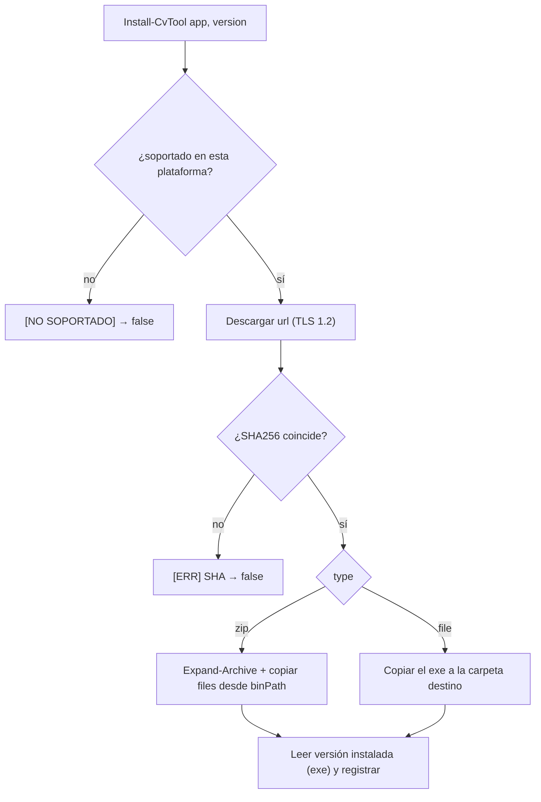

# Herramientas: versiones, plataforma y descargas

El conversor descarga y gestiona sus binarios (ffmpeg, aacgain) por sí mismo. Todo se describe en la sección `downloads` de `config.json` y lo maneja `lib\Tools.psm1`.

## Estructura en disco

```
tools/
├── ffmpeg/
│   ├── 8.1.2/x64/{ffmpeg,ffprobe,ffplay}.exe
│   ├── 7.1.1/x64/{ffmpeg,ffprobe,ffplay}.exe
│   └── 5.1.2/x64/{ffmpeg,ffprobe,ffplay}.exe
└── aacgain/
    └── 2.0.0/x64/aacgain.exe
```

Patrón: **`tools\<app>\<version>\<plataforma>\`**. Varias versiones conviven; cada job usa la suya.

- La carpeta la resuelve `Get-CvToolDir` (fuente única).
- La plataforma es la del **binario** que declara el descriptor (`Get-CvAppPlatform`), no la del proceso.

## Plataforma

Cada app declara en su descriptor la plataforma del archivo descargable:

```json
"platform": "x86_64"
```

- Se **normaliza** (`ConvertTo-CvPlatform`): cualquier etiqueta con `64` → `x64`; con `86`/`32`/`386` → `x86`.
- El SO se detecta con `[Environment]::Is64BitOperatingSystem`.
- **Soporte** (`Test-CvToolSupported`): un binario `x64` requiere SO de 64 bits; `x86` corre siempre. Si no hay build para la plataforma del equipo, se avisa **`[NO SOPORTADO]`** y no se instala/usa.

> Actualmente solo hay binarios de 64 bits (ffmpeg amd64, aacgain amd64). La estructura ya soporta `x86` para el futuro (haría falta añadir URLs/SHA de 32 bits en el config).

## Instalación (`Install-CvTool`)



Destino: `tools\<app>\<version>\<plataforma>` (calculado, ya no hay `dest` en el config).

### Validación de compatibilidad GPU (NVENC)

Tras instalar una versión de **ffmpeg** (y también desde la opción *Comprobar compatibilidad GPU* de `setup`) se hace una **validación funcional** de la codificación por GPU NVIDIA (`Test-CvNvenc`): se codifica un clip sintético mínimo con `hevc_nvenc` (y si falla, `h264_nvenc`), y se da un veredicto claro:

```
[GPU] - COMPATIBLE: la codificacion por GPU (NVENC) funciona (hevc_nvenc).
```
o, si falla, con la(s) línea(s) de causa extraídas del propio ffmpeg (ignorando el ruido de terminación):

```
[GPU] - NO COMPATIBLE: ... no funciona con ffmpeg 8.1.2 en este equipo.
[GPU] -   Causa:
[GPU] -     Driver does not support the required nvenc API version. Required: 13.1 Found: 13.0
[GPU] -     The minimum required Nvidia driver for nvenc is 610.00 or newer
[GPU] -   Solucion: perfil CPU (libx264/libx265), otra version de ffmpeg o actualizar el driver NVIDIA.
```

Detecta de antemano el caso típico de una versión de ffmpeg demasiado nueva para el driver (ffmpeg 8.x exige NVENC 13.1; si el equipo solo llega a 13.0, la GPU falla). Es solo un aviso: la instalación se completa igualmente.

## Versión por job y autoinstalación

- En **PREPARAR**, el job congela `ffmpegVersion` (y `aacgainVersion` si aplica) = la `selected` de config en ese momento.
- En el **WORKER**, antes de codificar se llama a `Confirm-CvTool` con la versión del job: si no está instalada, **la descarga sola**; luego `New-CvToolContext` apunta las herramientas a esa versión.
- Distintos jobs pueden usar distintas versiones sin conflicto.

Ver [jobs.md](jobs.md).

## `setup.ps1` / `setup.cmd`

Utilidad de gestión. Se lanza con `setup.cmd` (o `powershell -ExecutionPolicy Bypass -File setup.ps1`). Su sesión también queda registrada en `logs\setup_<fecha>_<PID>.log` (mismo interruptor `behavior.log` / marcador `no_log`).

El menú está **agrupado por bloques** (Instalación / Estado / Compatibilidad / Configuración / Limpieza):

| Bloque · Opción | Qué hace |
|---|---|
| **Instalación** · Instalar / cambiar versión de \<app\> | Elige versión (selector ordenado de más nueva a más antigua), borra esa carpeta de versión y la (re)instala; ofrece fijarla como `selected`. Al instalar ffmpeg, valida NVENC (ver abajo). |
| **Instalación** · Reinstalar TODO | Reinstala la versión por defecto de cada app. |
| **Estado** · Ver estado | Muestra (bajo demanda) el checklist de directorios y las versiones instaladas por app/plataforma (o `[NO SOPORTADO]`). |
| **Compatibilidad** · Comprobar compatibilidad GPU (NVENC) | Prueba NVENC en las versiones de ffmpeg instaladas, sin reinstalar. |
| **Configuración** · Editar configuración | Editor navegable de todas las secciones de `config.json`. |
| **Configuración** · Restablecer config.json | Vuelve a los valores por defecto (conserva el catálogo `downloads`; copia en `config.json.bak`). |
| **Limpieza** · Limpiar jobs / bloqueos (Proceso) | Borra `*.job.json`, `*.lock` o temporales (con confirmación). |
| **Limpieza** · Limpiar logs | Borra los `*.log` de `logs\` (excepto el de la sesión actual). |
| Salir | — |

> El estado ya no se imprime en cada vuelta al menú; se ve con la opción **Ver estado**.

### Editor de configuración

Recorre el árbol de `config.json`:
- **Escalares**: edición por tipo, con selectores especiales para colores (`background`/`foreground`), método de volumen (`method`) y booleanos.
- **Listas** (idiomas): añadir / eliminar / editar elementos.
- **Objetos**: se navegan hacia dentro.

El guardado usa un serializador propio que **conserva valores, tipos, arrays y formato** (4 espacios, CRLF), y normaliza a array los campos que deben serlo (PS 5.1 desenvuelve los arrays de 1 elemento al leer el JSON).

### Navegación

Al saltar de menú a menú se **limpia la pantalla**; tras cualquier acción que muestre información relevante (instalación, borrado, guardado) se hace una **pausa** antes de limpiar.

## Añadir una versión nueva

En `config.json`, dentro de `downloads.<app>.versions`, añade `"<version>": "<sha256>"`. Si sigue el patrón de la `url` (con `{version}`), ya se puede instalar desde `setup` o se autoinstala si un job la pide.
