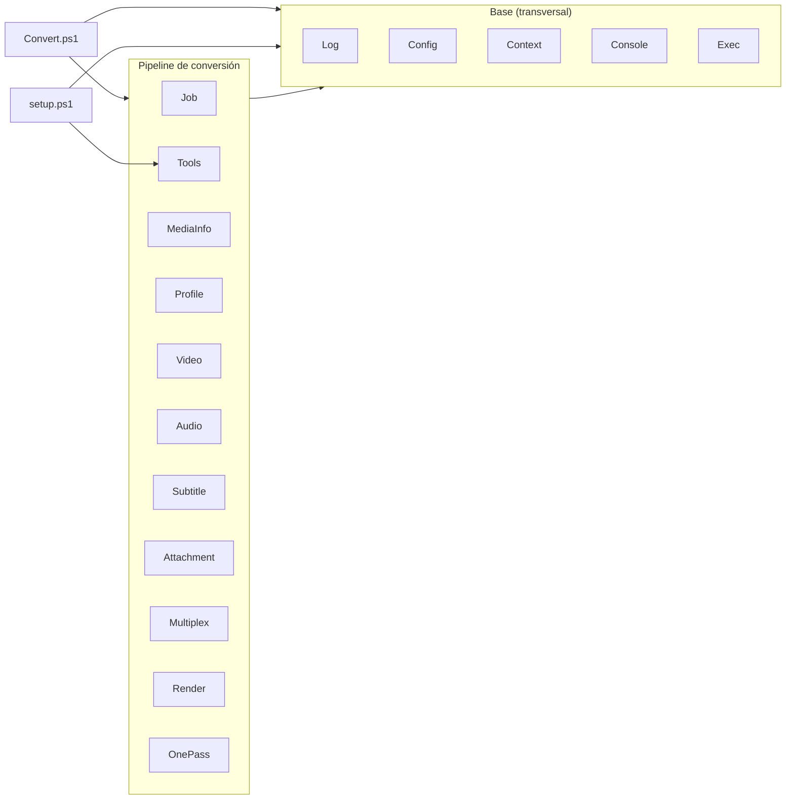

# Arquitectura

## Estructura de ficheros

```
ConvertVideo/
├── Convert.cmd                 Lanzador del conversor (ExecutionPolicy Bypass + UTF-8)
├── setup.cmd               Lanzador de la utilidad de gestión
├── Convert.ps1        Orquestador: clasificar / preparar / worker
├── setup.ps1               Utilidad: herramientas + editor de config + limpieza
├── FixSyncSub.ps1          Utilidad aparte: corregir/re-sincronizar subtítulos .srt (usa lib\SubtitleSRT.psm1)
├── *.cmd                   Lanzadores por doble clic (Bypass): Convert.cmd / setup.cmd / FixSyncSub.cmd (arrastrar y soltar) + Convert-Debug.cmd / setup-Debug.cmd (cargan config.debug.json)
├── config.json             Toda la configuración (se carga al arrancar)
├── config.debug.json       Config alterna para los lanzadores -Debug (-Config)
├── lib/
│   ├── Log.psm1            Log de consola (Write-CvLog) y transcript a logs\
│   ├── Config.psm1         Valores por defecto de config.json + carga/fusión/reset
│   ├── ConfigEditor.psm1   Editor interactivo de config.json (solo lo usa setup.ps1)
│   ├── Context.psm1        Contexto de ejecución ($ctx) + helpers (idiomas, números, tiempo, listado de ficheros)
│   ├── Console.psm1        Apariencia de consola, ventana nativa, menús y prompts
│   ├── Exec.psm1           Ejecución de procesos externos (ffmpeg/ffprobe…)
│   ├── Job.psm1            Cola: jobs JSON, lock atómico, temporales, ruta de salida
│   ├── Tools.psm1          Apps/versiones/descargas (ffmpeg, aacgain, sevenzip, mkvtoolnix)
│   ├── MediaInfo.psm1      ffprobe (JSON), selección de pista, resumen
│   ├── Profile.psm1        Perfiles de codificación + menú
│   ├── Video.psm1          Detección de bordes, preview, args y codificación de vídeo
│   ├── Audio.psm1          Selección de pista, sincronía, volumen y codificación de audio
│   ├── Subtitle.psm1       Selección de subtítulos por idioma (pistas de un vídeo)
│   ├── SubtitleSRT.psm1    Ficheros .srt externos: codificación, OCR y re-sincronización (lo usa FixSyncSub.ps1)
│   ├── Attachment.psm1     Selección de adjuntos (fuentes/carátulas) a conservar
│   ├── Multiplex.psm1      Unión final de pistas a MKV
│   ├── Render.psm1         Spec de render (job → decisiones: vídeo/audio/subs/adjuntos/códecs)
│   └── OnePass.psm1        🧪 BETA: ejecución en una sola pasada de ffmpeg
├── Original/               Entrada: vídeos a convertir
├── Proceso/                Trabajo: .job.json, .lock y temporales (.mkv/.m4a/.wav)
├── Convertido/             Salida: <nombre>_fix.mkv
├── tools/<app>/<ver>/<plat>/   Ejecutables (ffmpeg/ffprobe/ffplay, aacgain)
├── logs/                   Transcript de cada ejecución (fecha + PID)
├── docs/                   Esta documentación
└── .github/workflows/      CI: release.yml (empaqueta y publica al pushear un tag v*)
```

Las carpetas de trabajo (`Original`, `Proceso`, `Convertido`, `logs`) se pueden reubicar en `config.json` (sección `paths`); ver [ref-configuracion.md](ref-configuracion.md).

Las carpetas de trabajo (`Original`, `Proceso`, `Convertido`, `tools`) se crean automáticamente si faltan.

## Módulos (`lib\`)

Todos son módulos de PowerShell 5.1 (`.psm1`) que exportan sus funciones (`Export-ModuleMember -Function *`). `Convert.ps1` los importa en orden:

```powershell
$modules = @('Log','Config','Context','Console','Exec','Job','Tools','MediaInfo','Profile','Video','Audio','Subtitle','SubtitleSRT','Attachment','Multiplex','Render','OnePass')
foreach ($m in $modules) {
    Import-Module (Join-Path $Lib ("{0}.psm1" -f $m)) -Force
}
```

(`setup.ps1` usa el mismo patrón con un subconjunto: `@('Log','Config','Context','Console','Exec','Job','Tools','Profile','ConfigEditor')` — `Job` solo por `Get-CvProcesoPatterns` para la limpieza de `Proceso\`, `ConfigEditor` por el editor de `config.json`, y `Profile` porque el editor lista opciones desde sus catálogos (`Get-CvEditorOptions`). `FixSyncSub.ps1` importa la lista completa **más `SubtitleSRT`**.)

Los módulos se llaman entre sí (p. ej. `New-CvContext` de Context usa `Get-CvConfig` de Config y `New-CvToolContext` de Tools; `Install-CvTool` de Tools usa `Write-CvLog` de Log, `Invoke-ToolCapture` de Exec y `Select-FromList` de Console). Como todos se importan en la misma sesión, la resolución de comandos entre módulos funciona.

Capas y dependencias (a grandes rasgos: los orquestadores usan el pipeline y la base; el pipeline se apoya en la base):



- **Base**: `Log`, `Config`, `Context`, `Console`, `Exec` — sin dependencias del pipeline; los usa todo.
- **Pipeline**: `Job`, `Tools`, `MediaInfo`, `Profile`, `Video`, `Audio`, `Subtitle`, `SubtitleSRT`, `Attachment`, `Multiplex`, `Render`, `OnePass` — la lógica de conversión; se apoyan en la base (y en `MediaInfo`/`Exec` para leer/lanzar ffmpeg).
- **Orquestadores**: `Convert.ps1` (todo el pipeline) y `setup.ps1` (base + `Tools`).

| Módulo | Responsabilidad |
|---|---|
| **Log** | `Write-CvLog` (log de consola; avisos/errores como *badge* con extremos de medio bloque `▐ … ▌`: `[ERR]` en rojo, `[AVISO]`/`[WARN]`/`[NO SOPORTADO]` en amarillo, con el último carácter sin fondo para no "estirar" el color al redimensionar; el badge lo pinta el helper reutilizable `Write-CvBadge`, usado también por los menús —p. ej. el marcador `NO SOPORTADO`—), `Get-CvMark` (marca de estado `✓`/`×`, U+2713/U+00D7 — la cruz usa el signo × de Latin-1 porque algunas fuentes pintan el check Dingbats pero no la cruz U+2717) y `Set-CvMarkStyle` (modo ASCII vía `console.asciiMarks`), `Start-CvStep`/`Stop-CvStep`/`Write-CvInfoStep` (líneas de paso del worker: `- acción... ✓` en normal, log detallado en debug), `Start-CvLog`/`Stop-CvLog` (transcript a `logs\`), `Get-CvLogFiles`/`Remove-CvLogFiles`, `Save-CvToolError`/`Show-CvToolError` (vuelcan el `stderr` de ffmpeg —capturado en modo progreso vía `$global:CvLastToolError`— a `logs\error_*.log` y muestran las últimas líneas cuando falla). |
| **Config** | `Get-CvConfigDefaults` (fuente única de defaults), `Get-CvDefaultDownmixCoeffs` (fuente única de los coeficientes del downmix `dialogue`), **catálogos de dominio de config** (fuente única de los valores válidos de cada opción "enum", que consumen la validación de `New-CvContext` y el editor de setup): `Get-CvVolumeMethods`, `Get-CvTonemapCurves`, `Get-CvOutputContainers`, `Get-CvTonemapHdrModes`, `Get-CvAnamorphicModes`, `Get-CvQualityCheckModes`, `Get-CvMaxCodecOptions`, `Get-CvNvencTiers`; `Get-CvConfig` (carga + fusión; `-Path` para un config alterno), `Get-CvConfigHelp`/`Get-CvHelpFor` (catálogo de ayuda por opción `ruta/clave → descripción`, que muestra el editor de setup), `ConvertTo-CvPromptTimeouts` (normaliza `behavior.promptTimeout` a mapa por tipo), `Resolve-CvConfigPathArg` (resuelve el argumento `-Config` de Convert/setup), `Update-CvConfigEdits` (guardar solo diffs), `Reset-CvConfig`, serialización (`ConvertTo-CvJson`, `Read/Save-CvConfigFile`). |
| **Context** | `New-CvContext` (`$ctx`; `-ConfigPath` para `-Config`), `Start-CvSession` (arranque común de Convert/setup: config→contexto→marcas→log→apariencia→cabecera; devuelve `@{Context;ConfigPath;LogFile}`), `Get-CvVersion`/`Get-CvAppName` (fuente única de versión y nombre del proyecto → `$ctx.Version`/`$ctx.AppName`), `Get-CvWorkDirs`, `Test-CvLanguage` + `Get-CvLangCanon` (canonicaliza variantes de idioma: `es`≡`spa`≡`castellano`…), `Get-CvSafeStart` (ajusta el inicio de scan/preview a la duración real), `ConvertTo-InvDouble`, `Get-CvTimeParts` (descompone segundos → `{H;M;S;MS}`, base común de `Format-CvEta`/`ConvertTo-CvSrtStamp`), `Get-CvFiles` (lista ficheros por filtro/patrón, `-Recurse`/`-Exact`; fuente única del listado — clasificación de `Original\`, limpieza de `Proceso\`, selector de `.srt`). |
| **Console** | Cabecera (`Show-CvHeader`), apariencia (`Set-CvAppearance`…), separadores de sección `Get-CvLine -Char <c>` (base, carácter arbitrario) y sus atajos `Get-CvSepLine`(`=`)/`Get-CvDashLine`(`-`)/`Get-CvStarLine`(`*`) —todos con `-Width` opcional; el ancho por defecto lo fija `Set-CvSepWidth` desde `console.sepWidth` al arrancar—, ventana nativa (`Set-CvCloseButton`, `Initialize-CvNative`), menús (`Show-Menu` con separadores `----`, `Show-CvBox` con cuadro para avisos, `Select-FromList` — motor único de listas numeradas: opciones cadena o `@{ Value; Text; Position }`, marca del valor por defecto y alineación de descripciones; `Get-CvMenuNumWidth` — fuente única de la anchura del índice, para alinear a la derecha los números de 1 y 2+ cifras en TODOS los listados numerados: `Select-FromList`, el menú de perfiles `Select-Profile` y el de recortes de bordes), `Write-CvOptionUnsupported` (aviso estándar reutilizable —badge `[AVISO]`— cuando la opción elegida no vale en este equipo, p. ej. un encoder GPU no soportado), prompts con soporte de `ESC` y **timeout de inactividad** (`Read-CvLine` con `-TimeoutSec`/`-TimeoutDefault`; `Read-CvInt` = entero con re-pregunta; `Get-CvPromptTimeout` resuelve el timeout por tipo de pregunta desde `behavior.promptTimeout`; `Read-CvMenuLine` aplica ese timeout a los menús de selección con bucle propio; y los demás `Read-*`), `ConvertFrom-CvPlayCommand` (parser común de `P N [seg]`/`A N [seg]` de los menús de pistas). |
| **Exec** | `Invoke-ToolCapture`, `Invoke-ToolShow` (ventana de codificación aparte minimizada **sin** robar el foco vía el helper nativo `CvProc`/`CreateProcess`+`SW_SHOWMINNOACTIVE`; en cambio la **preview** ffplay **sí** se trae al primer plano con foco vía `CvWin::ToForeground`, para poder cerrarla con `q`/ESC), `Invoke-ToolProgress` (ffmpeg **inline** con línea viva de **% + ETA** leyendo `-progress`; `behavior.progress`) + `Format-CvEta` + `Write-CvProgressLine` (reescribe la línea en el sitio, cursor tras el texto), `Invoke-CvPreview` (núcleo común de las previews ffplay: inicio de `preview.start`/`P N <seg>` y duración de `preview.seconds` —por defecto `0`/`0` = desde el principio y **sin límite**, `-autoexit`; el usuario cierra con `q`/ESC. `-Start`/`-Seconds` = override opcional por-llamada, `-1` = usar la config), `ConvertTo-ArgString`, `Write-CvDebug`. |
| **Job** | Jobs (`*-CvJob`), lock (`Enter/Exit-Lock`), temporales (`Get-CvTempPaths`, `Remove-CvTemps`), patrones glob de `Proceso\` por categoría (`Get-CvProcesoPatterns` — fuente única de las convenciones de nombres; la usa setup para limpiar), salida (`Get-OutputPath`). |
| **Tools** | Descargas y versiones: `Install-CvTool`, `Confirm-CvTool`, `Select-CvToolVersion`, `Get-CvToolDir`, `Test-CvToolInstalled`, `Get-CvInstalledVersions`, `Test-CvToolSupported`, `New-CvToolContext`, `Test-CvTools`. Compatibilidad de codificación por GPU: `Test-CvNvenc`/`Write-CvNvencReport` (si la *versión de ffmpeg* soporta NVENC, en `setup`) y, más preciso, `Get-CvGpuEncoders` (fuente única de los encoders NVENC) + `Test-CvGpuEncoder`/`Test-CvEncoderSupported` (si ESTA GPU soporta un encoder concreto —p. ej. `av1_nvenc` requiere RTX 40+—; usado por los menús de perfil para avisar y no dejar fallar a ffmpeg). Detección al arrancar `Initialize-CvGpuCaps` (`Get-CvGpuName` vía `Win32_VideoController`) con **caché en `config.json`** (`Read/Save-CvGpuCache`, nodo `gpuCache`) clavada por versión de ffmpeg + GPU: solo re-sondea si cambia alguno. |
| **MediaInfo** | `Get-MediaInfo` (ffprobe JSON), `Select-AudioStream`/`Get-AudioStreams`, `Get-VideoStream`/`Get-VideoStreams` (excluye carátulas `attached_pic`/mjpeg…), posiciones para ffplay (`Get-VideoStreamPos`/`Get-SubtitleStreamPos`), `Get-MediaDuration`/`Get-DurationText`, `Write-ConversionSummary`. |
| **Profile** | `Get-CvProfiles` (los perfiles de serie, por grupos; ver [ref-perfiles.md](ref-perfiles.md)), catálogos del builder custom / del editor (`Get-CvVideoEncoders`, `Get-CvVideoSizes`, `Get-CvCodecOptions`, `Get-CvAudioCodecs`, `Get-CvAudioEncoders`, `Get-CvAudioBitrates`, `Get-CvNvencMultipass`, `Get-CvAudioChannels`, `Get-CvDownmixModes`, `Get-CvDetectBorderModes`, y `Get-CvVideoProfileOptions`/`Get-CvVideoLevelOptions` que unen los perfiles/levels de `Get-CvCodecOptions`), `ConvertTo-CvProfile`/`ConvertTo-CvDownmixCoeffs`/`Format-CvProfileLabel` (perfiles propios de `config.json`), `Select-Profile` (`-Extra`, opciones `0`=custom / `A`=auto), `New-CustomProfile`, y el **perfil Auto** (`Get-CvAutoEncoderPriority`/`Get-CvCodecRank`/`Resolve-CvAutoEncoder`/`New-CvAutoProfile`: elige el mejor encoder soportado con los filtros `encode.video.auto.gpuOnly`/`encode.video.auto.maxCodec`). |
| **Video** | `Find-CropDetect` + `Find-CropDetectSamples` (bordes en varios puntos, agrupados por votos), `Show-Preview`/`Show-VideoPreview`, `Select-VideoInteractive` (menú con reproducción cuando hay 2+ pistas de vídeo), `Invoke-VideoAsk`, `Get-CvVideoFilterChain` (cadena crop→scale→tonemap, pura), `Get-VideoArgs`, `Get-CvVideoRunArgs` (comando de vídeo completo, **puro**, golden-testeable), `Invoke-VideoRun` (lo ejecuta; mapea `0:<index>` del job), y el **control de calidad** (`Get-CvQualityLavfi`/`Get-CvQualityScore`/`Measure-CvQuality`: SSIM/VMAF de la salida vs origen, `encode.video.qualityCheck`). |
| **Audio** | `Invoke-AudioAsk`, `Select-AudioInteractive` (2+ pistas preferidas, con reproducción) / `Select-AudioFallback` (sin idioma preferido: elegir pista + idioma), `Show-AudioPreview` (ffplay `-ast`), sincronía A/V (`Get-AudioInitDelay` = audio empieza tarde; `Get-CvStreamEndPts`/`Resolve-CvAudioAhead` = audio adelantado —acaba antes que el vídeo—; `Show-CvSyncPreview` = preview A/B original vs corregido, reproduciendo la fuente directa con ffplay —sin recodificar y sin límite de tiempo— y aplicando el retardo con `adelay`), `Get-MaxVolume`, `Get-CvChannelLayout`, y las piezas **puras** compartidas con la una-pasada: `Resolve-CvAudioTrackPlan` (canales/downmix por pista), `Get-CvAdelayFilter`/`Get-CvDownmixPan`/`Get-CvLoudnormFilter`, `Get-CvAudioFilterChain` (orden del filtro), `Get-CvAudioEncodeArgs` (comando de encode, golden-testeable), `Invoke-AudioRun` (lo ejecuta; mide `peak`/`aacgain`, WAV clásico). |
| **Subtitle** | `Select-Subtitles` (auto: conserva todos los del idioma, forzados+completos), `Split-CvSubtitlesByRole` (clasifica forzado/completo por flag o por tamaño de cues), `Select-SubtitlesKeep` (fallback: elegir cuáles conservar si ninguno es del idioma) / `Show-SubtitlePreview` (ffplay `-sst`) / `Show-SubtitleContent` (extrae a `.srt` y abre en el editor), `ConvertTo-SubSel` (`-Forced`/`-Default` override), `Test-SubForced`/`Test-SubDefault`. |
| **SubtitleSRT** | Ficheros `.srt` **externos** (no pistas de un vídeo). **Lógica pura**: `Read-CvSrtText`/`Write-CvSrtText` (detecta codificación Windows-1252/UTF-8 → escribe UTF-8), `Get-CvSrtBlocks`/`Get-CvSrtBlockNum`/`Get-CvSrtCueStart` (parseo de cues), `ConvertTo-CvSrtSeconds`/`ConvertTo-CvSrtStamp` (tiempos), `Repair-CvSrtOcr` (OCR `l`→`I` en mayúsculas)/`Repair-CvSrtSpacing`, `Get-CvSrtLinearFit`/`Invoke-CvSrtResync` (re-sincronización lineal `t'=A·t+B`), `Find-CvSrtVideo` (localiza el vídeo que acompaña al `.srt`). **Interactivas** (para asistentes; usan Console/Log): `Select-CvSrtFile`, `Read-CvSrtAnchor`/`Read-CvSrtCueNum`/`Read-CvSrtTime` (re-preguntan sin abortar). La usa `FixSyncSub.ps1`. |
| **Attachment** | `Select-Attachments` (adjuntos a conservar según config: fuentes/carátulas/otros), `Get-AttachmentKind`. |
| **Multiplex** | `Get-CvMultiplexArgs` (comando de multiplexado, **puro**, sobre un *plan* con las piezas de I/O ya resueltas; golden-testeable) + `Invoke-Multiplex` (resuelve qué temporales existen, lo ejecuta y limpia las etiquetas con `mkvpropedit`; ver [ref-comandos.md](ref-comandos.md#9-multiplexado-final-invoke-multiplex)). `Get-CvSubtitleMapArgs`/`Get-CvAttachmentMapArgs` (mapeo de subs/adjuntos, **fuente única** que reutiliza también OnePass), `Resolve-CvMuxInputIndex`. |
| **Render** | `Resolve-CvRenderSpec` (job → *spec* de decisiones de codificación en un solo sitio: rama de vídeo; pistas de audio con canales/downmix/sync/idioma/título/default/samplerate/bitrate ya resueltos; subtítulos; adjuntos; códecs; salida). PURO (salvo la sonda de adjuntos). Los emisores (`Get-CvOnePassArgs`, y el worker por etapas) parten de este spec. |
| **OnePass** | 🧪 BETA. Ejecución en UNA sola pasada de ffmpeg: `Test-CvOnePassEligible` (decide si el job puede fundirse en un comando —`loudnorm` o `peak`, no `aacgain`—, con el motivo si no), `Get-CvOnePassArgs` (constructor **puro** del comando **sobre `Resolve-CvRenderSpec`**: un `-i` + `-filter_complex` con la rama de vídeo `crop→scale` y una rama por pista de audio `adelay→downmix→volumen`, más el mapeo de subtítulos/adjuntos/capítulos del original vía `Get-CvSubtitleMapArgs`/`Get-CvAttachmentMapArgs`; admite `-VolumeFilters` por pista para `peak`) e `Invoke-CvOnePass` (mide `peak` si aplica, ejecuta con progreso en vivo y limpia etiquetas). El worker lo usa cuando es elegible (activador `test.betaOnePass`); si no, cae al pipeline por etapas. |
| **ConfigEditor** | Editor interactivo de `config.json` (solo `setup.ps1`): `Edit-CvConfigFile` (punto de entrada; edita el config fusionado y al guardar aplica solo los diffs vía `Update-CvConfigEdits`), `Edit-Node` (navega el árbol), `Edit-Scalar` (edita un escalar: menú si la clave es enum, si no valor libre), `Edit-Array` (listas), y `Get-CvEditorOptions` (mapea cada clave a su catálogo de opciones —de Config/Profile— para listar en menú en vez de teclear; `null` = valor libre). No define valores propios: reutiliza los catálogos centrales. |

## El contexto (`$ctx`)

`New-CvContext -Root <dir>` lee `config.json` y devuelve un `[pscustomobject]` que se pasa a casi todas las funciones. Campos principales:

| Campo | Origen | Uso |
|---|---|---|
| `Root`, `Original`, `Proceso`, `Convertido`, `Tools`, `Logs` | rutas | Carpetas de trabajo. |
| `Log` | `config.behavior.log` | Si se genera el transcript en `logs\`. |
| `FFmpeg`, `FFprobe`, `FFplay`, `AacGain` | `New-CvToolContext` | Rutas a los ejecutables de la versión en uso. |
| `FFmpegVersion`, `AacGainVersion`, `Platform` | `downloads.*.selected` | Versiones y plataforma. |
| `Downloads` | `config.downloads` | Catálogo de apps/versiones. |
| `VolumeMethod`, `LoudnormI/TP/LRA` | `config.encode.audio.volume` | Normalización de volumen. |
| `Threads`, `Fps`, `DefaultAudioHz`, `OutExt` | `config.encode` (`.threads`, `.video.fps`, `.audio.hz`, `.outputExtension`) | Parámetros de codificación. |
| `BorderStart`, `BorderDur` | `config.encode.video.border` | Muestreo de detección de bordes. |
| `AudioLangs`, `SubLangs` | `config.languages` | Idiomas preferidos. |
| `CleanTemps`, `SeparateWindow`, `LockClose`, `Workers`, `PromptTimeouts`, `Progress` | `config.behavior` + marcadores | Comportamiento (`Workers` = nº de workers en paralelo por defecto; `PromptTimeouts` = mapa de timeouts de auto-aceptar por tipo de pregunta; `Progress` = progreso inline % + ETA). |
| `Debug`, `DebugPausePerCommand` | `config.debug` + marcador `debug_on` | `Debug` = log detallado y codificación en la principal; `DebugPausePerCommand` = pedir ENTER antes de cada comando de ffmpeg en debug (lo usa `Exec`). |
| `DownmixMode`, `DownmixCoeffs`, `AudioChannels`, `TonemapHdr` | `config.encode` | Salida de audio (downmix/canales) y tone-mapping HDR→SDR. |
| `SyncAdelay` | `config.encode.audio.syncAdelay` | Silencio de sincronía con `adelay` (1 pasada) vs WAV clásico. |
| `BetaDownmix`, `BetaOnePass` | `config.test` | Interruptores BETA (downmix `dialogue` con voz reforzada; ejecución en una sola pasada). |
| `StripTags`, `MkvPropEdit`, `Attachments` | `config.postprocess` | Limpieza de etiquetas (`mkvpropedit`) y conservación de adjuntos del MKV final. |
| `Console*`, `Window*`, `SepWidth` | `config.console` | Apariencia (`SepWidth` = ancho de los separadores `===`/`---`). |
| `Extensions` | fijo | `*.avi *.flv *.mp4 *.mov *.mkv`. |

En el **worker**, cada job se ejecuta con un contexto clonado (`New-CvToolContext`) que apunta las herramientas a la versión congelada en ese job — ver [ref-jobs.md](ref-jobs.md).

## Fuentes únicas de verdad

Para evitar duplicación, ciertos datos viven en una sola función:

| Concepto | Función |
|---|---|
| Carpetas de trabajo | `Get-CvWorkDirs` |
| Descriptor de una app del catálogo | `Get-CvAppDescriptor` |
| Rutas y nombres de los ejecutables | `New-CvToolContext` |
| Carpeta `tools\<app>\<ver>\<plat>` | `Get-CvToolDir` |
| Plataforma normalizada del binario | `Get-CvAppPlatform` |
| Rutas de los ficheros temporales | `Get-CvTempPaths` |

## Marcadores (ficheros vacíos en la raíz)

Activan comportamientos sin editar `config.json`:

| Fichero | Efecto |
|---|---|
| `debug_on` | Modo debug (log detallado; pausa por comando según `debug.pausePerCommand`). |
| `keep_temp` | No borra los temporales de `Proceso`. |
| `same_window` | Codifica en la ventana principal (no en ventana aparte). |
| `no_log` | No genera el transcript en `logs\`. |
