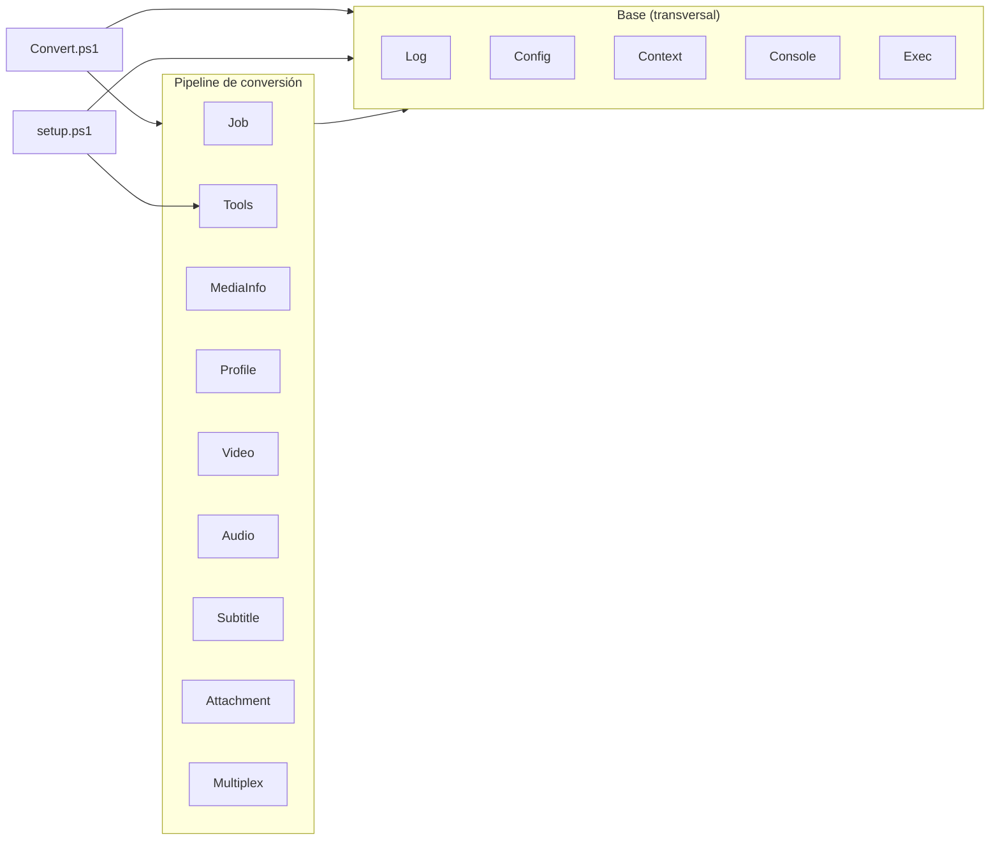

# Arquitectura

## Estructura de ficheros

```
ConversorVideoCMD/
├── Convert.cmd                 Lanzador del conversor (ExecutionPolicy Bypass + UTF-8)
├── setup.cmd               Lanzador de la utilidad de gestión
├── Convert.ps1        Orquestador: clasificar / preparar / worker
├── setup.ps1               Utilidad: herramientas + editor de config + limpieza
├── config.json             Toda la configuración (se carga al arrancar)
├── lib/
│   ├── Log.psm1            Log de consola (Write-CvLog) y transcript a logs\
│   ├── Config.psm1         Valores por defecto de config.json + carga/fusión/reset
│   ├── Context.psm1        Contexto de ejecución ($ctx) + helpers (idiomas, números)
│   ├── Console.psm1        Apariencia de consola, ventana nativa, menús y prompts
│   ├── Exec.psm1           Ejecución de procesos externos (ffmpeg/ffprobe…)
│   ├── Job.psm1            Cola: jobs JSON, lock atómico, temporales, ruta de salida
│   ├── Tools.psm1          Apps/versiones/descargas (ffmpeg, aacgain, sevenzip, mkvtoolnix)
│   ├── MediaInfo.psm1      ffprobe (JSON), selección de pista, resumen
│   ├── Profile.psm1        Perfiles de codificación + menú
│   ├── Video.psm1          Detección de bordes, preview, args y codificación de vídeo
│   ├── Audio.psm1          Selección de pista, sincronía, volumen y codificación de audio
│   ├── Subtitle.psm1       Selección de subtítulos por idioma
│   ├── Attachment.psm1     Selección de adjuntos (fuentes/carátulas) a conservar
│   └── Multiplex.psm1      Unión final de pistas a MKV
├── Original/               Entrada: vídeos a convertir
├── Proceso/                Trabajo: .job.json, .lock y temporales (.mkv/.m4a/.wav)
├── Convertido/             Salida: <nombre>_fix.mkv
├── tools/<app>/<ver>/<plat>/   Ejecutables (ffmpeg/ffprobe/ffplay, aacgain)
├── logs/                   Transcript de cada ejecución (fecha + PID)
├── docs/                   Esta documentación
└── .github/workflows/      CI: release.yml (empaqueta y publica al pushear un tag v*)
```

Las carpetas de trabajo (`Original`, `Proceso`, `Convertido`, `logs`) se pueden reubicar en `config.json` (sección `paths`); ver [ref-configuracion.md](ref-configuracion.md).

Las carpetas de trabajo (`Original`, `Proceso`, `Convertido`, `tools`) se crean automáticamente si faltan.

## Módulos (`lib\`)

Todos son módulos de PowerShell 5.1 (`.psm1`) que exportan sus funciones (`Export-ModuleMember -Function *`). `Convert.ps1` los importa en orden:

```powershell
$modules = @('Log','Config','Context','Console','Exec','Job','Tools','MediaInfo','Profile','Video','Audio','Subtitle','Attachment','Multiplex')
foreach ($m in $modules) {
    Import-Module (Join-Path $Lib ("{0}.psm1" -f $m)) -Force
}
```

(`setup.ps1` usa el mismo patrón con un subconjunto: `@('Log','Config','Context','Console','Exec','Tools')`.)

Los módulos se llaman entre sí (p. ej. `New-CvContext` de Context usa `Get-CvConfig` de Config y `New-CvToolContext` de Tools; `Install-CvTool` de Tools usa `Write-CvLog` de Log, `Invoke-ToolCapture` de Exec y `Select-FromList` de Console). Como todos se importan en la misma sesión, la resolución de comandos entre módulos funciona.

Capas y dependencias (a grandes rasgos: los orquestadores usan el pipeline y la base; el pipeline se apoya en la base):



- **Base**: `Log`, `Config`, `Context`, `Console`, `Exec` — sin dependencias del pipeline; los usa todo.
- **Pipeline**: `Job`, `Tools`, `MediaInfo`, `Profile`, `Video`, `Audio`, `Subtitle`, `Attachment`, `Multiplex` — la lógica de conversión; se apoyan en la base (y en `MediaInfo`/`Exec` para leer/lanzar ffmpeg).
- **Orquestadores**: `Convert.ps1` (todo el pipeline) y `setup.ps1` (base + `Tools`).

| Módulo | Responsabilidad |
|---|---|
| **Log** | `Write-CvLog` (log de consola; avisos/errores como *badge* con extremos de medio bloque `▐ … ▌`: `[ERR]` en rojo, `[AVISO]`/`[WARN]`/`[NO SOPORTADO]` en amarillo, con el último carácter sin fondo para no "estirar" el color al redimensionar), `Get-CvMark` (marca de estado `✓`/`✗`, U+2713/U+2717) y `Set-CvMarkStyle` (modo ASCII vía `behavior.asciiMarks`), `Start-CvStep`/`Stop-CvStep`/`Write-CvInfoStep` (líneas de paso del worker: `- acción... ✓` en normal, log detallado en debug), `Start-CvLog`/`Stop-CvLog` (transcript a `logs\`), `Get-CvLogFiles`/`Remove-CvLogFiles`. |
| **Config** | `Get-CvConfigDefaults` (fuente única de defaults), `Get-CvConfig` (carga + fusión; `-Path` para un config alterno), `Resolve-CvConfigPathArg` (resuelve el argumento `-Config` de Convert/setup), `Update-CvConfigEdits` (guardar solo diffs), `Reset-CvConfig`, serialización (`ConvertTo-CvJson`, `Read/Save-CvConfigFile`). |
| **Context** | `New-CvContext` (`$ctx`; `-ConfigPath` para `-Config`), `Get-CvWorkDirs`, `Test-CvLanguage` + `Get-CvLangCanon` (canonicaliza variantes de idioma: `es`≡`spa`≡`castellano`…), `Get-CvSafeStart` (ajusta el inicio de scan/preview a la duración real), `ConvertTo-InvDouble`. |
| **Console** | Cabecera (`Show-CvHeader`), apariencia (`Set-CvAppearance`…), ventana nativa (`Set-CvCloseButton`, `Initialize-CvNative`), menús (`Show-Menu` con separadores `----`, `Show-CvBox` con cuadro para avisos, `Select-FromList`, `Get-CvMenuLines`), prompts con soporte de `ESC` (`Read-CvLine`, `Read-*`), `ConvertFrom-CvPlayCommand` (parser común de `P N [seg]`/`A N [seg]` de los menús de pistas). |
| **Exec** | `Invoke-ToolCapture`, `Invoke-ToolShow` (ventana aparte minimizada sin robar el foco vía el helper nativo `CvProc`/`CreateProcess`+`SW_SHOWMINNOACTIVE`), `Invoke-CvPreview` (núcleo común de las previews ffplay: tramo + clamp + args de selección), `ConvertTo-ArgString`, `Write-CvDebug`. |
| **Job** | Jobs (`*-CvJob`), lock (`Enter/Exit-Lock`), temporales (`Get-CvTempPaths`, `Remove-CvTemps`), salida (`Get-OutputPath`). |
| **Tools** | Descargas y versiones: `Install-CvTool`, `Confirm-CvTool`, `Select-CvToolVersion`, `Get-CvToolDir`, `Test-CvToolInstalled`, `Get-CvInstalledVersions`, `Test-CvToolSupported`, `New-CvToolContext`, `Test-CvTools`. |
| **MediaInfo** | `Get-MediaInfo` (ffprobe JSON), `Select-AudioStream`/`Get-AudioStreams`, `Get-VideoStream`/`Get-VideoStreams` (excluye carátulas `attached_pic`/mjpeg…), posiciones para ffplay (`Get-VideoStreamPos`/`Get-SubtitleStreamPos`), `Get-MediaDuration`/`Get-DurationText`, `Write-ConversionSummary`. |
| **Profile** | `Get-CvProfiles` (los 7 de serie, por grupos), catálogos del builder custom (`Get-CvVideoEncoders`, `Get-CvVideoSizes`, `Get-CvCodecOptions`, `Get-CvAudioBitrates`), `ConvertTo-CvProfile`/`Format-CvProfileLabel` (perfiles propios de `config.json`), `Select-Profile` (`-Extra`), `New-CustomProfile`. |
| **Video** | `Find-CropDetect` + `Find-CropDetectSamples` (bordes en varios puntos, agrupados por votos), `Show-Preview`/`Show-VideoPreview`, `Select-VideoInteractive` (menú con reproducción cuando hay 2+ pistas de vídeo), `Invoke-VideoAsk`, `Get-VideoArgs`, `Invoke-VideoRun` (mapea `0:<index>` del job). |
| **Audio** | `Invoke-AudioAsk`, `Select-AudioInteractive` (2+ pistas preferidas, con reproducción) / `Select-AudioFallback` (sin idioma preferido: elegir pista + idioma), `Show-AudioPreview` (ffplay `-ast`), `Get-AudioInitDelay`, `Get-MaxVolume`, `Get-CvChannelLayout`, `Invoke-AudioRun`. |
| **Subtitle** | `Select-Subtitles` (auto: conserva todos los del idioma, forzados+completos), `Split-CvSubtitlesByRole` (clasifica forzado/completo por flag o por tamaño de cues), `Select-SubtitlesKeep` (fallback: elegir cuáles conservar si ninguno es del idioma) / `Show-SubtitlePreview` (ffplay `-sst`) / `Show-SubtitleContent` (extrae a `.srt` y abre en el editor), `ConvertTo-SubSel` (`-Forced`/`-Default` override), `Test-SubForced`/`Test-SubDefault`. |
| **Attachment** | `Select-Attachments` (adjuntos a conservar según config: fuentes/carátulas/otros), `Get-AttachmentKind`. |
| **Multiplex** | `Invoke-Multiplex` (une pistas, mapea los adjuntos elegidos, limpia los metadatos heredados y quita las etiquetas con `mkvpropedit`; ver [ref-comandos.md](ref-comandos.md#9-multiplexado-final-invoke-multiplex)). |

## El contexto (`$ctx`)

`New-CvContext -Root <dir>` lee `config.json` y devuelve un `[pscustomobject]` que se pasa a casi todas las funciones. Campos principales:

| Campo | Origen | Uso |
|---|---|---|
| `Root`, `Original`, `Proceso`, `Convertido`, `Tools`, `Logs` | rutas | Carpetas de trabajo. |
| `Log` | `config.behavior.log` | Si se genera el transcript en `logs\`. |
| `FFmpeg`, `FFprobe`, `FFplay`, `AacGain` | `New-CvToolContext` | Rutas a los ejecutables de la versión en uso. |
| `FFmpegVersion`, `AacGainVersion`, `Platform` | `downloads.*.selected` | Versiones y plataforma. |
| `Downloads` | `config.downloads` | Catálogo de apps/versiones. |
| `VolumeMethod`, `LoudnormI/TP/LRA` | `config.volume` | Normalización de volumen. |
| `Threads`, `Fps`, `DefaultAudioHz`, `OutExt` | `config.encode` | Parámetros de codificación. |
| `BorderStart`, `BorderDur` | `config.border` | Muestreo de detección de bordes. |
| `AudioLangs`, `SubLangs` | `config.languages` | Idiomas preferidos. |
| `Debug`, `CleanTemps`, `SeparateWindow`, `LockClose`, `Workers` | `config.behavior` + marcadores | Comportamiento (`Workers` = nº de workers en paralelo por defecto). |
| `StripTags`, `MkvPropEdit`, `Attachments` | `config.postprocess` | Limpieza de etiquetas (`mkvpropedit`) y conservación de adjuntos del MKV final. |
| `Console*`, `Window*` | `config.console` | Apariencia. |
| `Extensions` | fijo | `*.avi *.flv *.mp4 *.mov *.mkv`. |

En el **worker**, cada job se ejecuta con un contexto clonado (`New-CvToolContext`) que apunta las herramientas a la versión congelada en ese job — ver [ref-jobs.md](ref-jobs.md).

## Fuentes únicas de verdad

Para evitar duplicación, ciertos datos viven en una sola función:

| Concepto | Función |
|---|---|
| Carpetas de trabajo | `Get-CvWorkDirs` |
| Descriptor de una app del catálogo | `Get-CvAppDescriptor` |
| Rutas y nombres de los ejecutables | `New-CvToolContext` |
| Carpeta `tools\<app>\<ver>\<plat>` | `Get-CvToolDir` |
| Plataforma normalizada del binario | `Get-CvAppPlatform` |
| Rutas de los ficheros temporales | `Get-CvTempPaths` |

## Marcadores (ficheros vacíos en la raíz)

Activan comportamientos sin editar `config.json`:

| Fichero | Efecto |
|---|---|
| `debug_on` | Modo debug (muestra y confirma cada comando). |
| `keep_temp` | No borra los temporales de `Proceso`. |
| `same_window` | Codifica en la ventana principal (no en ventana aparte). |
| `no_log` | No genera el transcript en `logs\`. |
