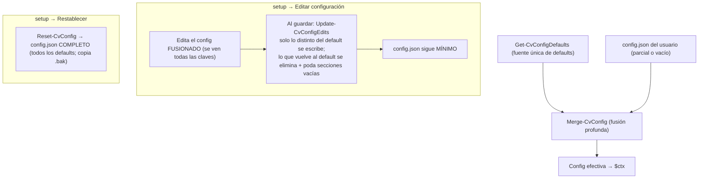

# Referencia de `config.json`

Se carga al arrancar (`Get-CvConfig`) y se **fusiona en profundidad** con los valores por defecto (`Get-CvConfigDefaults`, la fuente única): puedes tener un `config.json` parcial y se completan las claves que falten, sin romper al añadir opciones nuevas.

Por eso el `config.json` distribuido es **mínimo**: solo lleva lo que se **sobrescribe** respecto a los defaults (p. ej. la versión de ffmpeg, el idioma de audio o el tamaño de ventana). Todo lo demás —incluido el catálogo completo de `downloads` (`ffmpeg`, `aacgain`, `sevenzip`, `mkvtoolnix`) y la sección `postprocess`— sale de los defaults. Un `config.json` vacío (`{}`) también es válido.

La forma cómoda de editarlo es `setup.cmd` → **Editar configuración** (ver [ref-herramientas.md](ref-herramientas.md)), que carga el config **fusionado** (así ves y editas TODAS las opciones aunque el fichero sea mínimo) pero al guardar aplica **solo los valores que cambiaste** sobre el `config.json` actual, sin reescribir el resto: un fichero mínimo sigue mínimo (+ lo editado) y uno completo sigue completo. Para (re)generar un `config.json` **completo** con todos los valores por defecto, usa **Restablecer config.json**.

Carga (arranque) y edición (setup):



## Estructura

Esquema completo (tras la fusión con los defaults):

```json
{
  "downloads":   { "ffmpeg": {...}, "aacgain": {...}, "sevenzip": {...}, "mkvtoolnix": {...} },
  "languages":   { "audio": [...], "subtitle": [...] },
  "encode":      { "outputExtension": "mkv", "extensions": ["avi","flv","mp4","mov","mkv"], "threads": 0, "fps": "23.976", "forceFps": true, "multipass": "off", "tonemapHdr": "auto", "downmixMode": "default", "downmixCoeffs": { "center": 0.5, "front": 0.35, "surround": 0.15 }, "audioHz": 44100, "audioChannels": 2, "multiAudio": true, "audioKeepTitle": false },
  "customProfile": { "videoEncoder": "hevc_nvenc", "videoProfile": "main10", "videoLevel": "5.0", "qmin": 1, "qmax": 23, "crf": 21, "multipass": "off", "audioCodec": "aac", "audioBitrate": "192k" },
  "border":      { "start": 120, "duration": 120, "samples": 9, "autoAcceptPct": 60, "autoAcceptMinMargin": 2, "autoSamples": 3, "autoDuration": 5, "minCropPct": 2 },
  "volume":      { "method": "peak", "peakTarget": 0, "loudnorm": { "I": -16, "TP": -1.5, "LRA": 11 } },
  "preview":     { "start": 0, "seconds": 0 },
  "postprocess": { "stripTags": true, "mkvpropedit": "", "attachments": { "keep": false, "fonts": true, "covers": false, "other": false } },
  "behavior":    { "cleanTemps": true, "separateWindow": true, "lockCloseButton": true, "debug": false, "log": true, "workers": 2, "retries": 2, "asciiMarks": false, "progress": true, "promptTimeout": { "default": 0, "sync": 5, "border": 10, "animation": 10, "video": -1, "audio": -1, "subtitle": -1 } },
  "test":        { "enabled": false, "minutes": 5, "syncAdelay": false, "betaDownmix": false, "betaMultiAudio": false },
  "console":     { "background": "DarkBlue", "foreground": "Yellow", "font": "Cascadia Code", "fontSize": 18, "windowWidth": 150, "windowHeight": 40, "sepWidth": 64, "progressBarWidth": 20 },
  "paths":       { "original": "", "proceso": "", "convertido": "", "logs": "" },
  "profiles":    [ { "label": "...", "videoEncoder": "...", "crf": 18, ... } ]
}
```

## `downloads` — catálogo de herramientas

Una entrada por app. Ver el sistema completo en [ref-herramientas.md](ref-herramientas.md).

| Clave | Ejemplo | Significado |
|---|---|---|
| `selected` | `"8.1.2"` | Versión por defecto (la que usa PREPARAR y se congela en el job). |
| `type` | `"zip"` / `"7z"` / `"file"` | Paquete zip (se extrae), `.7z` (se extrae con `7zr`) o ejecutable directo. |
| `url` | `".../{version}/..."` | URL de descarga; `{version}` se sustituye. |
| `binPath` | `"ffmpeg-{version}-full_build/bin"` | Carpeta dentro del zip donde están los exe. |
| `files` | `["ffmpeg.exe","ffprobe.exe","ffplay.exe"]` | Ejecutables a copiar. |
| `platform` | `"x86_64"` | Plataforma del binario (`x86`/`x64`/`x86_64`, se normaliza). |
| `versionExe` / `versionArgs` / `versionRegex` | `"ffmpeg.exe"` / `["-version"]` / `"ffmpeg version (\\d+...)"` | Cómo leer la versión instalada. |
| `versions` | `{ "7.1.1": "<sha256>" }` | Versiones disponibles y su SHA256. |
| `dependsOn` | `["sevenzip"]` | (Opcional) Otras apps del catálogo que se aseguran **antes** de instalar esta. P. ej. `mkvtoolnix` necesita `sevenzip` (7zr) para extraer su `.7z`. |

## `languages`

| Clave | Ejemplo | Uso |
|---|---|---|
| `audio` | `["es"]` | Idiomas preferidos de audio. |
| `subtitle` | `["spa","es","castellano",...]` | Idiomas preferidos de subtítulos. |

Se **canonicalizan** las variantes (`Get-CvLangCanon`): `es`, `es-ES`, `es_es`, `spa`, `esp`, `castellano`, `spanish` cuentan como el mismo idioma, así que **basta un código** en la lista para reconocer cualquier variante (p. ej. `["es"]` ya reconoce una pista etiquetada `spa`). Lo mismo para `en`/`fr`/`de`/`it`/`pt`/`ja`/`zh`/`ko`/`ru`/`ca`/`gl`/`eu`. La comparación la hace `Test-CvLanguage`.

## `encode`

| Clave | Ejemplo | Uso |
|---|---|---|
| `outputExtension` | `"mkv"` | Extensión del contenedor de salida. |
| `extensions` | `["avi","flv","mp4","mov","mkv"]` | Extensiones de **entrada** que se procesan de `Original\` (sin punto; se tolera `.ext`/`*.ext`). Añade aquí `ts`, `webm`, `m4v`… si las necesitas. |
| `threads` | `0` | `-threads` de ffmpeg. **`0` = auto**: el encoder decide y, en la práctica, usa **todos los núcleos** de CPU. Pon un número `N` para limitarlo a N hilos. |
| `fps` | `"23.976"` | Fps de salida cuando `forceFps` está activo (`-r`). |
| `forceFps` | `true` | Si `true` (por defecto), fuerza la salida a `fps` con `-r` (reajusta dup/drop los vídeos de otro fps de origen). Si `false`, **se conserva el fps de cada archivo** (no se pasa `-r`) — recomendable si tus fuentes ya vienen a distintos fps y no quieres reajustarlas. |
| `multipass` | `"off"` | **2-pass de NVENC** (`-multipass`), solo `hevc_nvenc`/`h264_nvenc`: `"off"` (por defecto) · `"qres"` (1ª pasada a ¼ de resolución) · `"fullres"` (a resolución completa). Más calidad a costa de más tiempo de GPU. **No** afecta a los encoders de CPU (libx264/libx265 lo ignoran). Comprobado que `qres`/`fullres` funcionan en NVENC; `off` = comportamiento actual. Es el valor **global**; un perfil (custom o de `config.json`) puede **sobreescribirlo** con su propio `multipass`. |
| `tonemapHdr` | `"auto"` | **Tone-mapping HDR→SDR.** `"auto"` (por defecto) = si el origen es HDR (BT.2020 con PQ/HLG) lo convierte a **SDR BT.709** con `libplacebo` (GPU/Vulkan) para que no se vea lavado en SDR; `"off"` = nunca (deja el color como está). El material SDR no se toca. Detalle en [explica-tonemap-hdr.md](explica-tonemap-hdr.md). |
| `audioHz` | `44100` | Samplerate de audio por defecto. |
| `audioChannels` | `2` | Canales del audio **recodificado** (`-ac`), tratado como **máximo**: `2` = estéreo, `6` = 5.1, `8` = 7.1. Si la fuente tiene **más**, se hace **downmix**; si tiene **menos**, **no** se hace upmix (se conservan los del origen — p. ej. una fuente estéreo con `6` sale estéreo). (No afecta a `audioEncoder: copy`, que conserva la pista original.) Detalle en [explica-audio.md](explica-audio.md). |
| `downmixMode` | `"default"` | **Solo al bajar 5.1 → estéreo.** `"default"` = downmix estándar de ffmpeg. `"dialogue"` 🧪 **(BETA)** = downmix con **voz reforzada** (`pan` que sube el canal central —diálogos— y baja los surrounds), para que los diálogos no queden bajos frente al ambiente; coeficientes provisionales, el worker lo marca con `[beta]`. Detalle en [explica-audio.md](explica-audio.md). |
| `downmixCoeffs` | `{ center: 0.5, front: 0.35, surround: 0.15 }` | Pesos del downmix `dialogue` (voz reforzada): `center` = canal central (diálogos), `front` = frontales L/R, `surround` = surrounds (el LFE se descarta). Cada salida = `center·central + front·frontal + surround·surround`. **Clip-safe si suman ≤ 1,0** (los de serie suman 1,0); por encima puede recortar. Solo se usan con `downmixMode = "dialogue"`. |
| `multiAudio` | `true` | **🧪 BETA.** Con **2+ pistas del idioma preferido**, permite **conservar varias** (no solo la mejor) y elegir la **predeterminada**. **Doble llave**: solo actúa si además `test.betaMultiAudio = true`; si no, el audio es **monopista** (comportamiento clásico). Con 0-1 pistas del idioma preferido no cambia nada. Detalle en [explica-audio.md](explica-audio.md). |
| `audioKeepTitle` | `false` | Si `true`, la(s) pista(s) de audio de salida **conservan el título** del origen (útil para distinguir varias del mismo idioma). `false` (por defecto) = **título en blanco**. |

Sobre `threads` (uso de CPU):

- Por defecto (`0` = auto) **no hay límite**: ffmpeg reparte el trabajo entre todos los núcleos disponibles. Aplica a la codificación de vídeo, la de audio y el multiplexado.
- Con **NVENC** (`hevc_nvenc`/`h264_nvenc`) el peso está en la **GPU**; `threads` apenas influye (la CPU solo alimenta al encoder). Dejarlo en `0` es lo normal.
- Con encoders de **CPU** (`libx264`/`libx265`), `0` aprovecha toda la CPU. **Ojo si usas varios workers** (`behavior.workers` > 1): se lanzan varias codificaciones en paralelo y todas intentan usar todos los núcleos a la vez (se pisan, *oversubscription*, sin ganar velocidad). En ese caso, o baja `behavior.workers`, o limita `threads` (p. ej. ≈ núcleos ÷ workers). Con NVENC el límite real es el nº de sesiones simultáneas de la GPU, no la CPU.

## `customProfile`

Valores **por defecto** del constructor de perfil **custom** interactivo (opción `0` del menú *USAR PERFIL*). En cada menú, **ENTER acepta el valor por defecto** (o eliges otro). Cada opción se ignora si no aplica al codec elegido (p. ej. `videoProfile: main10` no existe para H.264, así que ahí el default cae a "ninguno").

| Clave | Ejemplo | Uso |
|---|---|---|
| `videoEncoder` | `"hevc_nvenc"` | Encoder preseleccionado: `libx264` / `h264_nvenc` / `libx265` / `hevc_nvenc` / `copy`. |
| `videoProfile` | `"main10"` | Perfil de codec por defecto (`main`/`main10` en H.265; `baseline`/`main`/`high`/`high10` en H.264). |
| `videoLevel` | `"5.0"` | Level por defecto (`4.0`, `4.1`, `5.0`, … según codec). |
| `qmin` / `qmax` | `1` / `23` | Control de tasa por defecto en NVENC (GPU). Acotados a 0–51; **`-1` (o negativo) = auto** (sin `-qmin`/`-qmax`, decide el encoder). |
| `crf` | `21` | Control de tasa por defecto en CPU (libx264/libx265). Acotado a 0–51; **`-1` = auto** (sin `-crf`, usa el CRF por defecto del encoder). |
| `multipass` | `"off"` | Valor por defecto del paso **2-pass NVENC** (`off`/`qres`/`fullres`) en el builder custom (solo aparece si el encoder es NVENC). |
| `audioCodec` | `"aac"` | Codec de audio de salida por defecto al recodificar: `aac`/`ac3`/`eac3`/`libmp3lame`/`flac`/`libopus`. Ver [explica-audio.md](explica-audio.md). |
| `audioBitrate` | `"192k"` | Bitrate de audio por defecto (`"copy"` = copiar la pista sin recodificar). |

Qué son CRF/QMIN/QMAX/QP, para qué sirven y cómo elegir valores: [explica-control-tasa.md](explica-control-tasa.md).

## `border`

Detección de bordes negros con `cropdetect` en varios puntos del vídeo. Cómo se reparten los puntos, se votan los recortes y se decide auto-aceptar o preguntar (con matriz de decisión) en [explica-deteccion-bordes.md](explica-deteccion-bordes.md).

| Clave | Ejemplo | Uso |
|---|---|---|
| `start` | `120` | Segundo donde empieza el muestreo de `cropdetect` (primer punto). Si el vídeo es más corto, se ajusta solo a ~10% de su duración. |
| `duration` | `120` | Segundos que escanea **cada** punto (no es un total: con `samples=9` son 9 escaneos de `duration` s cada uno). |
| `samples` | `9` | Nº de puntos repartidos del vídeo donde se escanean bordes (`1` = solo al inicio, clásico). Cuantos más puntos, más fiable la detección (p. ej. si los créditos iniciales o una escena oscura tienen distinto encuadre); cada punto mantiene su ventana de `duration` s, así que subir `samples` **aumenta el tiempo total** de análisis (N × `duration`). |
| `autoAcceptPct` | `60` | % de votos que debe alcanzar el recorte **más votado** (sobre los puntos que detectaron borde) para **aceptarse automáticamente**, descartando los atípicos (p. ej. una escena oscura con otro encuadre). Si el más votado llega a ese % **y** cumple `autoAcceptMinMargin`, se usa sin preguntar (preview + confirmar); si no, se muestra el menú de recortes por votos para elegir a mano. `100` = exigir unanimidad. Detalle y matriz de decisión: [explica-deteccion-bordes.md](explica-deteccion-bordes.md). |
| `autoAcceptMinMargin` | `2` | Margen mínimo de votos del más votado sobre el segundo para auto-aceptar (**además** del %). Evita auto-aceptar con evidencia débil cuando hay pocas muestras: `2/3` = 67% pero solo `+1` de margen → pregunta; `6/9` = 67% con `+3` → auto. `0` = solo cuenta el %. Detalle y matriz de decisión: [explica-deteccion-bordes.md](explica-deteccion-bordes.md). |
| `autoSamples` / `autoDuration` | `3` / `5` | Pre-escaneo del modo `DetectBorder: 'auto'` (más ligero que el normal): nº de puntos y segundos por punto. Nota: el escáner aplica un mínimo de **5 s/punto**, así que `autoDuration < 5` se trata como 5. |
| `minCropPct` | `2` | Reducción mínima (% de ancho o alto) para que el modo `auto` considere que **hay barras de verdad**; por debajo se toma como ruido de borde y **no** recorta (p. ej. un `3824` sobre `3832` = 0,2% → se ignora). |

## `preview`

Reproducción con ffplay en PREPARAR (previews de **pista de audio**, **pista de vídeo** y **bordes**). Independiente de `border` (que es el análisis de `cropdetect`).

| Clave | Def. | Uso |
|---|---|---|
| `start` | `0` | Segundo donde **empieza** la muestra. `0` = **desde el principio**. Si el vídeo es **más corto** que el valor, el inicio se ajusta solo a ~10% de su duración (no se queda fuera). |
| `seconds` | `0` | **Duración** (s) de la muestra. `0` = **sin límite**: reproduce hasta el final (o hasta que cierres con `q`/ESC). `> 0` = una muestra de esos segundos. |

> Por defecto (`0`/`0`) la preview reproduce **todo el vídeo desde el principio** y la cierra el usuario. Sube `seconds` si prefieres una muestra corta. En los menús de selección de pista se puede indicar un **segundo de inicio puntual**: `P N <seg>` (p. ej. `A 2 300` reproduce la pista 2 solo-audio desde el segundo 300).

## `volume`

| Clave | Valores | Uso |
|---|---|---|
| `method` | `peak` / `loudnorm` / `aacgain` | Método de normalización (ver "Audio" en [ref-comandos.md](ref-comandos.md)). |
| `peakTarget` | `0` | Pico objetivo (dBFS) del método `peak`: `0` = máximo sin recorte; `-1` deja margen (*headroom*) contra el clipping inter-sample del AAC. Solo amplifica (si el pico ya supera el objetivo, no atenúa). Se limita a ≤ 0. |
| `loudnorm.I` | ej. `-16` | Integrated loudness (LUFS) — solo `loudnorm`. |
| `loudnorm.TP` | ej. `-1.5` | True peak (dBTP). |
| `loudnorm.LRA` | ej. `11` | Loudness range (LU). |

## `postprocess`

Limpieza del MKV final tras multiplexar (ver "Tag DURATION y limpieza con mkvpropedit" en [ref-comandos.md](ref-comandos.md)).

| Clave | Def. | Uso |
|---|---|---|
| `stripTags` | `true` | Ejecuta `mkvpropedit <out> --tags all:` para quitar las etiquetas `DURATION` por pista que añade el muxer de ffmpeg (conservando Cues, duración y dispositions). |
| `mkvpropedit` | `""` | Ruta a `mkvpropedit.exe`. **Vacío** = usar la versión descargada en `tools\mkvtoolnix\<ver>\<plataforma>` (se auto-descarga la 1ª vez). Se puede fijar una ruta propia para usar otra instalación. |
| `attachments.keep` | `false` | Interruptor maestro: conservar adjuntos del original (fuentes, carátulas…). Por defecto **no** se conserva ninguno. |
| `attachments.fonts` | `true` | Si `keep`, permite las **fuentes** (`.ttf`/`.otf`, `font/*`) — útiles para subtítulos ASS/SSA. |
| `attachments.covers` | `false` | Si `keep`, permite las **carátulas/imágenes** (`image/*`, `cover*`…). |
| `attachments.other` | `false` | Si `keep`, permite el **resto** de adjuntos. |

## `behavior`

| Clave | Def. | Uso | Marcador equivalente |
|---|---|---|---|
| `cleanTemps` | `true` | Borra temporales al terminar cada archivo. | `keep_temp` (los conserva) |
| `separateWindow` | `true` | Codifica en ventana aparte minimizada **sin robar el foco** (`SW_SHOWMINNOACTIVE`). | `same_window` (todo en la principal) |
| `lockCloseButton` | `true` | Desactiva el botón X durante el proceso. | — |
| `debug` | `false` | Muestra y confirma cada comando; codifica en la principal. | `debug_on` |
| `log` | `true` | Guarda un transcript de la ejecución en `logs\` (un fichero por ventana: fecha + PID). | `no_log` (lo desactiva) |
| `workers` | `2` | Nº de workers en paralelo propuesto al terminar PREPARAR (esta ventana + N−1 nuevas). Es el valor por defecto del prompt; se puede cambiar en el momento (**0** = solo preparar y salir, sin codificar). | — |
| `retries` | `2` | Reintentos por archivo si su codificación falla, antes de abandonarlo. (Distinto de `workers`.) | — |
| `asciiMarks` | `false` | Usa marcas ASCII (`[OK]`/`[ERROR]`) y corchetes `[ ]` en los avisos, en vez de los símbolos `✓`/`✗` y el badge `▐ … ▌`. Útil si la consola/fuente no tiene esos glifos (se verían como cuadros). | — |
| `progress` | `true` | En los pasos largos (recodificar **vídeo**/**audio**) muestra una **línea viva con % y ETA** (`- Procesando Video...  42%  ETA 03:12  1.8x`) ejecutando ffmpeg **inline** (lee su `-progress`). `false` = clásico: ffmpeg en **ventana aparte** y solo `✓` al terminar. En modo debug no aplica. Convive con `separateWindow` (si `progress` está activo, esos pasos van inline; el multiplexado y las previews no cambian). | — |
| `promptTimeout` | *(objeto)* | **Auto-aceptar** el valor por defecto en las preguntas de PREPARAR (las simples —sync/bordes/animación— y los menús de selección de pista de vídeo/audio/subtítulos) si no tocas el teclado durante *N* segundos, para dejar la preparación desatendida. Contador de **inactividad**: cualquier tecla lo reinicia; si empiezas a escribir, no salta. Es un objeto (ver abajo). | — |

### `behavior.promptTimeout` — timeout granular por pregunta

El timeout es configurable **por tipo de pregunta**, con un genérico de reserva:

| Clave | Def. | Uso |
|---|---|---|
| `default` | `0` | Timeout **genérico** en segundos. `0` = desactivado. |
| `sync` | `5` | Pregunta de silencio de sincronía audio/vídeo. `-1` = hereda de `default`; `≥0` = valor propio (`0` = desactivado solo para esta). |
| `border` | `10` | Preguntas de detección de bordes: reintentar/confirmar recorte **y** las de nº de muestras / inicio / duración del escaneo. `-1` = hereda de `default`. |
| `animation` | `10` | Pregunta «¿es un vídeo de animación?». `-1` = hereda de `default`. |
| `video` | `-1` | Menú de selección de **pista de vídeo** (2+ pistas). Al expirar toma la preseleccionada (`*`). `-1` = hereda de `default` (por defecto `0` = off, para no auto-elegir pista sin querer). |
| `audio` | `-1` | Menús de selección de **pista de audio** (varias del idioma preferido, o fallback sin idioma). Al expirar toma la preseleccionada. `-1` = hereda de `default`. |
| `subtitle` | `-1` | Menú de **subtítulos fallback** (ninguno del idioma preferido). Al expirar **no conserva ninguno**. `-1` = hereda de `default`. |

Al expirar, si **no** has tecleado nada se aplica la respuesta por defecto (equivale a pulsar ENTER; se puede fijar otra en código con `-TimeoutDefault`); si tecleaste algo pero te quedaste parado, se respeta lo tecleado. El prompt avisa del timeout mostrando `[auto Ns]`. Para una pregunta/menú nuevo basta añadir su clave aquí y pasar su nombre a `Read-CvLine`/`Read-CvMenuLine` (vía `Get-CvPromptTimeout`). Solo actúa en consola interactiva real (en modo desatendido/tests con la entrada redirigida no aplica). Ejemplo: `"promptTimeout": { "default": 15, "sync": 5, "animation": 0 }` → 15 s general, 5 s en sync, animación sin timeout, bordes hereda 15 s.

Los marcadores son ficheros vacíos en la raíz del proyecto que fuerzan el comportamiento sin editar el JSON.

> **Editor de `setup.ps1`:** cada opción del editor de configuración (menú **Editar config.json**) muestra, junto a su valor actual, una **descripción de qué hace** (catálogo `Get-CvConfigHelp`), para no tener que consultar esta referencia mientras se edita.

## `test` — modo pruebas

Codifica solo un tramo del principio de cada archivo, para validar un perfil/ajuste **rápido** sin procesar el vídeo entero.

| Clave | Def. | Uso | Marcador equivalente |
|---|---|---|---|
| `enabled` | `false` | Activa el modo pruebas: codifica solo los **primeros `minutes` minutos** de cada archivo (el resto se descarta). Se avisa al arrancar y en el resumen (la salida es un **recorte**, no el archivo completo). Funciona con todos los perfiles, incluido `copy` (recorta también el vídeo copiado del original y los subtítulos/capítulos al mismo tramo). | `test_on` |
| `minutes` | `5` | Minutos que se codifican por archivo cuando `enabled` está activo (mínimo 1). | — |
| `syncAdelay` | `false` | **🧪 BETA.** Si `true`, el silencio de sincronía se aplica con el filtro `adelay` en **una sola pasada** (encadenado con la normalización de volumen), sin el WAV intermedio. `false` = método clásico (WAV `silencio + pista` y luego codificar). Ver [explica-audio.md](explica-audio.md). | — |
| `betaDownmix` | `false` | **🧪 BETA.** Activador del downmix `dialogue` (voz reforzada). **Doble llave**: `encode.downmixMode = "dialogue"` fija el modo, pero solo refuerza la voz si además `betaDownmix = true`. Con `false`, `dialogue` cae al downmix **estándar** de ffmpeg (el worker lo avisa). Ver [explica-audio.md](explica-audio.md). | — |
| `betaMultiAudio` | `false` | **🧪 BETA.** Activador de la **multipista de audio** (`encode.multiAudio`). **Doble llave**: `encode.multiAudio = true` habilita la función, pero solo actúa si `betaMultiAudio = true`. Con `false`, el audio es **monopista** (comportamiento clásico). Ver [explica-audio.md](explica-audio.md). | — |

Se aplica con `-t` en la codificación de vídeo, en la de audio (incluidos el wav de sincronía y la medición de pico) y en el multiplex final. `TestLimit` (segundos) en el contexto.

Con el modo activo, antes de procesar cada archivo se imprime un **resumen del origen** (`Write-SourceSummary`) con toda la info de sus pistas: vídeo (resolución/codec/fps), **todas** las de audio (codec/canales/idioma/título), **todas** las de subtítulo (tipo/idioma/forzado/default/nº de cues/título) y nº de capítulos.

En el **resumen de conversión** (al terminar), la duración es la del fichero **generado**; en modo pruebas se indica también la del origen entre paréntesis (`Duracion: 0:05:00 (origen 0:56:19)`), para que quede claro que la salida es un recorte. Las transiciones se muestran **`origen -> destino`** de forma coherente:

- **Tamaño**: siempre origen → destino con el % de ahorro.
- **Vídeo**: `codec origen -> codec destino`; la **resolución** solo aparece a ambos lados cuando cambia por un resize (si no cambia, una sola vez), p. ej. `h264 1920x1080 -> hevc 1920x800`.
- **Audio**: `codec/canales/bitrate` de **origen -> destino**, p. ej. `eac3 6ch 640k -> aac 2ch 192k (config)`; en modo `copy` (sin recodificar) se muestra una sola vez. El origen es la **pista de audio elegida** (índice congelado en el job); el bitrate de origen se lee de ffprobe (`bit_rate` o tag `BPS`) y el de destino, el medido o el configurado del perfil marcado `(config)` cuando ffprobe no lo reporta (habitual con AAC en MKV).

## `console`

| Clave | Ejemplo | Uso |
|---|---|---|
| `background` / `foreground` | `"DarkBlue"` / `"Yellow"` | Colores (nombres de `ConsoleColor`). |
| `font` | `"Cascadia Code"` | Fuente de la consola (`SetCurrentConsoleFontEx`). Por defecto `Cascadia Code`; si el equipo no la tiene, conhost hace fallback a su fuente (puedes poner `Consolas`, que viene en todo Windows). |
| `fontSize` | `18` | Tamaño de fuente. |
| `windowWidth` / `windowHeight` | `150` / `40` | Tamaño de la ventana (con buffer alto para scroll). |
| `sepWidth` | `64` | Ancho (caracteres) de los separadores de sección `===` / `---` de la UI (cabecera, menús, resúmenes). Fuente única del ancho; los helpers `Get-CvSepLine`/`Get-CvDashLine` lo usan (o un ancho explícito por-llamada). |
| `progressBarWidth` | `20` | Ancho (caracteres) de la barra visual de progreso del worker (`████████░░░░░░░░░░░░`, junto al `%` en vídeo/audio). `0` = sin barra (solo el `%`). Fuente única; `Get-CvProgressBar` la usa. Solo aplica con `behavior.progress = true` y duración conocida. |

## `paths` — carpetas de trabajo

Permite ubicar las carpetas fuera de la carpeta del programa. Cada valor admite **ruta absoluta** (`E:\Media\Original`, `\\servidor\share\in`) o **relativa** al programa; **vacío** = por defecto junto al programa. La carpeta se crea sola si no existe.

| Clave | Vacío (por defecto) | Uso |
|---|---|---|
| `original` | `<programa>\Original` | Vídeos de entrada. |
| `proceso` | `<programa>\Proceso` | Jobs, lock y temporales. |
| `convertido` | `<programa>\Convertido` | Salida. |
| `logs` | `<programa>\logs` | Transcript de las ejecuciones. |

> La carpeta `tools\` (binarios) no es configurable: siempre va junto al programa.

## `profiles` — perfiles de codificación propios

Array **opcional** de perfiles que se **añaden** a los de serie en el menú *USAR PERFIL* (numerados **a continuación** de ellos); no los sustituyen. Cada objeto usa los campos de un perfil en `camelCase`, todos opcionales:

```json
"profiles": [
  { "label": "Anime 1080p", "videoEncoder": "libx265", "crf": 18, "changeSize": "1920:-2" },
  { "videoEncoder": "hevc_nvenc", "videoProfile": "main10", "videoLevel": "5", "qmin": 1, "qmax": 20, "detectBorder": true }
]
```

| Clave | Ejemplo | Uso |
|---|---|---|
| `label` | `"Anime 1080p"` | Texto del menú. Si se omite, se genera un resumen automático. |
| `videoEncoder` | `"libx265"` | `copy` / `hevc_nvenc` / `libx265` / `h264_nvenc` / `libx264`. |
| `videoProfile` / `videoLevel` | `"main10"` / `"5"` | `-profile:v` / `-level:v`. |
| `qmin` / `qmax` | `1` / `20` | NVENC. Ausentes = calidad automática. |
| `crf` | `18` | CPU (libx264/libx265). |
| `detectBorder` | `true` | Detección de bordes por archivo. |
| `changeSize` | `"1920:-2"` | `scale=` (altura `-2` = automática **par**). Escala **siempre** (también amplía). Se usa `-2` y **no** `-1` porque `-1` puede dar una altura **impar** (sobre todo combinado con recorte de bordes) y 4:2:0 exige dimensiones pares → la codificación en **CPU** (libx264/libx265) abortaría; `-2` redondea a par. |
| `maxWidth` | `1920` | Reduce a ese ancho **solo si el vídeo es mayor** (manteniendo aspecto; no amplía). Alternativa a `changeSize` (si están los dos, manda `changeSize`). Ver [ref-perfiles.md](ref-perfiles.md). |
| `audioEncoder` / `audioCodec` / `audioBitrate` / `audioHz` | `"aac_coder"` / `"aac"` / `"192k"` / `44100` | Audio. `audioCodec` = codec de salida al recodificar (`aac`/`ac3`/`eac3`/`libmp3lame`/`flac`/`libopus`). Ver [explica-audio.md](explica-audio.md). |

Se editan **a mano** en el JSON (el editor navegable de `setup` los muestra pero remite a este documento, para no corromper el array de objetos). Ver [ref-perfiles.md](ref-perfiles.md).

## Fichero de config alternativo (`-Config`)

`Convert.cmd` y `setup.cmd` aceptan `-Config <ruta>` para usar/editar **otro** fichero de configuración en vez de `config.json` (ruta absoluta o relativa al directorio actual). Útil para mantener varios juegos de ajustes/perfiles:

```bat
Convert.cmd -Config perfiles\anime.json
setup.cmd   -Config perfiles\anime.json
```

Las ventanas de worker extra heredan el mismo `-Config`. Si la ruta no existe, se avisa y se usan los valores por defecto.
