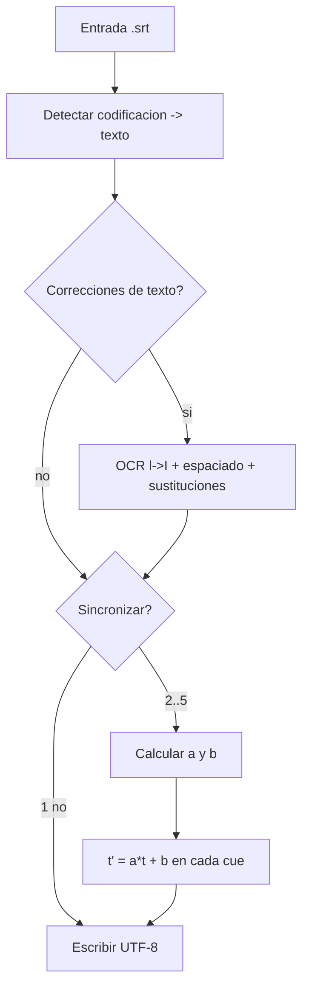

# FixSyncSub — corrector y sincronizador de subtítulos `.srt`

Utilidad interactiva en PowerShell para **arreglar y re-sincronizar** ficheros de subtítulos SubRip (`.srt`):
normaliza la codificación, corrige erratas típicas de OCR y ajusta los tiempos al vídeo. Es una
herramienta **aparte** del conversor (no se mete en `Convert.ps1`), pero **comparte sus piezas**: arranca
con `Start-CvSession` —el mismo `config.json` y argumento `-Config` que `Convert.ps1`/`setup.ps1`—, reutiliza
los menús de `lib\Console.psm1`, y toda la lógica de `.srt` vive en **`lib\SubtitleSRT.psm1`** (funciones
`*-CvSrt*`), así que queda disponible también para futuras funciones del conversor.

- **`FixSyncSub.ps1`** — el asistente.
- **`FixSyncSub.cmd`** — lanzador que ejecuta el `.ps1` con `-ExecutionPolicy Bypass` (solo para esa
  ejecución, no cambia la política del sistema) y admite **arrastrar y soltar**.
- **`lib\SubtitleSRT.psm1`** — la lógica pura de `.srt` (lectura/codificación, OCR, sincronización). Distinto
  de `lib\Subtitle.psm1`, que trata las **pistas** de subtítulo dentro de un vídeo (vía ffprobe).

Requisitos: Windows PowerShell 5.1+ (o PowerShell 7) y los módulos de `lib\` del proyecto (los importa igual
que `Convert.ps1`). No usa ffmpeg.

---

## Qué hace

En una sola pasada, y todo opcional:

1. **Codificación** → detecta la de entrada y escribe siempre en **UTF-8**.
2. **Correcciones de texto**:
   - **OCR**: en palabras EN MAYÚSCULAS, una `l` minúscula que en realidad es una `I` (`MANSlÓN` → `MANSIÓN`).
   - **Espaciado**: quita el espacio tras los signos de apertura invertidos (`¡ Hola` → `¡Hola`).
   - **Sustituciones manuales** que añadas (`buscar=reemplazar`), para nombres propios (`lmoogi=Imoogi`).
3. **Sincronización** de los tiempos (5 modos, ver abajo).

El fichero original **no se toca**: el resultado se escribe en uno nuevo (por defecto `<nombre>.es.srt`).

---

## Cómo se usa

Tres formas:

- **Doble clic** en `FixSyncSub.cmd` → lista los `.srt` de la carpeta `Original\` y eliges uno por número.
- **Arrastrar y soltar** un `.srt` sobre `FixSyncSub.cmd` → lo procesa directamente.
- **Por línea de comandos**:

  ```powershell
  .\FixSyncSub.ps1 "ruta\pelicula.srt"           # con ruta
  .\FixSyncSub.ps1                                # sin ruta: lista Original\ para elegir
  .\FixSyncSub.ps1 -Config config.debug.json     # usar otro config (igual que Convert.ps1/setup.ps1)
  ```

### Selección desde `Original\`

Si no pasas ruta, busca `.srt` (recursivo) en la carpeta **`Original\`** (la que diga `paths.original` del
config en uso) y los lista con `Select-FromList` (el mismo menú del resto del proyecto):

```text
  Subtitulos (.srt) en D:\...\Original:
   [1] pelicula-A.srt
   [2] serie\cap01.srt
  Elige numero (o pega una ruta):
```

Puedes escribir el número o pegar una ruta completa.

---

## El flujo del asistente (preguntas, en orden)

1. **Ruta / selección** del `.srt` (si no se pasó como argumento).
2. **¿Corregir OCR y espaciado?** `[S/n]`
   - Si sí, además: **¿Añadir sustituciones manuales?** `[s/N]` → bucle `buscar=reemplazar` (vacío para terminar).
3. **Sincronización**: `[1]` no · `[2]` offset · `[3]` lineal (2 cues) · `[4]` por tramos · `[5]` por extremos.
   - Según el modo, pide los tiempos de referencia (ver abajo).
4. **Guardar en** `[<nombre>.es.srt]` (ENTER acepta el sugerido) y **¿con BOM?** `[s/N]`.



---

## Correcciones de texto (detalle)

### OCR `l` → `I` en mayúsculas

Muchos SRT proceden de OCR y confunden la **I mayúscula** con la **l minúscula** (se parecen). La regla es
conservadora para no romper texto normal:

- Se mira cada **palabra** (secuencia de letras).
- Si contiene alguna `l` **y**, quitando todas las `l`, lo que queda son **solo letras mayúsculas**
  (`\p{Lu}`), entonces la palabra estaba en mayúsculas y esas `l` son `I` mal reconocidas → se
  sustituyen por `I`.
- Ejemplos: `MANSlÓN → MANSIÓN`, `SENSAClÓN → SENSACIÓN`.
- **No** toca palabras en minúscula/mixtas (`los`, `el`, `película`) ni nombres propios en minúscula
  (p. ej. `lmoogi`): para esos está el paso de **sustituciones manuales**.

Al terminar informa de cuántas cambió y cuáles.

### Espaciado tras signos invertidos

En español, `¡` y `¿` van pegados a la palabra. Se elimina el espacio sobrante: `¡ Hola` → `¡Hola`,
`¿ Qué?` → `¿Qué?`.

### Sustituciones manuales

Para erratas que la regla automática no puede adivinar (nombres propios, OCR en minúsculas, etc.).
Se introducen como `buscar=reemplazar`, una por línea; se aplican como texto literal e informa de cuántas veces.

---

## Codificación

Los `.srt` vienen en codificaciones dispares y, mal interpretados, muestran los acentos rotos (`Se�or`).
La detección es:

1. Si empieza por **BOM UTF-8** (`EF BB BF`) → se lee como UTF-8.
2. Si no, se intenta decodificar como **UTF-8 estricto**; si es válido, es UTF-8 sin BOM.
3. Si falla → se asume **Windows-1252 / Latin-1** (lo habitual en subtítulos antiguos en español).

La **salida siempre es UTF-8**, con saltos de línea `CRLF` (estándar SRT). Puedes elegir escribir **con o
sin BOM** (por defecto sin BOM, que es lo más compatible).

---

## Sincronización: cómo calcula la desviación

Todos los modos (salvo "no") aplican a cada marca de tiempo `t` (en segundos) del subtítulo una
**transformación lineal**:

```text
    t' = a · t + b
```

- **`a`** = factor de **escala** (corrige la *deriva*: cuando el desfase crece a lo largo de la película).
  Si no hay deriva, `a = 1`.
- **`b`** = **desplazamiento** constante en segundos (adelanta/retrasa todo por igual).

Se aplica a **ambos** tiempos de cada cue (inicio y fin), así que las duraciones se escalan igual que las posiciones.

### De dónde salen `a` y `b`

A partir de **dos puntos** conocidos "tiempo actual del subtítulo → tiempo real en el vídeo"
`(t1 → r1)` y `(t2 → r2)`:

```text
    a = (r2 − r1) / (t2 − t1)
    b =  r1 − a · t1
```

Cada modo solo cambia **de dónde** salen esos dos puntos:

| Modo | Puntos que usa | `a` | Se aplica a |
|---|---|---|---|
| `[2]` **offset** | 1 valor: el desfase (o una referencia `cue→real`) | `1` (sin escala) | todas las cues |
| `[3]` **lineal (2 cues)** | dos cues que tú eliges (por número) + su tiempo real | calculado | todas las cues |
| `[4]` **por tramos** | dos cues (≥ N) + su tiempo real | calculado | solo cues **≥ N** (las anteriores intactas) |
| `[5]` **por extremos** | el primer subtítulo **a ajustar** (ENTER = el 1º; o empiezas en otro) y el **último** + sus tiempos reales | calculado | cues **desde la de inicio** (las anteriores intactas) |

En los modos por cue/extremos, tú solo das el **tiempo real** (mm:ss.mmm) que debería tener esa línea; el
tiempo "actual" lo lee el propio script del SRT.

### Por qué hace falta la escala (`a ≠ 1`): la deriva

Si el subtítulo se hizo para una versión a **25 fps** (PAL) y tu vídeo va a **23,976 fps** (cine/NTSC), el
tiempo avanza a distinto ritmo: al principio casi coinciden, pero el desfase **crece** cuanto más avanza la
película. Un simple offset (mover todo N segundos) no lo arregla. La escala lo corrige:

```text
    a ≈ 25 / 23,976 ≈ 1,0427   (el subtítulo va "acelerado" y hay que estirarlo)
```

Por eso, si el desfase **crece** con el metraje, usa 2 puntos (`[3]`/`[5]`); si es **constante**, basta el offset (`[2]`).

### Ejemplo numérico

El primer subtítulo debería aparecer a **00:01:30** y el último a **01:58:00**, pero en el SRT están en
**00:01:20** y **01:52:10**:

```text
    t1 = 80 s     r1 = 90 s        (primer subtitulo)
    t2 = 6730 s   r2 = 7080 s      (ultimo subtitulo)

    a = (7080 − 90) / (6730 − 80) = 6990 / 6650 ≈ 1,051128
    b = 90 − 1,051128 · 80         ≈ 5,910 s
```

Una línea que en el SRT está en **00:50:00** (3000 s) pasa a `1,051128 · 3000 + 5,910 ≈ 3159,29 s` =
**00:52:39,294**. El primero cae en 00:01:30 y el último en 01:58:00 exactos, y todo lo de en medio queda
interpolado.

### Modo por tramos (`[4]`)

Para subtítulos que están **bien al principio** y se desajustan a partir de cierto punto (p. ej. porque la
copia tiene una escena de más). Eliges el número de cue **N** desde el que aplicar y dos cues (≥ N) como
referencia: las cues con número **menor que N se dejan intactas** y solo las **≥ N** se transforman. Así no
estropeas la parte que ya encajaba.

### Modo por extremos (`[5]`)

La forma más cómoda cuando el desfase **crece** con el metraje: solo tienes que fijar (mirando el vídeo) el
tiempo real del **primer** y el **último** subtítulo, y el script estira todo lo de en medio entre esos dos.
No hay que buscar números de cue: toma automáticamente la primera y la última línea del SRT.

Si el **principio ya está sincronizado** y solo se desajusta a partir de cierto punto, puedes indicar
**desde qué subtítulo empezar** (te lo pregunta; `ENTER` = el primero). En ese caso esa cue pasa a ser el
extremo inferior, las **cues anteriores se dejan intactas**, y el extremo superior sigue siendo el último
subtítulo. Es como el modo por tramos pero sin tener que localizar el número de la última cue.

Ejemplo: si dices "empezar en el subtítulo **8**", las cues 1-7 no se tocan y se ajusta de la 8 hasta el
final usando el tiempo real que des para la cue 8 y para la última.

### Precisión

Los tiempos se calculan en segundos con decimales y se redondean a **milisegundos** (el formato SRT es
`HH:MM:SS,mmm`). Nunca se generan tiempos negativos (se recortan a 0). Un desajuste residual de unos pocos
milisegundos es imperceptible en subtítulos (la tolerancia visual es de ~100 ms o más).

---

## Formato y límites

- Entrada: SubRip `.srt` estándar (bloques `número` / `HH:MM:SS,mmm --> HH:MM:SS,mmm` / texto).
- Acepta tiempos con `,` o `.` como separador de milisegundos al introducir referencias, y formatos
  `h:mm:ss.mmm`, `mm:ss` o segundos sueltos.
- La sincronización es **lineal** (offset + escala). Si un subtítulo tiene desajustes **no lineales**
  (varios saltos independientes por toda la película), usa el modo **por tramos** repetidamente, o divide el
  trabajo por secciones.
- **No** alinea por audio: no "escucha" el vídeo. Se guía por las referencias que le das. (Alinear por voz
  requeriría un detector de actividad de voz —VAD— externo.)

---

## Ejemplos de línea de comandos

Sincronizar por extremos (lo más habitual), sin correcciones de texto: se ejecuta y, en el asistente,
eliges `[5]` y das el tiempo real del primer y último subtítulo.

```powershell
.\FixSyncSub.ps1 "D:\pelis\Original\pelicula.srt"
```

Solo limpiar codificación + OCR + espaciado (sin sincronizar): en sincronización elige `[1]`.

Arreglar un desfase constante de +2,5 s: modo `[2]`, offset `+2.5`.
