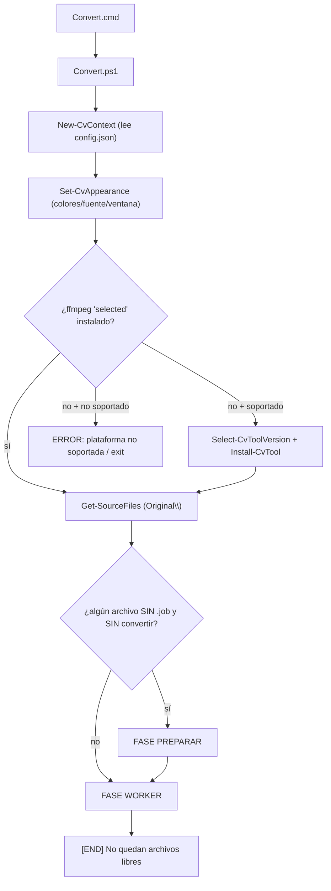
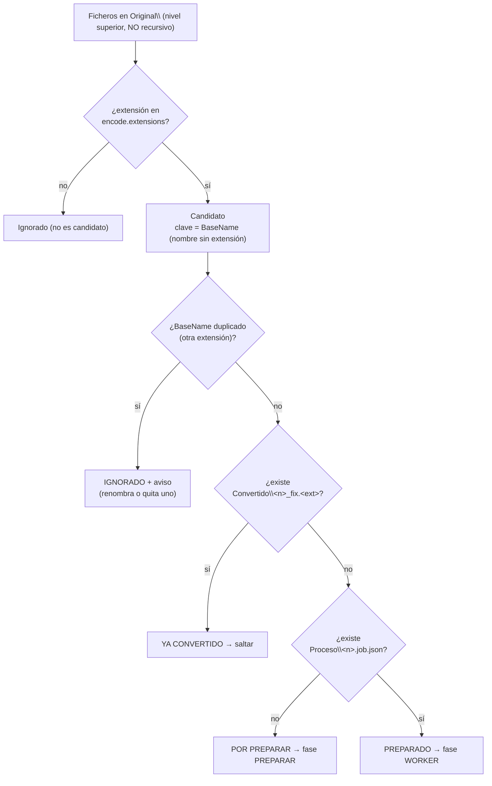
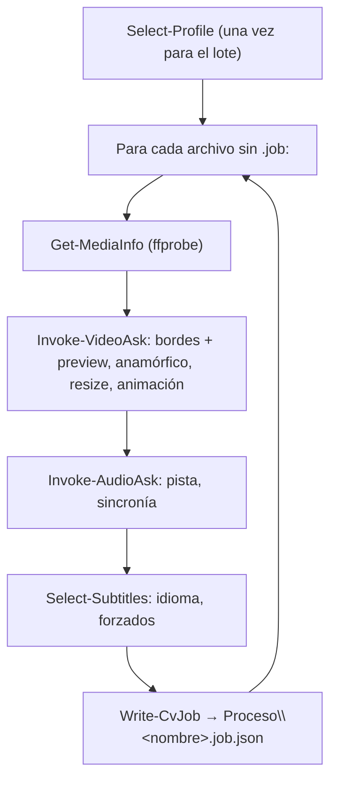
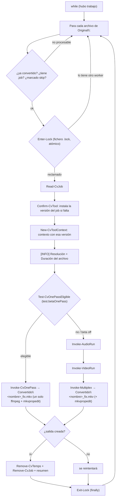
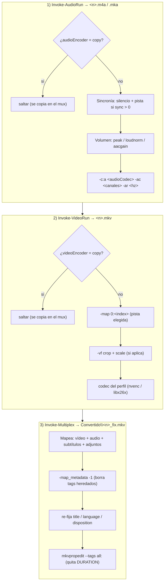

# Flujo de trabajo

El conversor sigue un modelo **productor/consumidor** en dos fases: primero se **prepara** (se pregunta todo y se congela en un job), luego se **procesa** (worker desatendido).

## Visión global



## Parámetros de lanzamiento

`Convert.cmd` (y `setup.cmd`) reenvían sus argumentos a los `.ps1`:

| Parámetro | Vale para | Uso |
|---|---|---|
| `-Config <ruta>` | `Convert` y `setup` | Fichero de configuración a usar en vez de `config.json` junto al programa. Admite ruta **absoluta** o **relativa** al directorio actual. Permite mantener varios perfiles de config (p. ej. `Convert.cmd -Config perfiles\anime.json`). Los workers extra heredan el mismo `-Config`. Si la ruta no existe, se avisa y se usan los valores por defecto. |
| `-WorkerOnly` | `Convert` | Salta la fase PREPARAR y entra directo como worker (lo usan las ventanas extra que se abren al pedir varios workers en paralelo). |

## Clasificación

Cómo se decide **qué archivos se intentan codificar**, de un vistazo:



### Qué archivos se consideran (entrada)

`Get-SourceFiles` construye la lista de candidatos. El **único** filtro de entrada es **carpeta + extensión**:

- **Carpeta**: solo `Original\` (`$ctx.Original`; configurable en `paths.original`, por defecto `<programa>\Original`). **No es recursivo** — solo el nivel superior de esa carpeta, no subcarpetas.
- **Extensión**: los ficheros cuya extensión esté en `encode.extensions` (por defecto `avi`, `flv`, `mp4`, `mov`, `mkv`; ver [ref-configuracion.md](ref-configuracion.md)). Internamente se usan como globs `*.ext`.
- El resultado se ordena por nombre.

No hay más criterios: cualquier fichero con esa extensión en `Original\` es un candidato (el prefijo `_` **no** excluye; solo fuerza la detección de bordes, ver abajo).

### Identidad de un archivo: su `BaseName`

Todo cuelga del **nombre sin extensión** (`BaseName`): el job (`Proceso\<nombre>.job.json`), la salida (`Convertido\<nombre>_fix.<outputExtension>`) y el lock (`Proceso\<nombre>.lock`).

> ⚠️ **Colisión por nombre**: dos entradas con el mismo `BaseName` y distinta extensión (p. ej. `peli.mp4` y `peli.mkv`) comparten job/salida/lock, así que **se ignoran TODOS los archivos del grupo** (para no procesar el equivocado) y se muestra un **aviso** al arrancar (`▐ AVISO - Nombre duplicado en Original: 'peli' (.mkv, .mp4); se IGNORAN… ▌`). Renombra o quita uno para procesarlos. (`Get-ProcessableFiles`; el worker aplica la misma exclusión en cada re-escaneo, sin repetir el aviso.)

### Estado de cada candidato

Al arrancar, tras comprobar herramientas, se decide si hace falta preparar:

```powershell
foreach ($f in $files) {
    $name = $f.BaseName
    if (Test-Path -LiteralPath (Get-OutputPath $ctx $name)) { continue }   # ya convertido
    if (-not (Test-CvJob -Context $ctx -Name $name)) { $needPrepare = $true; break }
}
```

Por cada candidato:

| Situación | Estado |
|---|---|
| Existe `Convertido\<nombre>_fix.<ext>` | **Ya convertido** → se salta. |
| No existe salida y **no** tiene `.job` | **Por preparar** → fase PREPARAR. |
| No existe salida y **sí** tiene `.job` | **Preparado** → fase WORKER. |

- Si algún candidato está "por preparar" → se entra en **PREPARAR**.
- Si todos tienen job (o están convertidos) → se salta PREPARAR y se entra directo como **WORKER**. Esto permite abrir **varias ventanas**: la primera prepara, las demás entran como workers.
- **Re-convertir** un archivo: borra su `Convertido\<nombre>_fix.<ext>` (y su `.job` si además quieres que te vuelva a preguntar la configuración).

## Fase PREPARAR

Se elige **un** perfil ([ref-perfiles.md](ref-perfiles.md)) que se aplica a todo el lote, y para cada archivo sin preparar se hacen las preguntas/detecciones y se escribe el job.



El job **congela**: el perfil completo, las respuestas del usuario (índice de vídeo, recorte, resize —incluido el tratamiento anamórfico si el vídeo tiene SAR ≠ 1—, animación, índice de audio, sincronía, subtítulos) y **las versiones de ffmpeg/aacgain** en uso. Es autosuficiente: el worker no depende de la config global. Ver [ref-jobs.md](ref-jobs.md).

**Salida por archivo:** en uso normal, PREPARAR imprime primero el **nombre del archivo** como cabecera (`- <nombre>`) y, **debajo e indentadas**, las preguntas interactivas (selección de pista de vídeo/audio/subtítulo, bordes, animación, sincronía) — así siempre se sabe de qué archivo son. Al terminar, una línea de estado: `Preparado ✓` (verde), `Preparado (seleccion manual) ✓` (amarillo, si hubo **cualquier** pregunta) o `No se pudo preparar ✗` (rojo, si ffprobe no puede leerlo). Los avisos (p. ej. **varias pistas de vídeo** o **audio sin idioma preferido**) salen como *badge* `▐ AVISO - … ▌`. En **modo debug** (`debug.enabled` / marcador `debug_on`) se ve el detalle completo (marco, tamaño/duración, y los `[INFO]` de audio/subtítulo/vídeo).

### Workers en paralelo

Al terminar PREPARAR, se pregunta **cuántos workers codificarán en paralelo** (contando esta ventana; ENTER usa el valor por defecto `behavior.workers`, 2). Si se piden N, esta ventana codifica y se abren **N−1 ventanas nuevas** (`Convert.cmd -WorkerOnly`): como ya está todo preparado, entran directas a codificar sin preguntar y se reparten los archivos por el lock. Con `-WorkerOnly` una ventana **salta PREPARAR** y va directa a la fase WORKER.

Con **0** solo se prepara y se **sale** sin codificar: los `.job.json` quedan listos y la conversión se lanza después abriendo `Convert.cmd` (una o varias ventanas) cuando se quiera.

### Regla del prefijo `_`

Si el nombre del archivo empieza por `_`, se **fuerza** la detección de bordes aunque el perfil (o la respuesta) diga "sin bordes". Pensado para marcar archivos con bordes que hay que limpiar sí o sí.

## Fase WORKER

Bucle que recorre los archivos preparados y codifica el siguiente libre, reclamándolo con un lock.



Al iniciar cada archivo, el worker muestra su **resolución y duración** (útil para estimar cuánto durará la codificación). En **uso normal**, cada paso se muestra como una línea compacta `- <acción>... ✓` (o `×` en rojo si falla; la cruz es `×` U+00D7 para que se vea en cualquier fuente). Los pasos **largos** (recodificar audio/vídeo) muestran **progreso en vivo** `- <acción>...  42%  ETA 03:12  1.8x  1234.5kbits/s  q28` (porcentaje, tiempo restante, velocidad, **bitrate** de salida y —en vídeo— el **cuantizador `q`**) leyendo el `-progress` de ffmpeg, si `behavior.progress` está activo (por defecto); si se desactiva, ffmpeg va en una ventana aparte y solo se ve el `✓` al terminar. Al acabar cada archivo se imprime su **resumen de conversión** enmarcado con guiones. En **modo debug** se ven los logs detallados por sección, los comandos exactos y (si `debug.pausePerCommand`, por defecto) la confirmación con ENTER antes de cada comando.

Orden de codificación por archivo: **audio → vídeo → multiplexado**. El audio se recodifica a un temporal (`.m4a` si el códec es AAC, `.mka` para el resto), el vídeo a un `.mkv` temporal, y el multiplexado los une con los **subtítulos** y los **adjuntos** conservados del original en `Convertido\<nombre>_fix.mkv`; después limpia los metadatos heredados y quita las etiquetas `DURATION` con **mkvpropedit**. Con la **multipista de audio** (`encode.audio.multiAudio`, por defecto; ver [explica-audio.md](explica-audio.md)) se recodifica **una pista por temporal** (`<nombre>_aN.*`, pos 0 = predeterminada) y el multiplexado las mapea todas (predeterminada primero). El orden global de pistas del MKV es **vídeo → audio → subtítulos → capítulos**.

> **🧪 Una sola pasada (BETA, `test.betaOnePass`, off por defecto).** Cuando el job es **elegible** —vídeo y audio se codifican (ninguno en `copy`), sincronía **`adelay`**, volumen **`loudnorm`** y **sin tone-mapping HDR→SDR**—, `Invoke-CvOnePass` funde las tres etapas en **una única llamada a ffmpeg** con `-filter_complex` (rama de vídeo `crop→scale` + una rama por pista de audio `adelay→downmix→loudnorm`), mapeando en el mismo comando los subtítulos/adjuntos/capítulos del original y escribiendo directo `Convertido\<nombre>_fix.mkv`. Ahorra los temporales intermedios y dos arranques de ffmpeg. `Test-CvOnePassEligible` decide (y registra el motivo cuando **no** aplica); en cualquier caso no elegible se usa el pipeline por etapas de abajo. Los métodos de volumen `peak`/`aacgain` obligan a una pasada extra por diseño, así que **quedan fuera** de este modo.

Pipeline interno de cada archivo (pasos de cada etapa):



Ver los comandos exactos en [ref-comandos.md](ref-comandos.md). El detalle del audio (selección de pista, sincronía, canales/códec de salida y métodos de volumen) en [explica-audio.md](explica-audio.md).

## Paralelismo y lock

- El reclamo de cada archivo es un **fichero-lock** `Proceso\<nombre>.lock` creado con `FileMode.CreateNew` (falla atómicamente si ya existe). Solo un worker gana.
- Se pueden lanzar **varias ventanas** (`Convert.cmd`) a la vez: cuando todos los archivos tienen `.job`, cada ventana entra como worker y se reparten los archivos por el lock.
- El lock se libera siempre en el `finally`, incluso si la codificación falla. Si un worker muere a mitad, otro puede **robar el lock caducado** (guarda `PID`+equipo; ver [ref-jobs.md](ref-jobs.md)).
- **Reintentos con límite**: un archivo que falla se reintenta hasta un máximo (`behavior.retries`, por defecto 2); superado, se **abandona** (se marca en `skip`). Los ilegibles se descartan y un error inesperado se captura por archivo (no aborta el lote). Esto evita el bucle infinito con inputs corruptos o ffmpeg que no arranca.
- La codificación de audio/vídeo debe terminar con éxito (ffmpeg código 0 + salida no vacía) para que se multiplexe; si no, el archivo cuenta como fallo (no se genera un MKV con vídeo sin recodificar).

## Errores y resumen del worker

- **Encoder por GPU no soportado**: antes de codificar cada archivo, el worker valida que el encoder de vídeo del job lo soporte **esta GPU** (`Test-CvEncoderSupported`, mismo sondeo que el menú). Si no (p. ej. `av1_nvenc` en una GPU anterior a RTX 40), **avisa en ese archivo y lo salta** (`[ERR]` con el motivo, sin reintentar) en vez de dejar que ffmpeg falle. Cubre los jobs ya preparados o los perfiles de `config.json` que se saltan el menú de PREPARAR.
- **Si ffmpeg falla** (código ≠ 0): como en modo progreso corre **oculto** (sin ventana), no se pierde su salida — se muestran en consola sus **últimas líneas de error** y se guarda la salida **completa** en `logs\error_ffmpeg-video|audio_<nombre>_<fecha>_<pid>.log` (`Show-CvToolError`). Tras **agotar los reintentos** (o ante un error inesperado), se muestra además un **cuadro rojo** de aviso con el archivo y el motivo.
- **Resumen final**: cuando ya no quedan archivos libres, cada worker imprime un **RESUMEN DEL WORKER** con todo lo que procesó: `✓`/`×` por archivo, el **tiempo** (en los OK), el **nº de intentos** si hubo reintentos, y el **motivo** en los fallidos; más una línea `Total / OK / Errores / Tiempo`. Cada worker es un **proceso independiente**, así que **cada ventana imprime su propio resumen** (no hay uno combinado entre workers en paralelo).
- **Pausa al terminar**: tras el resumen, la ventana **espera un ENTER** antes de cerrarse (así se puede leer el resultado; cada ventana en paralelo pausa con el suyo). Solo pausa si ese worker procesó algún archivo; con la entrada redirigida/EOF (baterías de test) no bloquea.

## Protección de la ventana

Durante el proceso se **desactiva el botón X** de la consola (API nativa de Windows, sustituye al antiguo `controls.exe`) para no cerrarla por error. Un `trap` y el final del script garantizan reactivarlo. Configurable con `behavior.lockCloseButton`.
