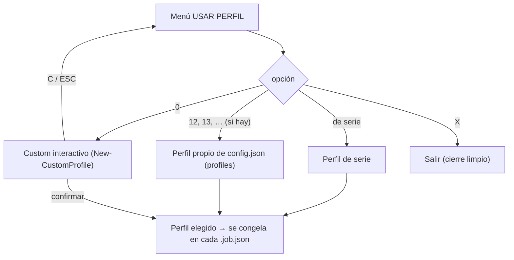

# Perfiles de codificación

En la fase PREPARAR se elige **un** perfil que se aplica a todo el lote y se **congela** dentro de cada `.job.json`. Definidos en `lib\Profile.psm1`.

Flujo de selección (`Select-Profile`):



## Perfiles predefinidos

Menú (`Select-Profile`):

La numeración (1..N) se **genera sola** a partir de los grupos de `Get-CvProfiles`; los grupos se separan con una línea en blanco en el menú. Estado actual:

| # | Audio | Vídeo | Detección bordes | Resize |
|---|---|---|---|---|
| **1** | 192k AAC | `copy` (no recodifica vídeo) | — | — |
| **2** | 192k AAC | hevc_nvenc, main10, L5, Q 1–23 | no | no |
| **3** | 192k AAC | hevc_nvenc, main10, L5, Q 1–23 | **sí** (interactivo) | no |
| **4** | 192k AAC | hevc_nvenc, main10, L5, Q 1–23 | **auto** | no |
| **5** | 192k AAC | hevc_nvenc, main10, L5, Q 1–23 | no | **≤1920 ancho** (solo si es mayor) |
| **6** | 192k AAC | hevc_nvenc, main10, L5, Q 1–23 | **sí** | **≤1920 ancho** (solo si es mayor) |
| **7** | 192k AAC | hevc_nvenc, main10, L5, Q 1–23 | **auto** | **≤1920 ancho** (solo si es mayor) |
| **8** | 192k AAC | hevc_nvenc, main10, L5, Q 1–23 | no | **1920:-2** (escala siempre) |
| **9** | 192k AAC | hevc_nvenc, main10, L5, Q auto | no | no |
| **10** | 192k AAC | hevc_nvenc, main10, L5, Q auto | **sí** | no |
| **11** | 192k AAC | h264_nvenc, L5, Q 1–23 | no | no |
| **12, 13, …** | — | **Perfiles propios de `config.json`** (si hay) | — | — |
| **0** | — | **Custom** (interactivo) | — | — |

- "Q 1–23" = `-qmin 1 -qmax 23`. "Q auto" = sin `qmin`/`qmax` (el encoder decide).
- **Detección de bordes**: **sí** = escaneo completo con preguntas/preview (antes de escanear te pregunta el nº de muestras, por defecto `border.samples`). **auto** = pre-escaneo rápido que decide solo si hay barras: si son claras las recorta sin preguntar, si no hay las ignora, y si es ambiguo pasa al modo interactivo. Detalle en [explica-deteccion-bordes.md](explica-deteccion-bordes.md).
- **Resize ≤1920 ancho** (`maxWidth`): reduce a 1920 de ancho **solo si el vídeo es mayor**; no amplía. **1920:-2** (`changeSize`): escala **siempre** al ancho dado (la altura `-2` se calcula automática y **par**). El nº de menú es orientativo (se autogenera): si añades/quitas perfiles, cambia.
- Todos usan encoder NVENC (GPU) salvo el 1 (copy). Para CPU (libx264/libx265/**libsvtav1** AV1) usar el custom o un perfil de `config.json`. **`av1_nvenc` (AV1 por GPU) aparece etiquetado `[SIN PROBAR]`**: el código está pero no se ha podido validar en hardware compatible (RTX 40+); sigue seleccionable. `libsvtav1` (AV1 por CPU) está validado.
- **Validación del encoder por GPU**: nada más arrancar (tras cargar config y asegurar ffmpeg, antes de distinguir preparación/worker) se detecta qué encoders por GPU (`*_nvenc`) soporta **esta GPU** —sondeando cada uno con una codificación sintética mínima—. En el menú de encoder del perfil custom, los encoders GPU no soportados se **marcan `[NO SOPORTADO]` en amarillo** (visible antes de elegir). Al elegir un perfil (de serie, de `config.json` o el custom) con un encoder que la GPU no soporta (p. ej. `av1_nvenc` en una GPU anterior a **RTX 40**), se **avisa** (badge amarillo `[AVISO]`) **y se vuelve al menú** para elegir otro, en vez de dejar que ffmpeg falle a mitad de la conversión. El resultado se **cachea en `config.json`** (nodo `gpuCache`, dato de máquina que no aparece en el editor) clavado por **versión de ffmpeg + modelo de GPU**: si no cambian, el arranque es instantáneo; si cambia alguno (o no hay caché), vuelve a sondear (~1-2 s, una vez) y actualiza la caché.
  - La misma validación se repite en el **WORKER, por cada archivo**: un job ya preparado (o un perfil de `config.json`) que se salta el menú de PREPARAR y trae un encoder no soportado no llega a fallar en ffmpeg — el worker **avisa en ese archivo y lo salta** (sin reintentar).

## Perfiles propios en `config.json`

La sección `profiles` de `config.json` permite definir perfiles **adicionales** que se **añaden** a los de serie (no los sustituyen), numerados **a continuación** de ellos en el menú *USAR PERFIL*. Es un **array de objetos**; cada objeto usa los mismos campos que un perfil (en `camelCase`), todos opcionales:

```json
"profiles": [
  { "label": "Anime 1080p", "videoEncoder": "libx265", "crf": 18, "changeSize": "1920:-2" },
  { "videoEncoder": "hevc_nvenc", "videoProfile": "main10", "videoLevel": "5", "qmin": 1, "qmax": 20, "detectBorder": true }
]
```

- `label` (opcional): texto que se muestra en el menú. Si se omite, se genera un resumen automático a partir de sus valores (p. ej. `A: 192K, V: h265[NV]/M10/L5/Q(1-20)/DETECT BORDE`). Es la **misma** función (`Format-CvProfileLabel`) que genera las etiquetas de los perfiles de serie en el menú, así que no hay una lista de texto duplicada que mantener.
- El resto de campos son los de la tabla de abajo pero en `camelCase`: `videoEncoder`, `videoProfile`, `videoLevel`, `qmin`, `qmax`, `crf`, `detectBorder`, `changeSize`, `maxWidth`, `multipass`, `audioEncoder`, `audioCodec`, `audioBitrate`, `audioHz`, `audioChannels`, `downmixMode`, `downmixCoeffs`.
- Se editan **a mano** en el JSON (el editor navegable de `setup` los muestra pero remite aquí, para no corromper el array de objetos). Se cargan al arrancar (`$ctx.Profiles`) y se pasan a `Select-Profile -Extra`.

## Campos de un perfil

`New-CvProfile` define la estructura (valores por defecto entre paréntesis):

| Campo | Valores | Uso |
|---|---|---|
| `VideoEncoder` | `copy` / `hevc_nvenc` / `libx265` / `h264_nvenc` / `libx264` / `libsvtav1` / `av1_nvenc` | Codec de vídeo. `libsvtav1` = AV1 por CPU (SVT-AV1, **validado**); `av1_nvenc` = AV1 por GPU NVIDIA (RTX 40+), etiquetado **`[SIN PROBAR]`** en el menú (sin validar en hardware compatible; el motor lo codifica igual). |
| `VideoProfile` | `main10` / `main` / `''` | En H.264/H.265, `-profile:v`. En AV1 **no** se pasa `-profile:v`: solo selecciona la profundidad de bits (`main10` = 10 bits). `main10` → `-pix_fmt p010le` (NVENC/HEVC) o `yuv420p10le` (SVT-AV1). |
| `VideoLevel` | ej. `5`, `4.1`, `''` | `-level:v` (H.264/H.265). **AV1 lo ignora.** |
| `Qmin`, `Qmax` | 0–51 / `null` | NVENC (incl. `av1_nvenc`): `-qmin`/`-qmax`. Si `Qmin == Qmax` → `-rc constqp -qp`. Qué son y cómo elegirlos: [explica-control-tasa.md](explica-control-tasa.md). |
| `Crf` | 0–51 (0–63 en AV1) / `null` | CPU (libx264/libx265/**libsvtav1**): `-crf`. Qué es y cómo elegirlo: [explica-control-tasa.md](explica-control-tasa.md). |
| `DetectBorder` | `false` / `true` / `'auto'` | Detección de bordes por archivo. `false` = nunca; `true` = siempre (escaneo completo interactivo, pregunta nº de muestras y previsualiza); `'auto'` = pre-escaneo rápido que decide (recorta solo si hay barras claras, ignora si no, y escala al interactivo si es ambiguo). Ver [explica-deteccion-bordes.md](explica-deteccion-bordes.md). |
| `ChangeSize` | ej. `1920:-2`, `''` | `scale=` (altura `-2` = automática manteniendo aspecto **y par**). Escala **siempre**, incluso amplía un vídeo más pequeño. Se usa `-2` y **no** `-1`: `-1` puede dar altura **impar** (más aún combinado con recorte de bordes) y 4:2:0 exige dimensiones pares → en **CPU** (libx264/libx265) abortaría; `-2` redondea a par. |
| `MaxWidth` | ej. `1920`, `null` | Reescalado **solo hacia abajo**: reduce a ese ancho (manteniendo aspecto) **solo si el vídeo es más ancho**; si ya es ≤ ese valor, no lo toca (no amplía). Se decide en PREPARAR comparando el ancho de origen: si es mayor congela un `scale=<W>:-2`, si no, no reescala. Alternativa a `ChangeSize` (si se ponen ambos, manda `ChangeSize`). |
| `Multipass` | `''`/`off`/`qres`/`fullres` | **NVENC**: 2-pass (`-multipass`). `''` = usa el global `encode.multipass`; `off`/`qres`/`fullres` lo fijan para este perfil (tienen prioridad sobre el global). Ignorado por los encoders de CPU. |
| `AudioEncoder` | `aac_coder` / `copy` | Recodifica el audio o copia la pista original. |
| `AudioCodec` | `aac` / `ac3` / `eac3` / `libmp3lame` / `flac` / `libopus` | Codec de salida al recodificar (`-c:a`). Por defecto `aac` (comportamiento previo). AAC va en un intermedio `.m4a`; el resto en `.mka`. FLAC ignora el bitrate (sin pérdida); Opus fuerza 48 kHz. Detalle en [explica-audio.md](explica-audio.md). |
| `AudioBitrate` | ej. `192k` | `-b:a` (no aplica a FLAC). |
| `AudioHz` | ej. `44100` | `-ar` (Opus se fuerza a `48000`). |
| `AudioChannels` | `null` / `2` / `6` / `8` | Canales de salida del audio recodificado, tratado como **máximo**: **no hace upmix** — si el origen tiene menos canales que el objetivo (p. ej. estéreo con `6`), se conservan los del origen; bajar sí (5.1→estéreo). `null` = usa el global `encode.audioChannels`; `2`/`6`/`8` lo fijan para este perfil. `2` = estéreo, `6` = 5.1, `8` = 7.1. |
| `DownmixMode` | `null` / `default` / `dialogue` | **Solo al bajar 5.1 → estéreo.** `null` = usa el global `encode.downmixMode`; `default`/`dialogue` lo fijan para este perfil. `dialogue` 🧪 (BETA, requiere `test.betaDownmix`) = voz reforzada. Ver [explica-audio.md](explica-audio.md). |
| `DownmixCoeffs` | `null` / `{center,front,surround}` | Pesos del downmix `dialogue` para este perfil (override del global `encode.downmixCoeffs`). `null` = global. Clip-safe si suman ≤ 1,0. |

Cómo se traducen estos campos a argumentos de ffmpeg: ver "Vídeo: codificación" en [ref-comandos.md](ref-comandos.md).

En el menú de perfiles, la opción **`X. Salir`** cierra el conversor de forma limpia.

## Perfil custom (`New-CustomProfile`)

Construcción interactiva:

1. **Encoder de vídeo**: libx264 / h264_nvenc / libx265 / hevc_nvenc / copy.
2. Si no es `copy`:
   - ¿Detectar bordes en cada archivo? (s/N)
   - ¿Cambiar el tamaño? → menú de tamaños de referencia (360p…4K) o valor libre (`W:H`, altura `-2` = auto y par; si solo das el ancho se completa con `:-2`).
   - **Perfil** y **Level** del codec (selectores; opciones distintas para H.264 vs H.265).
   - **Control de tasa**: CRF (CPU) o QMIN/QMAX (NVENC).
   - **2-pass NVENC (multipass)**: solo si el encoder es NVENC — `off` / `qres` / `fullres`.
3. **Salida de audio**: `copy` (no recodificar) o códec (`aac`/`ac3`/`eac3`/`libmp3lame`/`flac`/`libopus`); si recodifica, **bitrate** apropiado al códec.
4. Si recodifica: **canales de salida** (`estéreo`/`5.1`/`7.1`) y, si sale **estéreo**, **downmix 5.1→estéreo** (`default` / `dialogue` beta). Por defecto = los globales (`encode.audioChannels`/`downmixMode`). Los **coeficientes** del downmix no se preguntan aquí (usan el global; para afinarlos por perfil, edita `downmixCoeffs` en `config.json`).
5. **Resumen** + confirmación: `[ENTER]` usar / `[R]` rehacer.

En cada uno de esos menús, **`[ENTER]` acepta el valor por defecto** (marcado con `<= por defecto` / mostrado entre corchetes en el prompt), o se teclea otra opción. Los valores por defecto son **configurables** en la sección [`customProfile`](ref-configuracion.md) de `config.json` (encoder, perfil, level, qmin/qmax, crf y bitrate de audio); de fábrica: `hevc_nvenc` / `main10` / `5.0` / `1`–`23` / `192k`.

En **cualquier** pregunta del custom se puede **cancelar** con `C` o la tecla **`ESC`**: se limpia la pantalla y se vuelve al menú de perfiles (útil si te equivocaste en algún paso).

## Preguntas por archivo en PREPARAR

Aunque el perfil es común al lote, en PREPARAR se pregunta/detecta por archivo:

- **Pista de vídeo**: si hay **2+ pistas de vídeo reales**, menú para elegir cuál (con reproducción ffplay `P N`, opcionalmente `P N <seg>` para arrancar en otro segundo). Se **excluyen las carátulas** incrustadas (`attached_pic` / mjpeg / png…), que ffprobe lista como vídeo. El índice elegido se congela en el job (`video.index`) y se usa al codificar y al copiar/multiplexar (en vez del `0:v:0` fijo, que podía colar la portada). (`Select-VideoInteractive` en `lib\Video.psm1`.)
- **Bordes** (si el perfil los activa o el nombre empieza por `_`): se escanea con `cropdetect` en **varios puntos** del vídeo (`border.samples`) y se agrupan los recortes por votos. Si el más votado tiene mayoría fiable (% + margen) → se acepta solo, con preview del original y del recorte (sobre la pista de vídeo elegida) + confirmar; si no → aviso y **menú de recortes por votos** para elegir cuál probar. Opciones en la preview: usar / volver / valor manual / sin recorte. Detalle completo (reparto, votos, auto-aceptación y matriz de decisión) en [explica-deteccion-bordes.md](explica-deteccion-bordes.md).
- **Anamórfico** (si la pista tiene **SAR ≠ 1**, p. ej. un DVD `1920x1072` que se ve a ~`2538x1072`): al recodificar se **pregunta** qué hacer —mantener el SAR o cuadrar a píxeles cuadrados por ancho/alto— preseleccionando el modo configurado en `encode.anamorphic` (`ENTER`/timeout lo aceptan). En `copy` no se pregunta (no se puede cambiar el SAR sin recodificar), solo se avisa. Detalle en [explica-anamorfico.md](explica-anamorfico.md).
- **Animación** (solo `libx264`/`libx265`): añade `-tune animation`.
- **Audio**:
  - Si hay **2+ pistas del idioma preferido**, menú para elegir cuál. La lista muestra idioma, códec, canales, **bitrate** y título, y viene **preseleccionada (`*`) la de mejor calidad** según el criterio: más **canales** → mejor **códec** (E-AC-3 > AC-3…) → mayor **bitrate** (`Select-CvBestAudio`). `[ENTER]` acepta esa; también hay **reproducción** (`P N` = vídeo+audio, `A N` = solo audio, `P N <seg>` para otro segundo) para distinguirlas. El bitrate se lee de `stream.bit_rate` o del tag `BPS` de mkvmerge. Diagrama del flujo de selección en [explica-audio.md](explica-audio.md).
  - Si **ninguna pista** está en el idioma preferido, se muestra la lista y se puede **reproducir** cada pista con ffplay para confirmar cuál es (`P N` = vídeo+audio, `A N` = solo audio; opcionalmente un segundo de inicio, `P N <seg>`, p. ej. `A 2 300`, para buscar diálogo) antes de elegirla; tras elegirla se pregunta qué **idioma asignar** (el de la pista con `ENTER`, otro código con `O` o tecleándolo, o `und` con `U`), por si el tag de idioma es una errata. (`Select-AudioFallback` en `lib\Audio.psm1`.)
  - Detección de **sincronía** (silencio a añadir al inicio si el audio empieza más tarde). Cómo funciona: [explica-audio.md](explica-audio.md).
- **Subtítulos**: en el idioma preferido se **conservan todos** (nada de menú ni descartes), auto-clasificados en **forzado** y **completo**:
  - Se distinguen por flag/título; si no lo traen y hay 2+, por **tamaño** (nº de cues): el más pequeño = forzado. El nº de cues se lee del tag `NUMBER_OF_FRAMES` de mkvmerge (instantáneo, ya cargado con la info del archivo) y solo si falta se cuenta con `ffprobe -count_packets` (que demultiplexa el fichero, lento en MKVs grandes). Por qué y cómo se optimizó: ver [caso-rendimiento-subtitulos.md](caso-rendimiento-subtitulos.md).
  - **Forzado** → disposition `default+forced`, título "Forzados". **Completo** → sin default, sin forced, sin título (también el completo suelto).
  - Orden en el MKV: forzados antes que completos. Con 2+ completos, se conservan todos con un aviso.
  - Si hay subtítulos pero **ninguno del idioma preferido**, se **pregunta** cuáles conservar (menú multi-selección con nº de cues; `Select-SubtitlesKeep`). Opciones del menú: `P N` reproduce el vídeo con ese subtítulo superpuesto (ffplay `-sst`, `Show-SubtitlePreview`); **`V N` ve el contenido** (extrae la pista de texto a un `.srt` temporal y lo abre con el editor asociado de Windows; `Show-SubtitleContent`).
