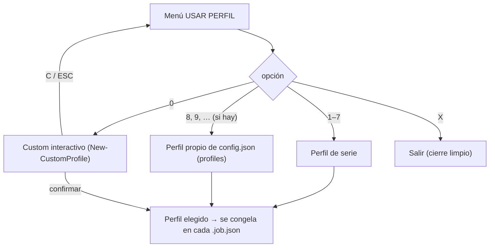

# Perfiles de codificación

En la fase PREPARAR se elige **un** perfil que se aplica a todo el lote y se **congela** dentro de cada `.job.json`. Definidos en `lib\Profile.psm1`.

Flujo de selección (`Select-Profile`):



## Perfiles predefinidos

Menú (`Select-Profile`):

| # | Audio | Vídeo | Detección bordes | Resize |
|---|---|---|---|---|
| **1** | 192k AAC | `copy` (no recodifica vídeo) | — | — |
| **2** | 192k AAC | hevc_nvenc, main10, L5, Q 1–23 | no | no |
| **3** | 192k AAC | hevc_nvenc, main10, L5, Q 1–23 | **sí** | no |
| **4** | 192k AAC | hevc_nvenc, main10, L5, Q auto | no | no |
| **5** | 192k AAC | hevc_nvenc, main10, L5, Q auto | **sí** | no |
| **6** | 192k AAC | hevc_nvenc, main10, L5, Q 1–23 | no | **1920:-1** |
| **7** | 192k AAC | h264_nvenc, L5, Q 1–23 | no | no |
| **8, 9, …** | — | **Perfiles propios de `config.json`** (si hay) | — | — |
| **0** | — | **Custom** (interactivo) | — | — |

- "Q 1–23" = `-qmin 1 -qmax 23`. "Q auto" = sin `qmin`/`qmax` (el encoder decide).
- Todos usan encoder NVENC (GPU) salvo el 1 (copy). Para CPU (libx264/libx265), usar el custom.

## Perfiles propios en `config.json`

La sección `profiles` de `config.json` permite definir perfiles **adicionales** que se **añaden** a los 7 de serie (no los sustituyen), numerados a partir del **8** en el menú *USAR PERFIL*. Es un **array de objetos**; cada objeto usa los mismos campos que un perfil (en `camelCase`), todos opcionales:

```json
"profiles": [
  { "label": "Anime 1080p", "videoEncoder": "libx265", "crf": 18, "changeSize": "1920:-1" },
  { "videoEncoder": "hevc_nvenc", "videoProfile": "main10", "videoLevel": "5", "qmin": 1, "qmax": 20, "detectBorder": true }
]
```

- `label` (opcional): texto que se muestra en el menú. Si se omite, se genera un resumen automático (p. ej. `A: 192k, V: HEVC_NVENC/main10/L5/Q(1-20)/BORDE`).
- El resto de campos son los de la tabla de abajo pero en `camelCase`: `videoEncoder`, `videoProfile`, `videoLevel`, `qmin`, `qmax`, `crf`, `detectBorder`, `changeSize`, `audioEncoder`, `audioBitrate`, `audioHz`.
- Se editan **a mano** en el JSON (el editor navegable de `setup` los muestra pero remite aquí, para no corromper el array de objetos). Se cargan al arrancar (`$ctx.Profiles`) y se pasan a `Select-Profile -Extra`.

## Campos de un perfil

`New-CvProfile` define la estructura (valores por defecto entre paréntesis):

| Campo | Valores | Uso |
|---|---|---|
| `VideoEncoder` | `copy` / `hevc_nvenc` / `libx265` / `h264_nvenc` / `libx264` | Codec de vídeo. |
| `VideoProfile` | `main10` / `main` / `''` | `-profile:v`. `main10` → `-pix_fmt p010le`. |
| `VideoLevel` | ej. `5`, `4.1`, `''` | `-level:v`. |
| `Qmin`, `Qmax` | 0–51 / `null` | NVENC: `-qmin`/`-qmax`. Si `Qmin == Qmax` → `-rc constqp -qp`. |
| `Crf` | 0–51 / `null` | CPU (libx264/libx265): `-crf`. |
| `DetectBorder` | `true`/`false` | Activa la detección de bordes por archivo. |
| `ChangeSize` | ej. `1920:-1`, `''` | `scale=` (altura `-1` = automático manteniendo aspecto). |
| `AudioEncoder` | `aac_coder` / `copy` | Recodifica a AAC o copia la pista. |
| `AudioBitrate` | ej. `192k` | `-b:a`. |
| `AudioHz` | ej. `44100` | `-ar`. |

Cómo se traducen estos campos a argumentos de ffmpeg: ver "Vídeo: codificación" en [ref-comandos.md](ref-comandos.md).

En el menú de perfiles, la opción **`X. Salir`** cierra el conversor de forma limpia.

## Perfil custom (`New-CustomProfile`)

Construcción interactiva:

1. **Encoder de vídeo**: libx264 / h264_nvenc / libx265 / hevc_nvenc / copy.
2. Si no es `copy`:
   - ¿Detectar bordes en cada archivo? (s/N)
   - ¿Cambiar el tamaño? → menú de tamaños de referencia (360p…4K) o valor libre (`W:H`, altura `-1` = auto).
   - **Perfil** y **Level** del codec (selectores; opciones distintas para H.264 vs H.265).
   - **Control de tasa**: CRF (CPU) o QMIN/QMAX (NVENC).
3. **Bitrate de audio**: copy / 128k / 160k / 192k / 256k / 320k / custom.
4. **Resumen** + confirmación: `[ENTER]` usar / `[R]` rehacer.

En **cualquier** pregunta del custom se puede **cancelar** con `C` o la tecla **`ESC`**: se limpia la pantalla y se vuelve al menú de perfiles (útil si te equivocaste en algún paso).

## Preguntas por archivo en PREPARAR

Aunque el perfil es común al lote, en PREPARAR se pregunta/detecta por archivo:

- **Pista de vídeo**: si hay **2+ pistas de vídeo reales**, menú para elegir cuál (con reproducción ffplay `P N`, opcionalmente `P N <seg>` para arrancar en otro segundo). Se **excluyen las carátulas** incrustadas (`attached_pic` / mjpeg / png…), que ffprobe lista como vídeo. El índice elegido se congela en el job (`video.index`) y se usa al codificar y al copiar/multiplexar (en vez del `0:v:0` fijo, que podía colar la portada). (`Select-VideoInteractive` en `lib\Video.psm1`.)
- **Bordes** (si el perfil los activa o el nombre empieza por `_`): se escanea con `cropdetect` en **varios puntos** del vídeo (`border.samples`) y se agrupan los recortes por votos. Si el más votado tiene mayoría fiable (% + margen) → se acepta solo, con preview del original y del recorte (sobre la pista de vídeo elegida) + confirmar; si no → aviso y **menú de recortes por votos** para elegir cuál probar. Opciones en la preview: usar / volver / valor manual / sin recorte. Detalle completo (reparto, votos, auto-aceptación y matriz de decisión) en [explica-deteccion-bordes.md](explica-deteccion-bordes.md).
- **Animación** (solo `libx264`/`libx265`): añade `-tune animation`.
- **Audio**:
  - Si hay **2+ pistas del idioma preferido**, menú para elegir cuál — también con **reproducción** (`P N` = vídeo+audio, `A N` = solo audio, `P N <seg>` para otro segundo) para distinguirlas.
  - Si **ninguna pista** está en el idioma preferido, se muestra la lista y se puede **reproducir** cada pista con ffplay para confirmar cuál es (`P N` = vídeo+audio, `A N` = solo audio; opcionalmente un segundo de inicio, `P N <seg>`, p. ej. `A 2 300`, para buscar diálogo) antes de elegirla; tras elegirla se pregunta qué **idioma asignar** (el de la pista con `ENTER`, otro código con `O` o tecleándolo, o `und` con `U`), por si el tag de idioma es una errata. (`Select-AudioFallback` en `lib\Audio.psm1`.)
  - Detección de **sincronía** (silencio a añadir al inicio si el audio empieza más tarde).
- **Subtítulos**: en el idioma preferido se **conservan todos** (nada de menú ni descartes), auto-clasificados en **forzado** y **completo**:
  - Se distinguen por flag/título; si no lo traen y hay 2+, por **tamaño** (nº de cues): el más pequeño = forzado. El nº de cues se lee del tag `NUMBER_OF_FRAMES` de mkvmerge (instantáneo, ya cargado con la info del archivo) y solo si falta se cuenta con `ffprobe -count_packets` (que demultiplexa el fichero, lento en MKVs grandes). Por qué y cómo se optimizó: ver [caso-rendimiento-subtitulos.md](caso-rendimiento-subtitulos.md).
  - **Forzado** → disposition `default+forced`, título "Forzados". **Completo** → sin default, sin forced, sin título (también el completo suelto).
  - Orden en el MKV: forzados antes que completos. Con 2+ completos, se conservan todos con un aviso.
  - Si hay subtítulos pero **ninguno del idioma preferido**, se **pregunta** cuáles conservar (menú multi-selección con nº de cues; `Select-SubtitlesKeep`). Opciones del menú: `P N` reproduce el vídeo con ese subtítulo superpuesto (ffplay `-sst`, `Show-SubtitlePreview`); **`V N` ve el contenido** (extrae la pista de texto a un `.srt` temporal y lo abre con el editor asociado de Windows; `Show-SubtitleContent`).
