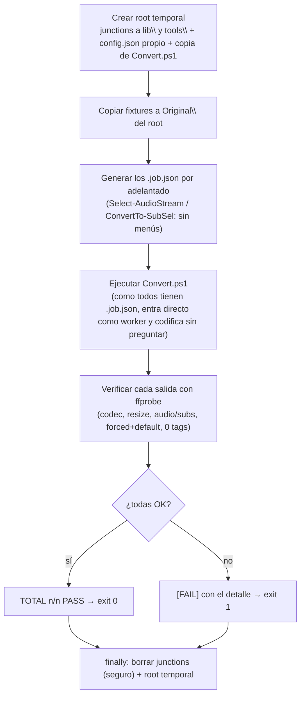

# Muestras de test

Vídeos de muestra (carpeta `test\`) para probar los comandos del conversor: selección de audio/subtítulos por idioma, forzados, orden de pistas, formatos de entrada y la limpieza de metadatos del multiplex.

> Los binarios (`*.mp4`, `*.mkv`, `*.avi`) están **excluidos de git** (`.gitignore`) y del paquete de release (`.gitattributes`). Las fixtures multipista `*.mkv` se regeneran con `test\generate-fixtures.sh`; las muestras base se descargan de las fuentes indicadas abajo.

El nombre de cada fichero indica **la prueba a la que se somete**.

## Muestras base (variedad de entrada)

Prueban clasificación de formatos, decodificación, recodificación de vídeo/audio, resize y la limpieza de metadatos del multiplex.

| Fichero | Qué prueba |
|---|---|
| `video-1080p-basico.mp4` | Caso básico 1080p h264 + audio AAC estéreo (base de las fixtures multipista). |
| `video-1080p-60fps-audio51-und.mp4` | Vídeo a **60 fps** + pista de audio **5.1** (canales, `-r <fps>`). |
| `video-4k-2160p-resize.mp4` | Entrada **4K (2160p)**: pruebas de resize/escalado. |
| `entrada-codec-h265.mp4` | Entrada ya en **HEVC/h265** (recodificar desde h265). |
| `entrada-codec-vp9.mp4` | Entrada en **VP9** (decodificación de vp9). |
| `entrada-contenedor-avi-720p.avi` | Contenedor **AVI** (720p). |
| `entrada-contenedor-mp4-1080p.mp4` | Contenedor **MP4** (1080p). |

## Fixtures multipista (selección de audio/subtítulos)

Idioma preferido por defecto = `spa`/`es`. Resultado esperado validado con `Select-AudioStream` / `Select-Subtitles` (ver [ref-comandos.md](ref-comandos.md) y [ref-perfiles.md](ref-perfiles.md)).

| Fichero | Qué prueba | Resultado esperado |
|---|---|---|
| `subs-forzado-predefinido.mkv` | Subtítulo **forzado + predefinido** (`default+forced`) que antes perdía el flag `default` al convertir. | Se conserva el forzado spa con **`default=1 forced=1`**. |
| `audio-y-subs-multiidioma.mkv` | Varias pistas de audio (spa/eng/fra) y subtítulos (spa completo, spa forzado, eng, fra forzado). | Audio → **spa**; subs → **spa forzado (1º) + spa completo** (se conservan ambos); eng/fra descartados. |
| `subs-varios-completos-espanol-menu.mkv` | **2+ subtítulos completos** del idioma preferido (+ forzado + eng). | Se conservan **todos** los spa (forzado + 2 completos), sin menú; aviso de 2+ completos. |
| `audio-espanol-estereo-y-51.mkv` | Dos pistas spa (2.0 y **5.1**) + eng. | Audio → **spa 5.1** (preferencia de 5.1); en ASK aparece el **menú** por haber 2+ pistas spa. |
| `audio-sin-espanol-fallback.mkv` | Audio solo en eng (default) y fra, **sin español**. | Audio → **pista `default`** (eng), por descarte. |
| `subs-sin-espanol-descartar.mkv` | Subtítulos solo en eng y fra, **sin español**. | **Ningún** subtítulo (no hay del idioma preferido). |
| `pistas-orden-aleatorio.mkv` | Pistas en orden **no estándar**: `sub, audio, vídeo, audio, sub`. | Se mapea por tipo/idioma correctamente: audio → **spa**, sub → **spa forzado** (`default` preservado). |
| `pistas-video-multiple.mkv` | **2 pistas de vídeo** (640×480 y 320×240) + audio spa. | Se elige la **1ª pista de vídeo** y se codifica esa (se comprueba que el ancho de salida es 640, no 320): valida el mapeo `0:<index>` congelado en el job. |

Las pistas de audio adicionales y los subtítulos de estas fixtures son **sintéticos** (audio duplicado/silencioso vía `anullsrc`, subtítulos SRT generados); solo cambian sus etiquetas de idioma/`disposition` para ejercitar la selección.

Los subtítulos sintéticos llevan un número de cues **repartido por toda la duración del vídeo** (no agrupados al inicio) y **variable por rol**, entre 3 y 9: el **forzado** con pocos (3) y los **completos** con muchos (9 y 7). Así, además de por flag/título, se ejercita la distinción forzado/completo **por tamaño** (nº de cues). Al generarse con ffmpeg, estas muestras **no** traen el tag `NUMBER_OF_FRAMES` de mkvmerge, por lo que el recuento de cues usa el fallback `-count_packets` (ver [caso-rendimiento-subtitulos.md](caso-rendimiento-subtitulos.md)).

## Regenerar las fixtures

```powershell
# Windows / PowerShell
powershell -ExecutionPolicy Bypass -File test\generate-fixtures.ps1
```

```bash
# Linux / macOS
bash test/generate-fixtures.sh
```

Usan el ffmpeg de `tools\` (o el del `PATH`) y la muestra base `test\video-1080p-basico.mp4`. No generan las muestras base: esas se descargan de las fuentes de abajo.

## Batería de tests del pipeline (`run-tests.ps1`)

Ejecuta el **pipeline real** (`Convert.ps1`, fase worker desatendida) sobre todas las fixtures con un **perfil test**, en un **root aislado** (un directorio temporal con *junctions* a `lib\`/`tools\` del proyecto, más su propio `config.json` y copia de `Convert.ps1`), y verifica cada salida con ffprobe. No toca nada del proyecto real (ni `config.json` ni las carpetas de trabajo); las junctions se borran de forma segura (solo el enlace, nunca su destino).



```powershell
powershell -ExecutionPolicy Bypass -File test\run-tests.ps1                  # GPU (hevc_nvenc, por defecto)
powershell -ExecutionPolicy Bypass -File test\run-tests.ps1 -Encoder libx265 # CPU (portable, sin GPU)
powershell -ExecutionPolicy Bypass -File test\run-tests.ps1 -Keep            # conserva el área temporal para inspeccionar
```

Cubre **las 15 muestras** (las 7 base de entrada + las 8 fixtures multipista). No es interactivo: los `.job.json` se generan por adelantado (con la selección **real** de audio vía `Select-AudioStream` y de subtítulos vía `ConvertTo-SubSel`), de modo que `Convert.ps1` entra directo como worker y codifica sin preguntar. Por cada muestra comprueba:

- **Vídeo recodificado** al codec esperado (`hevc`/`h264` según el encoder; se omite con `copy`) — ejercita la decodificación de cada entrada (h264, HEVC, VP9, AVI, MP4, 60 fps, 4K).
- **Resize**: la muestra 4K se escala a `1280:-2` y se verifica que el ancho de salida es 1280.
- **Recuento de audio y subtítulos** correcto (p. ej. 0 subtítulos si no hay del idioma preferido).
- **Subtítulo forzado que conserva `default`** (regresión del bug de "pista predefinida").
- **Cero etiquetas** en ninguna pista (solo se permite `language`/`title`): valida tanto la limpieza de metadatos del multiplex como el borrado del `DURATION` con `mkvpropedit`.

Devuelve código de salida `0` si todo pasa, `1` si alguna verificación falla. Las opciones con **menú** interactivo (varios subtítulos completos del mismo idioma, varias pistas de audio del idioma preferido) se resuelven de forma automática en la batería (se elige el primero); la selección con menú se valida por separado.

> El perfil test se congela en los jobs; `Convert.ps1` no distingue entre este y un perfil normal. La detección de bordes queda desactivada para que la batería sea determinista y desatendida.

## Tests unitarios (`unit-tests.ps1`)

Complementa a la batería del pipeline: comprueba en **aislado** **todas las funciones puras/deterministas** de `lib\` (las que no dependen de ffmpeg, ficheros, consola nativa ni menús interactivos). **No** necesita GPU ni ffmpeg ni ficheros, y corre en **< 1 s** — red de seguridad barata frente a regresiones al refactorizar. Actualmente **~240 casos**. Incluye los helpers `Resolve-*`/`Get-*` extraídos de los `Invoke-*` (canales no-upmix, método de volumen, cadena de filtros de vídeo, `pan` del downmix, validación de enums, índices del multiplex…).

```powershell
powershell -ExecutionPolicy Bypass -File test\unit-tests.ps1
```

Sale con código `0` si todo pasa, `1` si falla algún caso (apto para CI). Usa un mini-harness propio (`Assert-Eq`/`Assert-True`), sin dependencia de Pester. Cobertura por áreas:

- **Utilidades**: `Format-CvEta`, `Format-CvNumber`, `ConvertTo-InvDouble` (locale), `ConvertTo-ArgString`, `Get-CvMark`, barra/separadores (`Get-CvProgressBar`, `Get-CvSepLine`/`Dash`/`Star`/`Line`, `Resolve-*Width`).
- **Idioma/rutas/tiempo**: `Get-CvLangCanon`, `Test-CvLanguage`, `Get-CvSafeStart`, `Resolve-CvPath`, `Get-DurationText` (regresión del bug < 1h), `Get-MediaDuration`, `Get-VideoSize`, `Get-Tag`.
- **Audio**: `Get-CvChannelLayout`, `Get-CvAudioBitrate`, `Get-CvAudioCodecRank`, `Select-CvBestAudio`, `Select-AudioStream`, `Select-CvDefaultAudio`, `ConvertTo-AudioSel`, `Format-CvAudioLine`, `ConvertFrom-CvPlayCommand`, `Get-CvJobAudioTracks`, `Get-CvAudioTempPath`, `Resolve-CvAudioTitle`.
- **Subtítulos**: `Test-SubForced`/`Test-SubDefault`, `ConvertTo-SubSel`, `Split-CvSubtitlesByRole`, `Get-SubtitleStreamPos`.
- **Perfiles**: `New-CvProfile`, `ConvertTo-CvProfile`, `Get-CvProfileProp`, `Format-CvProfileLabel`, catálogos (`Get-CvVideoEncoders`/`Get-CvAudioCodecs`/`Get-CvCodecOptions`/`Get-CvAudioBitrates`/`Get-CvProfiles`).
- **Vídeo/Config**: `Get-VideoArgs` (NVENC/CPU, constqp, forceFps, tune), `Merge-CvConfig`, `ConvertTo-CvJson`, `Get-CvHelpFor`, `Get-CvConfigDefaultValue`, `ConvertTo-CvPromptTimeouts`/`Get-CvPromptTimeout`, `Get-CvVolumeMethods`, coeficientes de downmix.
- **Job/Tools/Attachment**: `Get-CvJobPath`, `Get-CvTempPaths`, `Get-OutputPath`, `Get-CvProcesoPatterns`, `ConvertTo-CvPlatform`/`Get-CvPlatform`, `Get-AttachmentKind`, `Get-CvNvencCause`, `Get-CvAppName`/`Get-CvVersion`.

Lo que **no** cubren (por diseño): funciones con ffmpeg/ffprobe (`Invoke-*`, `Get-MediaInfo`, `Find-CropDetect*`…), consola nativa (`Set-Cv*`), menús interactivos (`Select-*Interactive`/`Fallback`/`Multi`, `Read-*`) y ficheros/red (`*-CvTool*`) — esos se validan con la **batería E2E** y las pruebas funcionales.

También se pueden lanzar desde `setup` (bloque **Pruebas** · *Ejecutar tests unitarios*), que ejecuta el script como proceso hijo y muestra si todo pasó — cómodo para comprobar tras editar la configuración sin salir a la terminal. Ver [ref-herramientas.md](ref-herramientas.md).

## Batería de features (`feature-tests.ps1`)

Complementa a las otras dos: mientras `run-tests.ps1` prueba selección de pistas/decodificación y `unit-tests.ps1` la lógica pura, esta batería ejercita **las rutas de feature que aquellas no cubren**, llamando directamente a las etapas (`Invoke-VideoRun`/`Invoke-AudioRun`/`Invoke-Multiplex`) con perfiles/contexto a medida sobre **entradas sintéticas efímeras** (lavfi; no se commitea ninguna fixture nueva) y verificando la salida con ffprobe.

```powershell
powershell -ExecutionPolicy Bypass -File test\feature-tests.ps1
```

Cubre (~50 comprobaciones):

- **Vídeo**: tone-mapping HDR→SDR (BT.709), resize, `tune animation`, multipass NVENC, `forceFps=false` (conserva fps de origen), **detección de bordes** (`cropdetect` sobre un vídeo con barras negras → recorte esperado).
- **Audio**: `loudnorm`, `aacgain`, códecs no-AAC (ac3/eac3/flac/opus/mp3), downmix 5.1→estéreo estándar y `dialogue` (beta), sincronía `adelay` (beta) y **WAV clásico**, no-upmix.
- **Multiplex**: multipista (predeterminada primero + disposition), capítulos conservados, adjuntos (fuentes) conservados, `copy` de vídeo/audio.
- **Modo pruebas** (`-t`/`TestLimit`).

Los casos que dependen de **GPU** (tone-mapping con libplacebo, multipass NVENC) se **saltan** (`[SKIP]`, no fallo) si `Test-CvNvenc` falla, así la batería vale también en equipos sin GPU. Igual con `aacgain` si no está instalado. Sale con `0` si nada falla (los SKIP no cuentan), `1` si algo falla. Esta batería detectó, entre otros, el bug de locale del silencio de sincronía clásico (`aevalsrc d=0,5` → coma), ya corregido.

También se lanza desde `setup` (bloque **Pruebas** · *Ejecutar batería de features*), igual que los tests unitarios (proceso hijo). Tarda más que los unitarios porque codifica; los unitarios siguen siendo la comprobación rápida. Ver [ref-setup.md](ref-setup.md).

## Fuentes y licencias de las muestras base

Documentado para evitar problemas legales. Verificar siempre las condiciones en la web de origen antes de redistribuir.

| Muestra base | Fuente | Notas de licencia |
|---|---|---|
| `entrada-contenedor-avi-720p.avi`, `entrada-contenedor-mp4-1080p.mp4` (originales `file_example_*`) | [file-examples.com](https://file-examples.com/index.php/sample-video-files/) | Ficheros de ejemplo para pruebas/desarrollo. |
| `video-1080p-basico.mp4`, `video-4k-2160p-resize.mp4`, `entrada-codec-h265.mp4`, `entrada-codec-vp9.mp4` (originales `sample-*`) | [samplelib.com](https://samplelib.com/es/sample-mp4.html) | Ficheros de muestra libres para pruebas/desarrollo. |
| `video-1080p-60fps-audio51-und.mp4` (Big Buck Bunny) | [github.com/chthomos/video-media-samples](https://github.com/chthomos/video-media-samples) · [peach.blender.org](https://peach.blender.org/) | *Big Buck Bunny* © Blender Foundation — **Creative Commons Attribution 3.0**. |

Las fixtures `*.mkv` se derivan de `video-1080p-basico.mp4` (fuente: samplelib.com) más pistas sintéticas generadas localmente.
